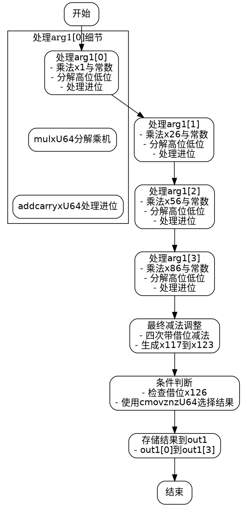

好的，我需要帮用户理解这个Zig函数，并生成对应的流程图。首先，这个函数的名字是fromMontgomery，看起来是在进行蒙哥马利域的转换，将参数arg1从蒙哥马利域转换到非蒙哥马利域，结果存储在out1中。

首先，我会通读代码，了解整体结构。函数中有很多变量定义，比如x1到x130，这些变量可能是在进行大数运算中的中间步骤。很多操作涉及mulxU64（可能是乘法并返回高位和低位）、addcarryxU64（带进位的加法）和subborrowxU64（带借位的减法）。这些通常用于大整数运算，特别是处理模运算，比如椭圆曲线加密中的操作。

接下来，注意到函数分为几个部分。首先是对arg1[0]的处理，然后是arg1[1]、arg1[2]、arg1[3]，每次处理都有一系列的乘法和加法，可能是在进行蒙哥马利约减的步骤。每个步骤生成一些中间变量，然后进行累加，最后可能会有条件移动（cmovznzU64）来处理可能的减法溢出，确保结果在正确的范围内。

为了画流程图，我需要将这个过程分解成步骤：

1. 初始化部分：获取arg1的第一个元素x1，并进行一系列乘法操作，得到x2到x18，然后处理进位。
2. 处理arg1[1]，同样进行乘法和进位处理，生成x26到x30，接着是更多的运算。
3. 类似的步骤处理arg1[2]和arg1[3]，每一步都涉及乘法、进位处理，累积中间结果。
4. 最后的减法步骤，检查是否需要调整结果，使用subborrowxU64进行四次减法，根据借位情况决定是否使用条件移动来修正结果。
5. 将结果存储到out1数组。

流程图的结构应该是一个顺序流程，每个主要处理步骤（如处理每个arg1的元素）作为不同的块，内部包含乘法和加法操作。条件移动部分作为最后的判断步骤，根据借位标志决定是否替换结果。

需要注意循环结构是否存在，但看起来是线性的处理，没有循环。因此流程图可能由多个顺序的处理块组成，每个块对应处理一个数组元素，然后是最后的条件调整。

另外，变量名如x1到x130很多，但流程图不需要显示每个变量，而是每个步骤的操作，比如“乘法并分解高位低位”、“带进位加法”、“处理arg1[0]”等。

最后，使用subborrowxU64后的条件移动是关键部分，可能需要一个决策点，根据x126的值选择是否使用减法后的结果或原来的值。

总结流程图结构：
1. 处理arg1[0]
   - 乘法、分解、进位处理
2. 处理arg1[1]
   - 类似步骤
3. 处理arg1[2]
4. 处理arg1[3]
5. 最后的四次减法操作
6. 条件判断，决定结果存储
7. 输出out1

每个主要步骤内部可能有多个子操作，但流程图应简化为主要步骤的顺序流程，加上条件判断的分支。
================================================
