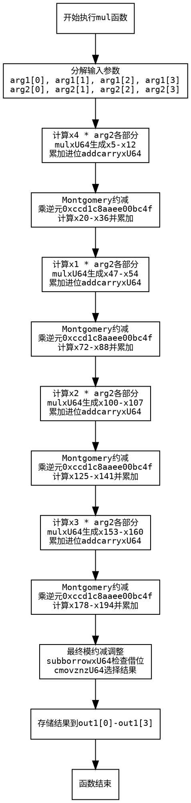

好，我现在需要帮用户分析一个用Zig语言编写的函数，并且画出它的流程图。用户提供的代码是来自P-256曲线实现的乘法函数，看起来是Montgomery域的乘法运算。我需要先理解这个函数的结构，然后根据代码流程画出正确的流程图。

首先，我得仔细阅读代码，了解每个步骤的作用。函数名为mul，接受三个参数，其中out1是输出，arg1和arg2是输入的两个Montgomery域元素。整个函数看起来是执行大数乘法，然后进行模约减，可能使用了Montgomery乘法的方法。

代码一开始定义了一些变量，比如x1到x4，这些可能是输入的各个部分。接着有很多mulxU64和addcarryxU64的调用，这些应该是处理64位无符号整数的乘法和带进位的加法。看起来像是在进行多精度乘法运算，逐位相乘并累加进位。

接下来，函数中有多次类似的模式：先进行乘法，然后处理进位，接着进行模约减的步骤。例如，每次处理arg1的不同部分（x4, x1, x2, x3），分别与arg2的各个元素相乘，然后累积结果，并进行模约减。模约减时使用了特定的常数，比如0xccd1c8aaee00bc4f，这可能是Montgomery乘法中的模逆元相关常数。

在代码的最后部分，有subborrowxU64和cmovznzU64的调用，这应该是在进行最终的模约减后的调整步骤，确保结果在正确的范围内。最后将结果存入out1数组。

现在，我需要根据这些步骤绘制流程图。流程图应该从函数入口开始，按照代码的执行顺序，分步骤展示各个操作。需要注意循环结构和条件判断，但在这个函数中，可能没有明显的循环，而是线性的步骤，因为每个步骤都是展开的，处理不同的元素。

可能的流程图结构如下：
1. 函数开始。
2. 分解输入参数arg1和arg2的各个部分。
3. 对每个输入部分进行乘法运算（比如x4与arg2的各个元素相乘）。
4. 处理乘法的结果和进位，累加到中间变量。
5. 进行模约减操作，乘以特定的常数并调整结果。
6. 重复类似步骤处理其他输入部分（x1, x2, x3）。
7. 最终的模约减调整，使用条件移动指令确保结果正确。
8. 将结果存入out1数组。
9. 函数结束。

需要注意的是，每次处理arg1的不同部分时，都会重复类似的乘法、累加、模约减步骤，因此流程图中会有多个类似的块。此外，最后的调整步骤可能需要条件判断，根据借位情况选择结果值。

在绘制流程图时，应该使用graphviz的语法，用节点表示操作，箭头表示流程。每个主要操作步骤作为一个节点，例如乘法、处理进位、模约减等。分支部分，比如条件判断，需要使用条件节点和不同的路径。

现在，我需要确保流程图中的每个步骤正确对应代码中的操作，没有遗漏关键步骤。例如，四次处理arg1的不同部分（x4, x1, x2, x3），每次都会生成中间结果并调整。最后处理所有的中间结果，进行最终的模约减和调整，输出结果。

可能遇到的挑战是如何将复杂的多精度运算步骤简化为流程图中的节点，同时保持逻辑清晰。需要将重复的结构合并或概括，避免流程图过于冗长。例如，可以概括四次处理arg1不同部分的操作为一个循环结构，但由于代码中是展开的，可能需要分别表示每个处理步骤。

另外，最后的条件移动步骤（cmovznzU64）需要根据前面的借位情况选择是否替换结果，这在流程图中应表示为条件分支。

总结，流程图的大致结构是：

函数入口 → 分解输入 → 处理x4 → 模约减 → 处理x1 → 模约减 → 处理x2 → 模约减 → 处理x3 → 模约减 → 最终调整 → 输出结果 → 函数结束。

每个处理步骤内部包含乘法、累加进位、模约减的具体操作。最终的调整步骤根据是否有借位来决定是否替换结果值。

接下来，我需要将这些步骤转化为graphviz的节点和边。使用矩形框表示操作步骤，菱形表示条件判断，箭头连接各步骤。
================================================
