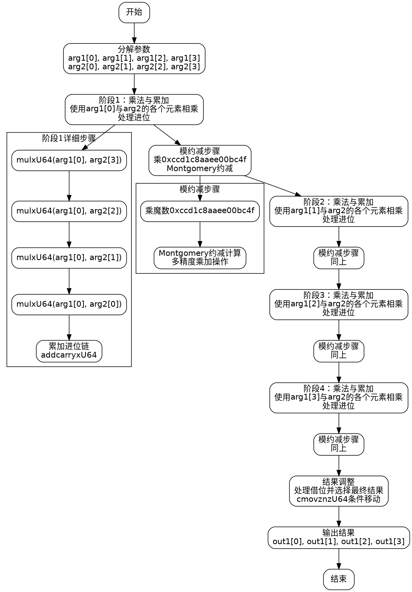

嗯，我需要为这个用Zig编写的函数绘制流程图。这个函数看起来是用于椭圆曲线P-256的标量乘法。首先，我需要理解函数的结构和各个部分的作用。

首先，函数名为mul，参数是两个MontgomeryDomainFieldElement类型的参数arg1和arg2，输出是out1。函数内部有很多变量和操作，尤其是使用mulxU64和addcarryxU64这些函数，看起来是进行大数乘法和处理进位。可能是在进行Montgomery乘法运算，这在椭圆曲线运算中很常见。

接下来，我注意到代码中有四个主要的乘法部分，每个部分对应不同的参数索引（比如arg1[0], arg1[1]等），然后进行一系列乘法和累加操作。每个部分结束后，会有一个模约减的步骤，使用特定的常数0xccd1c8aaee00bc4f，这可能与P-256的模数有关。

然后，代码末尾有一系列的subborrowxU64操作，可能是在进行模运算后的调整，确保结果在正确的范围内。最后使用cmovznzU64来选择正确的值，这可能是条件移动指令，避免分支预测错误。

为了绘制流程图，我需要将函数分解成几个主要步骤：

1. 初始化参数，分解arg1和arg2的元素。
2. 四个主要的乘法累加阶段，每个阶段处理不同的元素组合。
3. 每个阶段后的模约减步骤。
4. 最后的减法调整，确保结果在模数范围内。
5. 存储结果到out1。

流程图应该从函数入口开始，依次展示每个阶段的乘法和累加，然后是模约减，循环处理所有四个部分，最后进行结果调整和输出。每个步骤之间的数据流向需要明确，特别是进位和中间结果的传递。

可能需要使用条件判断来处理进位和借位，但代码中使用了addcarryxU64和subborrowxU64，这些函数已经处理了进位标志，因此在流程图中可以表示为带有进位输入的步骤。

可能的结构：

开始 -> 分解参数 -> 阶段1乘法 -> 模约减 -> 阶段2乘法 -> 模约减 -> 阶段3乘法 -> 模约减 -> 阶段4乘法 -> 模约减 -> 调整结果 -> 输出结果。

每个阶段内部可能有多个乘法和加法操作，需要细化到每个变量的操作，但为了简洁，可以合并为阶段内的处理步骤。

需要注意循环或重复的结构，但由于每个阶段处理不同的元素，可能需要分开表示。

最后，使用条件移动指令来确定最终结果，这部分在流程图中可以用条件判断框来表示，根据是否借位来选择结果值。

总结来说，流程图需要清晰地展示数据流、各个阶段的处理步骤、进位/借位的处理，以及最终的调整和输出。
================================================
