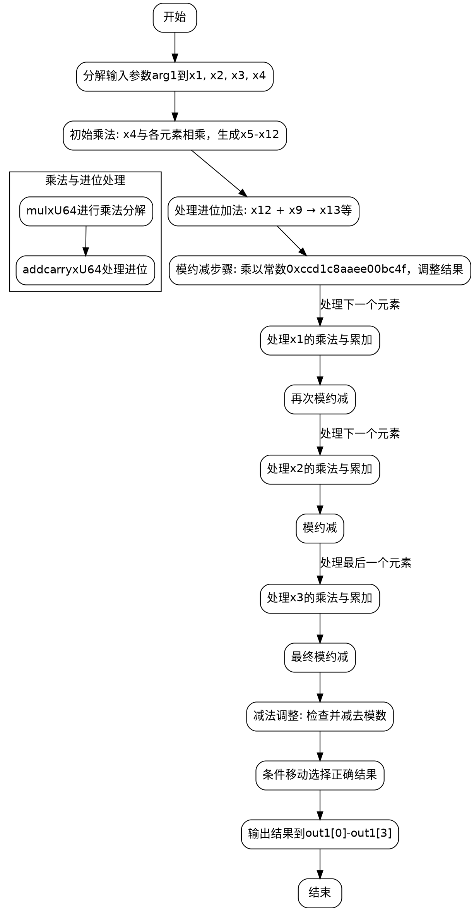

嗯，我现在需要给这个用 Zig 写的函数画流程图。这个函数是用于椭圆曲线 P-256 的标量平方运算。看起来里面有很多变量和操作，比如乘法、加法、进位处理，还有最后的条件移动指令。首先，我需要理解这个函数的整体结构，然后分解步骤，画出流程图。

首先，函数名是 `square`，参数是一个 Montgomery 域中的元素 `arg1`，输出是 `out1`。函数内部有很多变量，像 x1 到 x219，看起来是中间计算步骤。可能有多个阶段，比如乘法、累加、模约减等。

接下来，函数开始定义了一些局部变量，比如 x1 到 x4 是 arg1 的元素。然后有很多 mulxU64 和 addcarryxU64 的调用，这些应该是进行无符号64位乘法和带进位的加法。之后还有一些 subborrowxU64 和 cmovznzU64，可能用于模运算后的调整步骤。

为了画流程图，我需要将函数分解成几个主要部分：

1. **初始化阶段**：从 arg1 中取出元素，进行初步的乘法运算，得到中间结果。
2. **累加和进位处理**：连续的乘法和加法，处理进位，逐步构建中间结果。
3. **模约减步骤**：使用特定的常数（如0xccd1c8aaee00bc4f）进行乘法，然后调整结果，确保在模数范围内。
4. **最终调整**：通过条件移动指令（cmovznzU64）选择正确的值，避免负值，确保结果正确。

可能的流程图步骤：

- 开始
- 分解输入参数 arg1 到 x1, x2, x3, x4
- 进行四个乘法操作（mulxU64），得到 x5 到 x12
- 处理进位加法（addcarryxU64），得到 x13 到 x19
- 进行模约减的第一步，乘以常数，得到 x20 到 x36
- 继续处理加法和进位，得到 x37 到 x45
- 接下来处理 x1 的乘法部分，重复类似的步骤，直到处理完 x3
- 最后进行减法调整（subborrowxU64）和条件移动（cmovznzU64），将结果写入 out1
- 结束

需要注意的是，每次处理一个输入元素（如x1、x2、x3、x4）时，可能有类似的循环结构，但因为代码是展开的，所以需要分别处理每个部分。每个部分的处理可能包括乘法、加法、进位处理、模乘和调整步骤。

可能的结构图：

开始 -> 分解输入 -> 处理每个元素（四次循环）-> 模约减 -> 调整结果 -> 输出。

不过，代码中每个元素的处理是顺序进行的，没有显式循环，所以流程图会有多个类似的块，每个块对应一个输入元素的处理。例如，处理 x4 的部分，然后是 x1，x2，x3，每个部分都有乘法、累加、模乘等步骤。

另外，最后的减法部分（subborrowxU64）可能用于检查结果是否超过模数，如果超过则减去模数，这里使用条件移动来确保结果正确。

总结流程图的大致步骤：

1. 输入参数分解
2. 对每个输入元素进行乘法和累加
3. 每次累加后进行模约减
4. 处理所有元素后，进行最终的减法调整
5. 使用条件移动选择正确结果
6. 输出结果到out1

可能需要用不同的模块表示这些步骤，并用箭头连接表示流程。每个模块内部可能有更详细的步骤，比如乘法、处理进位、模乘等。
================================================
