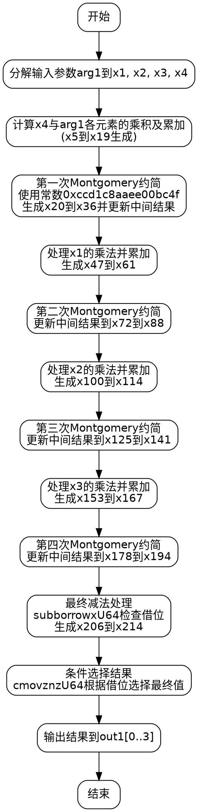

好，我现在要分析这段用Zig语言编写的函数，并画出它的流程图。首先，我需要理解这个函数的功能。函数名为square，属于Montgomery域中的元素平方运算。输入是一个MontgomeryDomainFieldElement类型的参数arg1，输出是另一个同类型的out1。看起来这是一个椭圆曲线P-256的标量乘法或相关运算的一部分。

接下来，我需要逐步解析代码的结构。函数内部有很多变量定义和操作，尤其是mulxU64（乘法）、addcarryxU64（带进位的加法）、subborrowxU64（带借位的减法）等函数的使用，这表明代码在进行大数运算，处理64位无符号整数，并且可能需要处理溢出。

首先，函数开始时分解了arg1的元素，x1到x4对应arg1的不同位置。然后进行了一系列的乘法和累加操作，生成中间变量如x5到x19。这部分可能是计算某个中间结果的展开，比如多项式乘法中的各项。

接下来，代码中多次出现对0xccd1c8aaee00bc4f的乘法，这可能是Montgomery约简中的常数，用于将结果转换回模数域。每次乘法后，会进行一系列的乘法和累加，然后使用addcarryxU64处理进位。这应该是Montgomery约简的步骤，将大数相乘后的结果模约到正确的范围内。

之后，代码对不同的输入元素（如x1、x2、x3）重复了类似的乘法和约简过程。每个部分的结构看起来相似，可能是在处理不同位或不同部分的乘法，并将结果累加到中间变量中。例如，处理x1的部分生成x47到x61，然后与之前的中间结果结合，再进行Montgomery约简。

最后，代码使用subborrowxU64进行减法操作，并利用cmovznzU64（条件移动指令）来选择最终结果，这可能是在处理模运算中的减法，防止结果为负数，从而确保结果在正确的模数范围内。

为了画出流程图，我需要将整个函数的步骤分解成不同的块。大致可以分为以下几个部分：

1. 初始化：分解输入参数arg1的元素。
2. 第一次乘法展开（x4与arg1的各个元素相乘，生成x5到x19）。
3. 第一次Montgomery约简（使用x11和特定常数相乘，处理进位，生成中间结果）。
4. 处理x1的乘法并累加，然后进行约简。
5. 处理x2的乘法并累加，再进行约简。
6. 处理x3的乘法并累加，最后约简。
7. 最后的减法处理，条件选择最终结果输出到out1。

每个主要步骤内部可能包含多个子步骤，比如乘法、进位处理、累加等。需要注意循环结构是否存在，但看起来代码是线性的，没有明显的循环，而是分阶段处理每个输入元素。

在绘制流程图时，每个步骤作为一个处理框，箭头表示执行顺序。条件选择部分（如cmovznzU64）可能需要判断分支，但根据代码结构，最后的减法处理后的条件移动可能根据是否有借位来决定使用减法后的值还是原始值。

需要注意的是，由于代码中多次重复类似的结构（如处理x4、x1、x2、x3的部分），可能可以将其视为循环展开，但在流程图中可能需要分别表示每个处理块，因为它们处理不同的数据部分。

总结流程图的结构：

开始 → 分解输入 → 处理x4 → 约简 → 处理x1 → 约简 → 处理x2 → 约简 → 处理x3 → 约简 → 最终减法处理 → 条件选择 → 输出结果。

每个“处理xN”步骤包括乘法、累加进位，然后进行约简。最后的减法处理部分包括多次subborrowxU64和条件移动。

现在需要将这些步骤用Graphviz的节点和边表示出来，确保逻辑顺序正确，并标明每个步骤的主要操作。
================================================
