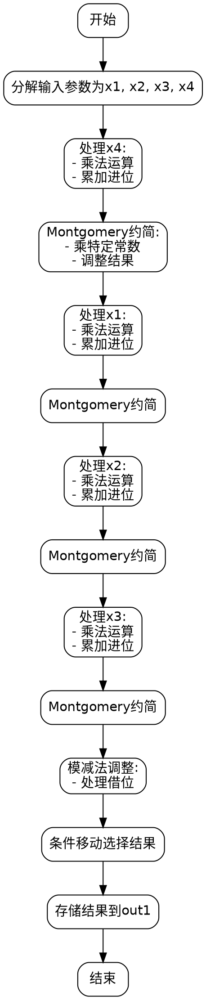

好的，我现在需要为这个用Zig编写的函数绘制一个流程图。函数名是toMontgomery，作用是将非Montgomery域的元素转换为Montgomery域。首先，我需要理解这个函数的整体结构和各个部分的操作。

首先，函数接收两个参数：out1是一个指向MontgomeryDomainFieldElement的指针，arg1是一个NonMontgomeryDomainFieldElement。函数体内有很多变量和操作，看起来涉及到大量的乘法、加法以及进位处理。这可能是因为在处理大数运算，比如椭圆曲线加密中的模运算。

接下来，我看到函数开始将arg1的元素分解为x1, x2, x3, x4，然后进行一系列的mulxU64操作，这可能是在进行64位无符号整数的乘法，并获取高位和低位的结果。例如，mulxU64(&x5, &x6, x4, 0x66e12d94f3d95620)可能将x4与后面的常数相乘，结果的高位存到x5，低位存到x6。

然后，有一些addcarryxU64的调用，处理进位加法。例如，addcarryxU64(&x13, &x14, 0x0, x12, x9)可能将x12和x9相加，进位标志存在x14，结果存在x13。

之后，函数中多次出现类似的模式：对不同的变量进行乘法、累加、进位处理，接着进行模约减。特别是在处理完每个部分的乘法后，会有一个乘数0xccd1c8aaee00bc4f，这可能与Montgomery约简有关，因为Montgomery乘法通常需要一个特定的常数来转换到Montgomery域。

接下来，每个阶段处理完之后，会有subborrowxU64进行减法借位处理，这可能是在进行模减法，检查结果是否需要调整，以确保在模的范围内。最后的cmovznzU64函数可能是条件移动，根据借位标志决定是否替换结果。

现在，要画流程图的话，我需要将整个函数的步骤分解成块。大致流程可能是：

1. 分解输入参数到各个变量（x1, x2, x3, x4）。
2. 对每个输入部分（x4, x1, x2, x3）进行乘法运算，并累加进位。
3. 每次乘法累加后，进行Montgomery约简，可能包括乘以特定常数，然后调整结果。
4. 处理完所有部分后，进行最终的模减法调整，确保结果在正确的范围内。
5. 使用条件移动指令选择正确的结果，并将结果存储到输出数组中。

需要注意各个部分的顺序，尤其是每个输入元素（x4, x1, x2, x3）的处理步骤是否独立，或者是否存在依赖关系。例如，处理x1的部分可能依赖于之前x4处理的结果，因为后面的变量如x37、x39等可能是在之前步骤中计算的。

可能的流程图结构如下：

开始 → 分解输入 → 处理x4 → Montgomery约简 → 处理x1 → 再次约简 → 处理x2 → 再次约简 → 处理x3 → 最后约简 → 模减法调整 → 条件移动 → 输出结果。

每个处理块内部可能包含乘法、加法、进位处理，以及约简步骤。需要确保每个步骤的正确连接，尤其是进位和借位的传递。

另外，注意到每个大步骤（处理x4、x1、x2、x3）之后都会有一个Montgomery约简步骤，这可能是一个循环或重复的结构。因此，流程图可能需要用循环结构表示，或者分别画出每个阶段的处理。

最后，最终的减法调整和条件移动部分需要处理可能的溢出，并选择正确的值输出。

总结，流程图的大致步骤应该是：

1. 初始化，分解输入。
2. 依次处理每个输入元素（x4, x1, x2, x3），每个元素处理包括乘法、累加、进位处理，然后进行Montgomery约简。
3. 处理完所有元素后，进行最终的模减法调整。
4. 根据减法调整的结果，使用条件移动选择正确的结果。
5. 将结果存储到输出数组。

在绘制时，每个主要处理阶段可以用一个处理框，内部的详细操作可以简化为步骤说明。例如，“处理x4”框内包含多个mulxU64和addcarryxU64操作，接着是约简步骤。而约简步骤本身可能又包含多个乘法和调整步骤。

需要确保流程图中的箭头正确表示控制流和数据依赖关系。例如，处理x1的部分可能在处理x4之后，并且依赖x4处理的结果。

可能需要注意，每个阶段的Montgomery约简是否结构相同，可以统一表示，或者每个阶段有不同的细节。

最后，在绘制时，使用graphviz的语法，用节点和边来表示各个步骤，节点内的文字描述该步骤的操作，边表示流程的顺序。
================================================

该流程图展示了函数的主要步骤：
1. **分解输入** - 将输入参数分解为四个64位整数(x1-x4)
2. **逐元素处理** - 对每个元素(x4→x1→x2→x3)进行：
   - 多精度乘法运算(mulxU64)
   - 带进位累加(addcarryxU64)
   - Montgomery约简（乘模常数+结果调整）
3. **最终调整** - 通过带借位减法(subborrowxU64)确保结果在模范围内
4. **条件移动** - 使用cmovznzU64选择最终有效值
5. **结果存储** - 将四个64位结果写入输出数组

每个Montgomery约简步骤包含：
- 与常数0xccd1c8aaee00bc4f相乘
- 分步模约简操作（对应P256曲线的模数）
- 结果调整以保证在256位范围内