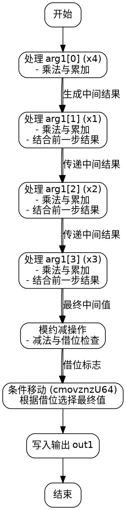

嗯，我需要帮用户把这段Zig代码转换成Graphviz的流程图。首先，我得理解这段代码的功能。看起来这是一个将非Montgomery域的元素转换到Montgomery域的函数，可能是用于椭圆曲线加密，特别是P256曲线。不过，用户的需求是流程图，所以具体算法细节可能不是最关键的，但了解代码结构对画流程图有帮助。

代码中有很多变量和操作，特别是乘法（mulxU64）、进位加法（addcarryxU64）和减法（subborrowxU64）。看起来函数处理四个输入元素（arg1[0]到arg1[3]），然后进行一系列的乘法和累加操作，最后进行条件移动（cmovznzU64）来设置输出。

流程图需要展示函数的控制流。首先，函数开始，然后处理每个输入元素，进行乘法、累加，可能有循环或分支。不过，这段代码看起来是线性的，没有明显的循环，但有多个步骤，每个步骤处理不同的部分。例如，处理x4，然后是x1，x2，x3，每个部分都有类似的乘法、进位加法的步骤。

接下来，我需要确定每个步骤的顺序和它们之间的依赖关系。例如，处理x4的部分（mulxU64生成x5到x12），然后进行一系列的addcarryxU64操作得到x13到x17。接着处理x1，同样进行乘法，然后与之前的结果结合。每个处理步骤后，可能会生成中间结果，这些结果会被后续步骤使用。

另外，代码的最后部分有减法操作和条件移动，这可能是最后的规约步骤，确保结果在Montgomery域的正确范围内。这里可能有条件判断，根据借位标志决定是否使用减后的值或原值。

画流程图时，应该将每个主要操作作为节点，如乘法、进位加法、减法，并用箭头连接它们的执行顺序。需要注意条件分支，比如最后的cmovznzU64会根据subborrowxU64的结果选择不同的值，这可能需要条件判断的节点。

不过，由于代码非常底层且包含许多临时变量，流程图可能会非常复杂。可能需要适当抽象，将相似的操作步骤合并，比如将处理每个输入元素（x4, x1, x2, x3）的部分作为四个大块，每个块内包含乘法和进位加法。然后处理每个块后的中间结果，最后进行规约和条件移动。

需要注意的是，Graphviz的流程图通常用矩形表示处理步骤，菱形表示条件判断，箭头表示流程方向。可能需要将重复的操作模式识别出来，简化表示，否则流程图会过于庞大。

总结步骤：
1. 函数开始，初始化变量。
2. 处理arg1[0]（x4）的乘法和累加。
3. 处理arg1[1]（x1）的乘法和累加，结合之前结果。
4. 处理arg1[2]（x2）的乘法和累加，结合之前结果。
5. 处理arg1[3]（x3）的乘法和累加，结合之前结果。
6. 进行最后的减法规约步骤，检查借位。
7. 根据借位结果，使用条件移动选择最终输出值。
8. 将结果写入out1数组，结束函数。

每个处理步骤内部可能包含多个乘法和进位操作，但在流程图中可以将其合并为一个步骤，比如“处理x4的乘法与累加”。这样流程图不会过于细化，保持可读性。

最后，确保流程图的逻辑正确，特别是条件判断部分是否正确影响最终输出。
================================================
