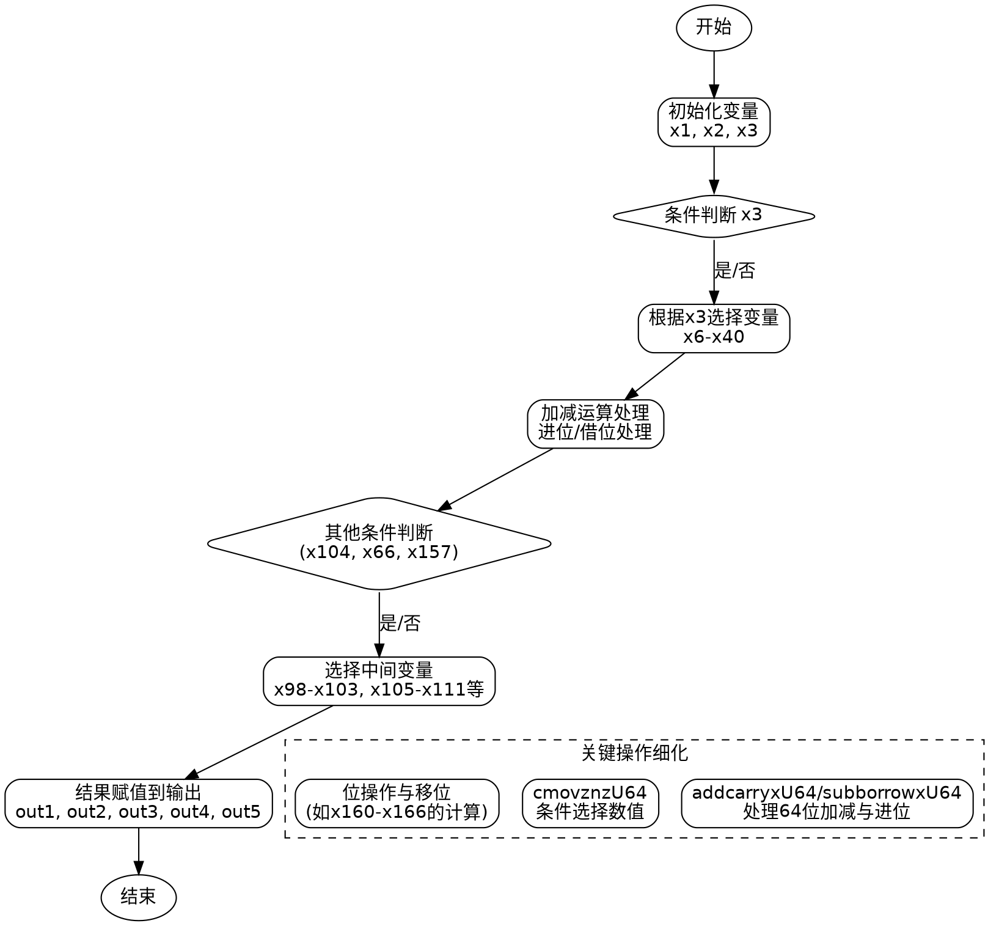

嗯，用户让我用Graphviz画一个Zig函数的流程图。首先，我需要理解这个函数的功能和结构。这个函数叫做divstep，参数包括多个输出指针和输入参数，看起来像是处理椭圆曲线密码学中的某种运算，尤其是P-384曲线。不过具体功能可能不是关键，关键是要画出流程图。

首先，我得通读代码，找出主要的控制流和操作步骤。函数内部有很多变量定义和操作，特别是使用了addcarryxU64、subborrowxU64和cmovznzU64这些函数，看起来像是处理大整数的加减和条件选择。这些操作可能涉及到条件分支，但Zig中的条件移动（cmovznzU64）可能用三元运算符实现，所以实际的控制流可能不明显。

接下来，函数开始部分计算x1和x2，然后根据x3的值选择不同的变量。x3是通过arg1和arg3[0]的某些位运算得到的。这里可能有一个条件判断，根据x3的值决定后续变量的赋值，但由于使用的是cmovznzU64，可能没有显式的分支，而是根据条件选择不同的值。

之后，有很多的addcarryxU64和subborrowxU64调用，处理进位和借位，这些可能对应一系列的算术操作步骤。每个步骤可能生成新的变量，并传递进位或借位标志。这可能需要将这些操作按顺序排列，并连接起来，显示数据流向。

然后，函数中有多个cmovznzU64调用，根据不同的条件（如x3、x104、x66、x157等）选择不同的值。这些条件可能对应不同的执行路径，但由于是条件移动，实际的控制流可能还是线性的，只是变量值不同。

需要确定流程图的结构。可能的步骤是：

1. 初始化变量x1, x2。
2. 计算x3，并根据x3选择一系列变量（x6到x40）。
3. 进行一系列的加减操作，处理进位和借位。
4. 根据不同的条件（如x3、x104等）选择不同的值。
5. 最终将结果赋值给输出参数。

流程图应该反映这些步骤的顺序，以及条件选择的影响。由于函数内部没有显式的循环或分支语句（如if/else、switch），可能主要是顺序执行，但条件移动会影响变量的值，因此在流程图中需要用条件判断节点来表示这些选择。

可能的节点包括：

- 开始节点
- 计算初始变量（x1, x2, x3）
- 根据x3选择变量（x6到x40）
- 处理加减运算和进位借位（如x14到x26，x41到x63等）
- 条件选择（如x98到x103，x105到x111，x126到x131）
- 最后的赋值操作到out1到out5

连接这些节点时，需要注意数据依赖关系，比如某个变量的计算依赖于前面的结果，因此箭头应指向后续步骤。条件选择节点可能需要分支出不同的路径，但由于是条件移动，可能用菱形判断节点表示条件，然后根据条件选择不同的操作。

不过，由于代码非常线性，且条件移动不改变执行流程，只是变量值，可能需要将每个主要操作步骤作为节点，并用箭头表示执行顺序。条件选择可以作为节点内的操作，标注条件。

考虑到代码复杂度，可能需要将流程分为几个主要阶段：

1. 初始化和条件选择（x3的处理）
2. 加减运算处理
3. 条件选择中间变量
4. 最终结果处理

每个阶段内的操作按顺序排列，并在流程图中用箭头连接。例如，初始阶段处理x1到x3，然后根据x3选择变量，接着进行一系列的加减运算，再根据其他条件选择变量，最后输出结果。

另外，函数末尾的out赋值需要作为流程图的结束节点。

总结，流程图的大致结构可能是：

开始 → 初始化变量 → 条件判断（x3） → 选择变量 → 加减运算 → 条件判断（其他条件） → 选择变量 → ... → 输出结果 → 结束

每个步骤中的具体操作需要细化，比如加减运算的具体步骤，条件判断的具体条件等。

由于代码中变量非常多，可能需要简化，只显示主要步骤，而不是每个变量操作。例如，将多个连续的addcarryxU64和cmovznzU64合并为一个节点，标注为“处理进位加法”或“条件选择变量”。

最后，生成Graphviz的DOT语言代码，用节点和边表示这些步骤。
================================================

该流程图通过以下方式展示函数逻辑：

1. **初始节点**表示函数入口
2. **变量初始化**处理初始计算和第一个条件判断(x3)
3. 菱形节点表示**条件判断**，控制后续变量选择逻辑
4. 主要运算模块分为：
   - 加减运算与进位处理（包含连续多个addcarryxU64/subborrowxU64操作）
   - 条件选择指令（cmovznzU64）的多处应用
   - 位操作和结果重组（如通过位移构造输出值）
5. 最终将所有计算结果写入输出参数
6. 虚线框内展示了实现细节的关键操作模式

由于函数高度线性化且使用大量条件移动指令，实际控制流较为平坦，流程图重点突出了数据流向和关键的条件选择点。每个主要操作块内部包含数十个顺序执行的原子操作，这里进行了逻辑分组简化表示。