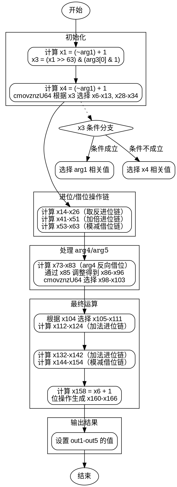

嗯，我现在需要为这个用Zig编写的函数画一个流程图。首先，我得仔细看看这个函数是做什么的。函数名是divstep，可能和椭圆曲线相关的除法步骤或者某种算法步骤有关，比如在模逆运算中使用的扩展欧几里得算法的一个步骤。不过具体细节可能比较复杂，但画流程图的话可能不需要完全理解算法，而是关注代码的结构和流程。

首先，函数参数有很多输出指针：out1到out5，以及输入的arg1到arg5。函数内部有很多变量和操作，比如addcarryxU64、cmovznzU64这些函数，看起来像是处理大整数运算的，可能涉及进位和条件移动操作。

接下来，我需要理清代码的执行流程。函数开始处有一些变量的定义，然后是一系列的addcarryxU64和cmovznzU64调用。这些操作可能对应于某种条件判断和算术运算的组合。比如，开始的addcarryxU64计算了x1和x2，然后根据x3的条件选择不同的值，这可能是在处理模运算中的负值或者条件分支。

代码中有大量的变量赋值和条件移动操作，这可能是为了避免分支预测错误，使用恒定时间的算法，这在密码学中很重要。每个cmovznzU64根据某个条件选择两个值中的一个，这可能在处理不同的情况，比如模运算中的不同路径。

接下来，我需要将这些步骤分解成流程图中的各个节点。可能的步骤包括：

1. 初始化和变量定义。
2. 计算x1和x2，然后确定x3的值。
3. 根据x3的条件，选择不同的参数值，生成x6到x13，x28到x34，x35到x40等。
4. 进行一系列的加法和进位操作，比如计算x41到x51，然后进行减法借位操作得到x53到x63。
5. 处理arg4和arg5的值，进行更多的条件移动和算术运算。
6. 处理x104的条件，进行更多的条件赋值。
7. 最后的加法、位移操作，以及输出结果的赋值。

每个主要的操作可以作为一个流程图的节点，而条件判断（比如x3、x66、x157等）会导致不同的分支。不过由于代码中没有明显的循环结构，可能是一个线性的流程，但有很多条件选择。

需要注意的是，像cmovznzU64这样的条件移动操作，在流程图中可能表示为条件判断后的选择，但因为是恒定时间操作，可能没有实际的分支，而是数据选择。因此，在流程图中可能需要用判断框来表示这些条件选择的影响。

另外，函数中有大量的中间变量，可能需要将这些变量的计算步骤合并成更简洁的步骤，以避免流程图过于复杂。例如，多个连续的cmovznzU64调用可能可以合并为一个条件判断下的多个赋值。

最后，流程图的结束部分是给输出参数赋值，将结果写入out1到out5指向的位置。

现在，我需要将这些步骤组织成流程图的结构，用Graphviz的DOT语言来表示。需要确定各个操作之间的顺序，条件判断如何影响流程，以及如何处理并行或顺序的操作。

可能的流程图结构：

1. 开始节点。
2. 计算初始变量x1、x2、x3。
3. 根据x3选择不同的值，生成多个变量。
4. 进行加法进位链（如x14到x26）。
5. 再次根据x3选择值，生成x28到x34。
6. 处理arg4和arg5的条件移动，生成x35到x40。
7. 计算x41到x51（可能涉及乘以2的操作，因为每个变量都加自己，例如x35 + x35）。
8. 减法借位链，得到x53到x63。
9. 处理arg4的各个元素，计算x73到x83，然后根据x85进行调整，得到x86到x96。
10. 根据x3选择arg5的值，得到x98到x103。
11. 处理x104的条件，生成x105到x111。
12. 加法进位链，得到x112到x124。
13. 处理x104的条件，生成x126到x131。
14. 加法进位链得到x132到x142，再进行减法借位链得到x144到x154。
15. 处理最后的条件，生成x158和各个输出变量。
16. 将结果写入out1到out5。
17. 结束节点。

这中间有很多步骤，可能需要将这些步骤分解成多个节点，并用箭头连接。条件判断会影响某些变量的选择，因此在流程图中需要用判断框来表示这些条件，例如x3的判断会影响多个变量的赋值。

由于代码中的操作很多，流程图可能会非常庞大。为了简化，可能需要将某些重复的操作模式合并，比如多个cmovznzU64调用可以表示为“根据条件选择多个变量”的单一节点。

另外，像连续进行的addcarryxU64和subborrowxU64操作可能形成链条，可以用顺序节点表示。

最终的Graphviz图可能包含多个顺序节点，每个节点代表一个代码块，根据条件选择不同的路径。不过由于代码中没有循环，主要是顺序执行和条件选择，所以流程图的结构是线性的，带有条件分支的并行处理。

最后，确保使用正确的节点和箭头，用条件判断框来引导不同的赋值路径，然后将所有步骤连接起来，直到输出结果。
================================================

该流程图使用 Graphviz 的 DOT 语言描述，主要特点：

1. 使用子图划分不同逻辑阶段
2. 用菱形节点表示关键条件分支（x3 的判断）
3. 用矩形圆角节点表示操作步骤
4. 虚线箭头表示隐式条件分支的影响
5. 包含完整的处理流程：
   - 初始化计算
   - 多精度数位操作（进位/借位链）
   - 参数处理（arg4/arg5）
   - 最终位操作和结果输出
   - 条件选择的核心逻辑

关键路径展示了从初始化到最终输出的线性流程，同时用子图结构保持了代码的模块化特征。实际实现中每个 cmovznzU64 和算术运算的具体细节被抽象为高层次的操作描述。