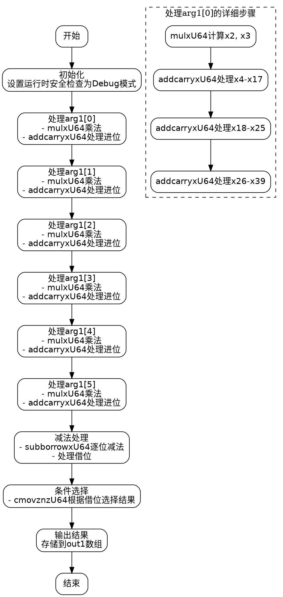

嗯，我现在需要为这个用Zig编写的函数画一个流程图。首先，我得仔细看看这段代码是做什么的。看起来这是一个从Montgomery域转换到非Montgomery域的函数，具体是针对P-384曲线的。函数名为fromMontgomery，接收两个参数：out1和arg1。

首先，函数开始时设置了运行时安全检查为Debug模式。然后，处理了arg1的第一个元素x1，接着进行了一系列的乘法运算，比如mulxU64，这些可能是64位的无符号整数乘法，同时处理进位。之后有很多的addcarryxU64函数调用，这些应该是在做带进位的加法操作。每个步骤中，变量x2到x309被逐步计算，可能是在进行大数的运算，比如模约减之类的。

接下来，我需要理清整个函数的逻辑流程。函数似乎按顺序处理输入的每个元素（arg1[0]到arg1[5]），每一步都进行乘法、加法，然后处理进位。之后有多次的subborrowxU64操作，可能是在进行减法并处理借位，最后使用cmovznzU64根据条件选择结果，最终将结果存入out1数组。

为了画流程图，我需要将代码分解成各个步骤，确定每个步骤之间的流程。可能的步骤包括：

1. 初始化阶段：设置调试模式，读取输入的第一个元素。
2. 处理每个输入元素（arg1[0]到arg1[5]）的乘法、加法、进位处理。
3. 对于每个元素处理后的结果，进行一系列的带进位加法运算。
4. 处理完所有输入元素后，进行减法操作，处理可能的借位。
5. 根据条件选择最终结果，存入输出数组。

需要注意的是，代码中存在多个循环结构吗？看起来可能每个输入元素（共6个）都进行了类似的处理步骤，可能是重复的结构，可以用循环表示，但在代码中是展开的，因为每个arg1[i]都单独处理。例如，处理arg1[0]时生成x2到x50，然后处理arg1[1]生成x52到x88，依此类推，直到处理arg1[5]。

因此，流程图应该反映这些重复的步骤，每个输入元素对应一个处理块，每个块内部进行乘法和进位处理，然后连接这些块，最后是减法处理和条件选择。

另外，每个处理块内部的结构可能相似，所以可以用子流程或重复的结构表示。例如，处理每个arg1[i]时，都是先进行mulxU64，然后一系列的addcarryxU64，接着处理下一个元素，直到所有元素处理完毕。之后是减法操作和条件移动。

可能的流程如下：

开始 → 初始化 → 处理arg1[0] → 处理arg1[1] → ... → 处理arg1[5] → 减法处理 → 条件选择 → 输出结果。

每个处理arg1[i]的步骤内部可能有类似的乘法、加法、进位操作，这些可以用子节点表示。减法处理部分包括多个subborrowxU64步骤，然后根据借位情况决定最终的输出值。

需要注意，变量之间的依赖关系可能会影响流程的结构，例如前一个步骤的输出是下一个步骤的输入。因此，流程图中需要正确表示这些顺序关系。

总结来说，流程图的大致结构是线性的，按代码顺序处理每个输入元素，每个元素处理包含乘法和进位加法，之后是减法处理和条件选择。每个主要步骤可以作为一个流程图节点，节点内部如果有重复结构，可能需要展开或标注。
================================================

### 流程图说明：
1. **线性流程**：代码按顺序处理`arg1[0]`到`arg1[5]`，每个元素的处理逻辑相似。
2. **乘法与进位处理**：每个`arg1[i]`通过`mulxU64`计算中间值，再通过多步`addcarryxU64`处理进位。
3. **减法与条件选择**：所有元素处理后，通过`subborrowxU64`进行减法并处理借位，最后用`cmovznzU64`选择最终结果。
4. **输出**：最终结果存入`out1`数组并结束流程。