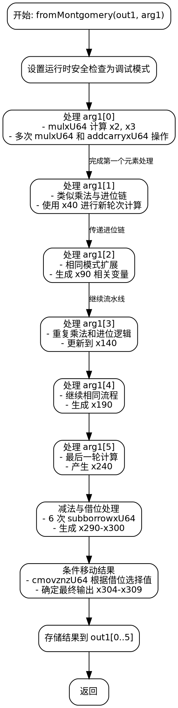

嗯，我需要为这个用Zig编写的函数绘制一个流程图。这个函数的名字是fromMontgomery，看起来是处理椭圆曲线P-384的蒙哥马利域到非蒙哥马利域的转换。首先，我应该理解这个函数的结构和逻辑。

函数一开始设置运行时安全检查为调试模式。然后，它读取输入参数arg1的第一个元素x1。接下来有一系列的mulxU64和addcarryxU64操作，这些都是处理大数乘法和进位加法。每个步骤都在处理不同的中间变量，比如x2到x17，然后继续处理更多的变量，直到最后的subborrowxU64和cmovznzU64操作，最后将结果存入out1数组。

我需要将这些操作步骤分解成流程图中的节点。可能的步骤包括初始化、乘法运算、进位处理、循环处理每个输入元素（arg1[0]到arg1[5]），以及最后的条件移动（cmovznzU64）和结果存储。

需要注意的是，函数中有多个类似的块，可能是处理每个输入元素时的重复结构。例如，处理arg1[0]、arg1[1]等可能有相似的操作序列。这可能在流程图中表现为循环结构或重复的节点块。

另外，最后的减法（subborrowxU64）和条件移动操作可能需要条件判断，根据借位标志来决定是否使用减法结果或保留原值。这部分需要分支处理。

在绘制流程图时，应该从函数入口开始，按顺序处理每个操作，包括乘法、加法、进位处理，循环处理每个输入元素，最后进行条件判断和结果输出。可能需要将重复的结构简化为一个子流程，以避免图表过于复杂。

总结步骤：
1. 函数入口，设置调试模式。
2. 处理第一个输入元素（arg1[0]），进行乘法和进位加法。
3. 类似地处理后续输入元素（arg1[1]到arg1[5]），每个元素可能经历类似的乘法和进位处理。
4. 最后的减法操作和条件移动，根据借位标志决定结果。
5. 将结果存储到out1数组中。

需要注意变量之间的依赖关系，确保流程图中的箭头正确表示执行顺序和数据流向。可能需要将每个主要的操作步骤作为一个节点，并连接它们以反映控制流。
================================================
