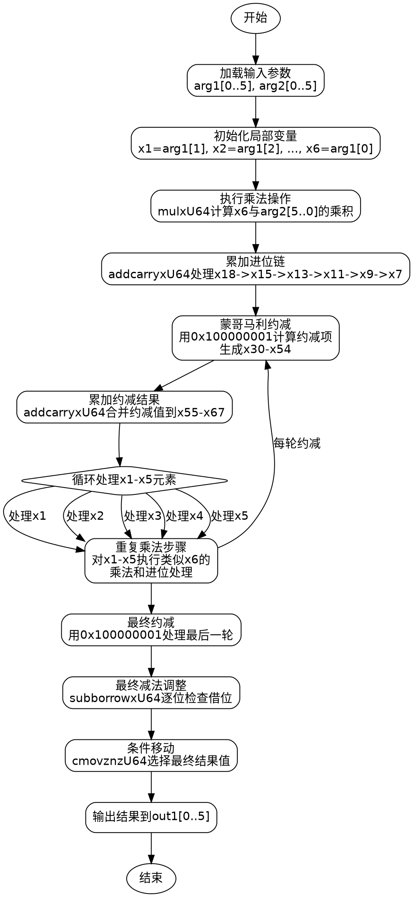

好的，我需要为给定的Zig函数绘制一个流程图。首先，我需要理解这个函数的结构和逻辑。这个函数是用于P-384曲线上的蒙哥马利域乘法运算。看起来函数内部进行了大量的乘法、加法和进位处理操作，最后还有一些条件移动操作。

首先，我会通读代码，确定主要的步骤。函数开始从arg1和arg2中加载元素，然后进行一系列的乘法和累加操作。每个乘法步骤似乎都使用了mulxU64函数，该函数可能执行64位无符号整数的乘法，并返回高位和低位的结果。接着使用addcarryxU64处理进位。之后，进行模约减，可能与蒙哥马利约减有关，使用特定的常数如0x100000001。最后，通过一系列的条件移动操作（cmovznzU64）来处理可能的减法溢出，确保结果在正确的范围内。

接下来，我需要将这些步骤分解成流程图的基本块。每个主要的乘法、累加和进位处理可以视为一个处理节点。模约减部分可能需要一个子流程。最后的条件移动部分也是一个决策节点，根据是否借位来决定结果的值。

在绘制流程图时，需要注意循环结构，但在这个函数中，似乎没有显式的循环，而是通过展开的操作步骤来处理每一位的乘法和累加。因此，流程图将是一系列顺序执行的操作块，每个块处理特定的乘法和加法步骤，然后进行模约减，最后是条件判断和结果输出。

可能的步骤如下：
1. 初始化变量，加载输入参数的元素。
2. 对每个输入元素进行乘法操作，并累加结果，处理进位。
3. 执行蒙哥马利约减步骤，使用预定义的常数。
4. 重复以上步骤，直到所有元素处理完毕。
5. 最后进行减法操作，检查是否需要调整结果，使用条件移动指令选择正确的值。
6. 输出结果到out1数组。

在绘制时，每个乘法、加法和进位处理步骤可以用一个处理框表示，条件移动部分用判断框表示。由于代码较长，可能需要将流程图分成几个部分，或者使用子图来简化复杂部分，比如模约减的多次操作。

需要注意的是，由于代码中存在大量重复的模式（例如，对x1到x5的处理结构类似），在流程图中可以简化为循环结构，或者用注释说明重复模式。但在实际绘图中，可能需要详细展示每个步骤以确保准确性，或者使用注释说明重复的部分。

最后，确保流程图的逻辑与代码一致，每个步骤之间的数据流和控制流正确无误。可能需要多次检查代码中的变量和操作顺序，确保流程图的正确性。
================================================
