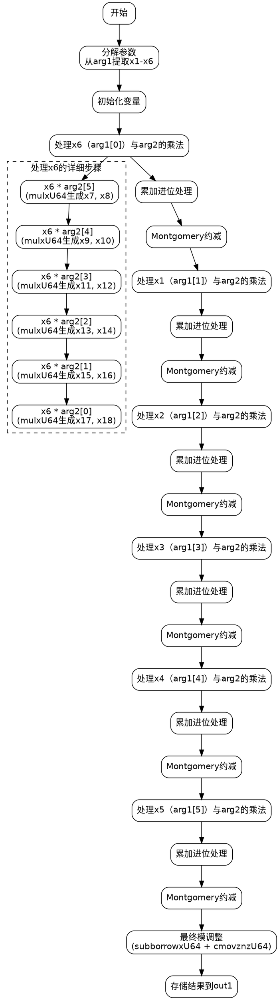

好的，我现在需要帮用户分析一个用Zig语言编写的函数，并生成对应的流程图。用户提供的函数是P-384椭圆曲线的乘法实现，位于文件crypto/pcurves/p384/p384_64.zig中。首先，我需要理解这个函数的功能和结构，然后根据代码逻辑绘制流程图。

首先，我会通读代码，了解这个mul函数的作用。函数接受两个MontgomeryDomainFieldElement类型的参数arg1和arg2，执行乘法运算，结果存入out1。Montgomery乘法通常用于高效的大数模乘，尤其是在椭圆曲线运算中，用于减少计算开销。

接下来，观察函数的实现细节。代码中大量使用了mulxU64和addcarryxU64等内联函数，这些通常是处理无符号64位整数乘法和带进位的加法。变量命名如x1到x473，看起来像是中间计算步骤的结果。代码结构分为多个部分，每个部分可能对应不同的乘法步骤和模约减过程。

为了绘制流程图，我需要将代码分解成主要的步骤：

1. **参数分解**：函数开始时，从arg1中提取元素x1到x6，其中x6是arg1[0]，其余依次是arg1[1]到arg1[5]。这可能是因为Montgomery域中的元素存储顺序不同，或者是为了方便后续计算。

2. **乘法运算**：接下来，代码对arg1的每个元素（从x6开始）与arg2的所有元素进行乘法运算，生成一系列的中间变量。例如，x7和x8是x6与arg2[5]的乘积结果，使用mulxU64处理，这里可能分解为高位和低位部分。

3. **累加进位处理**：通过多次调用addcarryxU64，将乘积累加，并处理进位。这部分可能对应着大数乘法的中间累加步骤，将部分积相加，并逐位处理进位。

4. **模约减**：在每次乘法累加之后，代码中出现了一些与0x100000001和多个0xffffffff...常数的乘法操作。这些可能是Montgomery约减的步骤，用于将结果转换回模数域。例如，乘以逆元或模数的补数，以优化模运算。

5. **循环处理每个元素**：代码中对x1到x5进行了类似的处理，即每个元素与arg2的所有元素相乘，并进行累加和模约减。这表明函数可能采用了一种分层的方法，逐位处理每个输入元素，并逐步构建最终结果。

6. **最终调整**：在最后的步骤中，代码使用subborrowxU64和cmovznzU64进行条件移动，这可能是最后的模数调整，确保结果在正确的范围内，即如果结果大于模数，则减去模数。

接下来，我需要将这些步骤转化为流程图的结构。流程图的节点应该包括各个主要操作，如初始化变量、乘法、累加进位、模约减、循环处理每个输入元素，以及最终的调整步骤。

可能的流程如下：

- **开始** → **分解参数** → **初始化变量**
- **循环处理每个arg1的元素（x6到x5）**：
  - 对当前元素与arg2的所有元素相乘
  - 累加部分积，处理进位
  - 执行Montgomery约减
- **累加所有中间结果**
- **最终模调整**
- **存储结果到out1**

需要注意的是，代码中有多个层次的循环和条件处理，比如每个arg1的元素需要与所有arg2的元素相乘，这可能在流程图中表现为嵌套循环。不过，由于代码是展开的，没有显式的循环结构，而是逐个处理每个元素，因此流程图中的每个处理块对应一个元素的计算步骤。

另外，模约减部分涉及多个乘法和加法步骤，可能需要分解为子步骤。例如，乘以特定常数（如0x100000001），然后进行一系列的乘法和加法来调整结果，使其符合模数要求。

最后，条件移动（cmovznzU64）用于根据借位情况选择正确的值，确保结果在模数范围内。这对应于流程图中的条件判断节点，根据是否发生借位来决定最终存储的值。

在绘制流程图时，应使用矩形框表示操作步骤，菱形框表示条件判断，箭头表示流程方向。每个主要步骤（如乘法、累加、约减）作为独立节点，按执行顺序连接。由于代码较长，可能需要将重复的结构（如每个元素的处理）合并为一个子流程，避免流程图过于复杂。

总结，流程图的大致结构为：

1. 初始化和参数分解
2. 对每个arg1元素：
   a. 与arg2的所有元素相乘，生成部分积
   b. 累加部分积，处理进位
   c. 执行Montgomery约减
3. 累加所有中间结果
4. 最终模调整（条件选择）
5. 输出结果

每个步骤内部可能包含更详细的操作，但整体结构应遵循这个顺序。需要确保流程图的逻辑正确反映代码的执行路径，尤其是条件分支和循环处理部分。
================================================


该流程图使用Graphviz的DOT语言描述，主要特点如下：

1. 使用纵向布局展示完整的乘法流程
2. 通过子图(cluster)展示x6处理的详细步骤（其他xi处理类似）
3. 使用不同颜色区分主要阶段（分解参数、逐元素处理、最终调整）
4. 关键操作节点使用矩形，流程控制使用箭头
5. 包含Montgomery约减和最终条件调整等重要步骤

可以通过Graphviz工具（如dot命令）生成图片：
```bash
dot -Tpng flowchart.dot -o p384_mul_flow.png
```