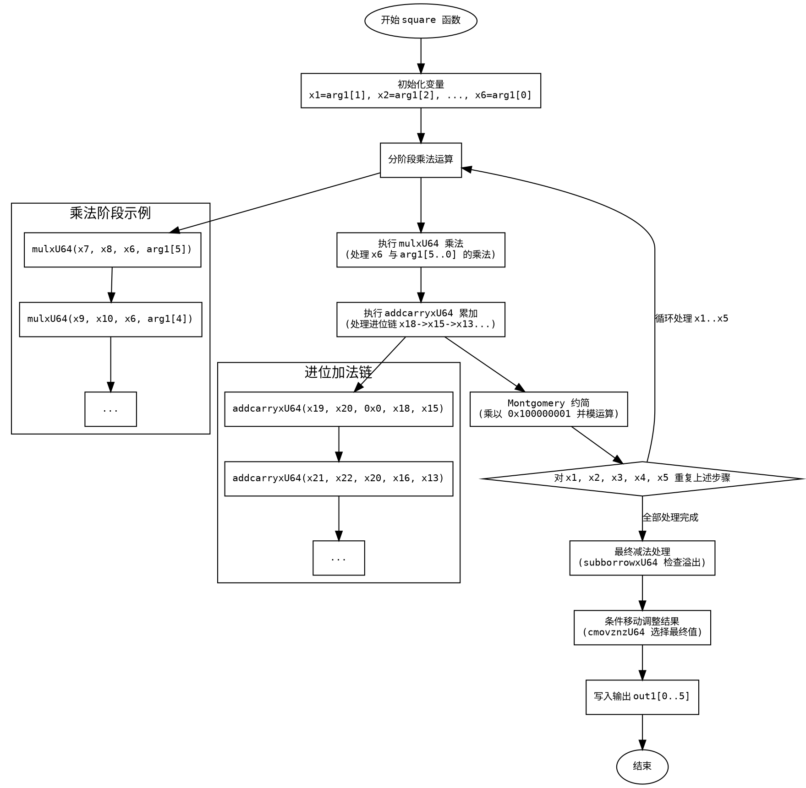

好的，我需要为给定的Zig函数绘制流程图。首先，我需要理解这个函数的功能。看起来这是一个在Montgomery域中进行平方运算的函数，用于椭圆曲线P-384的64位实现。函数名为square，接受两个参数：输出out1和输入arg1，都是MontgomeryDomainFieldElement类型。

接下来，我需要仔细分析代码结构。函数内部有很多变量和操作，包括乘法（mulxU64）、加法（addcarryxU64）、减法（subborrowxU64）以及条件移动（cmovznzU64）。这些操作都是处理大数运算的常见方法，尤其是在密码学中处理模运算时。

为了绘制流程图，我需要确定代码的主要步骤。首先，函数初始化了一些变量，然后进行一系列的乘法和累加操作。之后，进行模约简，可能涉及Montgomery约简步骤。最后，处理可能的减法以保持在模数范围内，并使用条件移动来确保结果正确。

流程图的大致步骤可能如下：

1. 初始化变量，分解输入参数到各个xi。
2. 进行多次乘法操作，计算中间结果。
3. 使用进位加法将中间结果累加。
4. 执行Montgomery约简，乘以特定的常数（如0x100000001）并进行模运算。
5. 重复上述步骤，处理每个输入元素（x1到x5）。
6. 最后进行减法操作，处理可能的溢出，确保结果在模数范围内。
7. 使用条件移动指令（cmovznzU64）选择正确的值作为输出。

需要注意的是，每个乘法和加法步骤可能对应流程中的一个节点，而循环或重复的结构可能需要分支或循环的表示。但由于代码是展开的，没有显式循环，因此流程图中的每个操作都是顺序执行的。

此外，由于涉及多个阶段（例如，处理x6到x5的不同部分），流程图可能需要分块表示每个阶段的处理过程，并显示数据流如何在这些阶段之间传递。

在绘制时，应使用graphviz的节点和边来表示每个操作步骤，例如：

- 矩形框表示操作（如乘法、加法）。
- 菱形框表示条件判断（如进位或借位处理）。
- 箭头表示控制流和数据流的方向。
- 可能需要将重复的模式抽象为子图，以提高可读性。

需要特别注意各个变量之间的依赖关系，确保流程图的顺序正确反映代码的执行顺序。例如，x7和x8由mulxU64生成，之后被用于后续的加法操作，这些依赖关系应在流程图中体现。

最后，确保流程图的每个步骤都有清晰的标签，说明执行的操作，如“Multiply x6 and arg1[5]”，“Add with carry x18 and x15”等，这样读者可以轻松理解每个步骤的作用。
================================================
