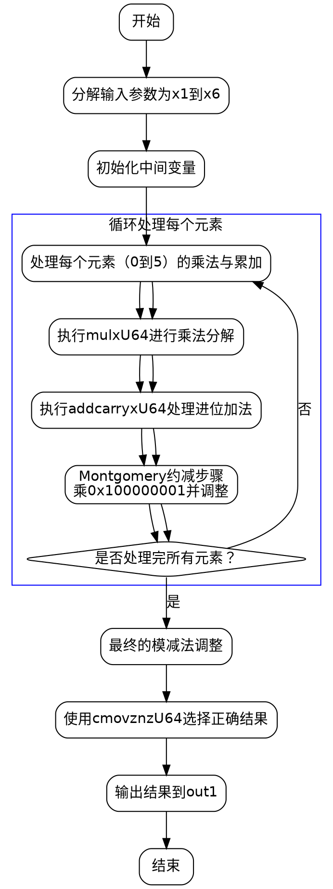

嗯，我需要理解这个Zig函数的流程，然后画出它的流程图。首先，这个函数叫square，属于Montgomery域中的域元素平方运算。看起来代码里有大量的变量和乘法、加法操作，可能涉及模约减。

首先，函数参数是out1和arg1，都是MontgomeryDomainFieldElement类型。函数内部有很多mulxU64和addcarryxU64的调用，这些应该是处理大整数乘法和进位加法。mulxU64可能是进行64位乘法，返回高位和低位的结果。addcarryxU64处理带进位的加法，记录结果和进位标志。

接下来，函数里有很多步骤，每个步骤都在处理不同的乘法累积和进位。比如一开始，用x6（即arg1[0]）与arg1的各个元素相乘，得到一系列中间结果x7到x18。然后通过一系列的addcarryxU64将这些中间结果累加起来，处理进位。

然后，在每次累加之后，似乎有一个乘法和模约减的步骤，比如乘以0x100000001，然后与一些0xffffffff...的常数相乘，这可能是在进行Montgomery约减。每次约减之后，结果被加到之前的累加结果中，调整进位。

整个流程可能分为多个阶段，每个阶段处理不同的元素相乘，然后进行累加和约减。比如，处理完arg1[0]之后，接着处理arg1[1]、arg1[2]等等，直到arg1[5]。每个元素处理完之后，都会进行类似的乘法和模约减步骤，最后进行最终的减法调整，并使用cmovznzU64来选择正确的值，避免下溢。

为了画流程图，需要将整个过程分解为几个主要步骤：

1. 初始化变量，分解输入参数的元素。
2. 对每个输入元素（从0到5）进行乘法累加，处理进位。
3. 每次累加后执行Montgomery约减，调整中间结果。
4. 最后处理所有元素后，进行最终的模约减，确保结果在域内。
5. 使用条件移动指令（cmovznzU64）来处理可能的减法结果，避免负值。

流程图中需要表示这些步骤的顺序，循环处理每个元素，以及每个阶段的乘法和进位处理。可能每个元素处理都是一个子流程，包含乘法和累加，然后是约减步骤。最后的减法调整和条件选择也需要在流程图中体现。

需要注意，代码中有多个类似的块，比如处理x1到x5的部分，每个可能对应不同的元素相乘，因此流程图可能需要循环结构来表示重复的操作，但实际代码中是展开的，所以每个块需要单独处理。

此外，最后的减法操作和条件移动可能形成一个条件判断分支，决定是否使用减法后的结果或原始值。

总结来说，流程图的大致结构可能是：

- 开始
- 分解输入元素到变量x1到x6
- 对每个元素进行乘法累加和进位处理
- 执行Montgomery约减
- 重复处理所有元素
- 最终的模减法调整
- 条件选择结果
- 输出结果到out1
================================================
