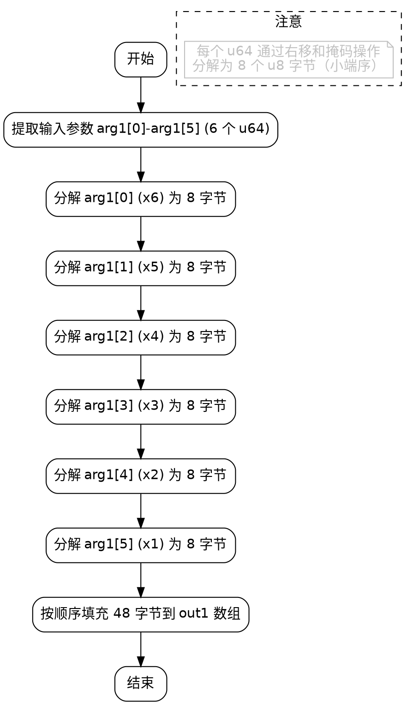

好的，我现在需要帮用户把提供的Zig语言函数转换成一个Graphviz的流程图。首先，我需要仔细阅读并理解这个函数的功能和结构。

这个函数名为toBytes，接收一个长度为48的u8数组指针out1和一个包含6个u64元素的数组arg1，返回void。看起来它的主要作用是将arg1中的6个64位整数转换为48字节的数组。每个64位整数会被分解成8个字节，所以6个整数正好是48字节，对应输出的数组长度。

接下来，我需要分析函数的处理步骤。函数一开始将arg1的每个元素赋值给变量x1到x6，其中x1对应arg1[5]，x6对应arg1[0]。这可能是因为字节序的问题，比如大端序或小端序的处理。例如，arg1[0]可能对应最高位或最低位，需要进一步确认。

然后，对于每个xi（比如x6到x1），函数通过右移和掩码操作提取每个字节。例如，对于x6，首先取低8位（x7 = x6 & 0xff），然后将x6右移8位得到x8，再取低8位得到x9，依此类推，直到处理完所有8个字节。每个64位整数被分解成8个字节，顺序可能是从低到高或者相反，需要观察变量的赋值顺序。

之后，这些提取出来的字节被按顺序存入out1数组中。从out1的索引0到47，依次填充x7, x9, x11,…直到x90。这里需要注意的是每个64位整数分解后的字节在输出数组中的排列顺序，这可能涉及到字节序的问题，比如是否是小端序存储。

现在，我需要将这些步骤转化为流程图。流程图通常包括开始、处理步骤、判断（如果有）、结束等节点。但在这个函数中，没有条件判断或循环，主要是顺序处理步骤。因此，流程图的结构会比较线性。

首先，流程图的开始节点是“函数开始”，然后是按顺序处理每个arg1的元素，分解为字节，最后将这些字节按顺序填入out1数组，最后结束。

可能的步骤分解如下：
1. 开始
2. 提取arg1的每个元素（x6到x1）
3. 对每个元素进行位移和掩码操作，分解成8个字节
4. 将所有分解后的字节按顺序存入out1数组
5. 结束

需要注意的是，每个64位数的分解过程是重复的，可以在流程图中用循环结构表示，但原函数中并没有使用循环，而是逐个处理，因此可能需要表示每个元素的处理步骤，或者简化为一个通用的处理块，说明每个元素分解为8字节。

另外，考虑到Graphviz的结构，每个处理步骤可以用矩形框表示，箭头表示流程方向。可能需要将分解每个64位数的过程作为子流程，或者合并成一个步骤，避免流程图过于冗长。

例如：

开始 -> 分解arg1[0]为8字节 -> 分解arg1[1]为8字节 -> ... -> 分解arg1[5]为8字节 -> 将字节按顺序存入out1 -> 结束

或者，更简洁地表示：

开始 -> 处理每个64位数为8字节 -> 组合所有字节到out1 -> 结束

但可能需要更详细的步骤，特别是每个分解操作的具体步骤。不过，由于每个分解过程类似，可以抽象为一个通用的步骤，比如“分解u64到8个u8”，重复6次，然后填充数组。

或者，考虑到每个变量的处理，可能需要更详细的节点，但这样会导致流程图非常长，包含大量重复的步骤。因此，需要找到一种平衡，既能反映代码结构，又不让图表过于复杂。

最后，确认字节存储的顺序是否正确。例如，arg1[5]对应x1，而分解后的第一个字节是x7来自x6（即arg1[0]），这说明可能函数是将arg1视为高位在前，而分解后的字节是按小端序排列，或者相反。这可能影响流程图的说明，但用户主要关心的是流程结构，而非具体的数值处理逻辑，所以可能不需要在流程图中体现这一点，除非特别要求。

综上，流程图的结构大致为线性，每个参数被分解，然后结果被存储。接下来需要用Graphviz的DOT语言来描述这个过程，使用适当的节点和边连接。
================================================
