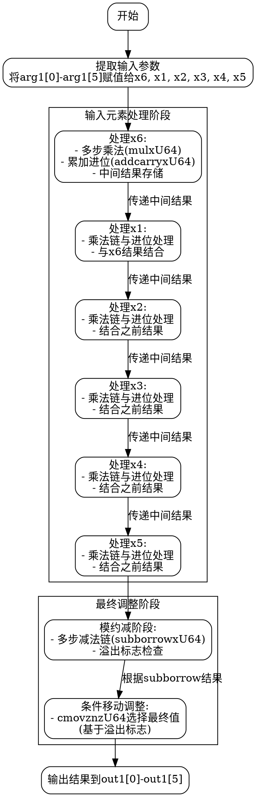

好的，我需要帮助用户将提供的Zig函数转换为流程图。首先，我需要理解这个函数的功能。看起来这个函数`toMontgomery`是将一个非蒙哥马利域的元素转换为蒙哥马利域的元素。这通常涉及到大数运算和模约减，特别是在椭圆曲线密码学中，比如P-384曲线。

接下来，我需要仔细阅读代码，识别主要的步骤和结构。函数开始于从输入参数中提取各个元素（x1到x6），然后进行一系列的乘法和加法操作，使用`mulxU64`和`addcarryxU64`函数。这些函数可能分别执行带进位的乘法和加法。接着，代码中多次出现类似的模式：乘法、累加、进位处理，然后是模约减步骤，可能使用蒙哥马利约减方法。

每个大的代码块似乎处理输入的不同部分，可能是每个输入元素（比如x1到x5）依次处理，通过乘法和加法累积结果，然后进行模运算。最后的部分（从`subborrowxU64`开始）进行减法以处理可能的溢出，并使用条件移动（`cmovznzU64`）来选择正确的结果，确保数值在正确的范围内。

为了绘制流程图，我需要将这些步骤分解为不同的节点，如开始、初始化变量、循环处理每个输入元素、乘法和加法操作、进位处理、模约减、最后的溢出检查和结果选择。需要注意的是，代码中有多个类似的块，可能表示循环或重复结构，但由于输入元素是固定的（例如x1到x5），可能需要将它们表示为顺序步骤而不是循环。

可能的流程图结构如下：
1. 开始
2. 初始化变量（从arg1中提取x1到x6）
3. 处理x6的乘法和加法，生成中间结果
4. 处理x1的乘法和加法，与之前的结果结合
5. 处理x2，同样结合之前的结果
6. 重复处理x3、x4、x5
7. 进行最终的模约减和溢出检查
8. 使用条件移动选择最终结果
9. 输出结果到out1

每个处理步骤可能包含多个乘法和加法操作，需要详细展开。但由于代码冗长且重复，可能需要抽象这些操作为一个通用的处理块，标注为“处理输入元素Xi”并说明其中的乘加步骤。

另外，最后的减法部分（subborrowxU64）和条件移动（cmovznzU64）用于处理可能的溢出，确保结果在模数范围内，这也是流程图中的一个重要分支点。

需要注意的是，代码中有大量的变量（如x7到x410），但在流程图中不需要详细标注每个变量，而是关注整体的操作流程和控制结构。例如，每次处理一个输入元素时，进行乘加操作，处理进位，然后进行模约减，最后处理溢出。

总结起来，流程图的主要步骤是：
- 初始化
- 依次处理每个输入元素（x6, x1, x2, x3, x4, x5）
- 每个元素的处理包括乘加和进位处理
- 最终的模约减和溢出调整
- 输出结果

在绘制时，可以使用矩形框表示操作，菱形表示条件判断（如最后的溢出检查），箭头表示流程方向。需要确保每个主要步骤清晰，尤其是重复处理元素的部分和最后的条件选择。
================================================
