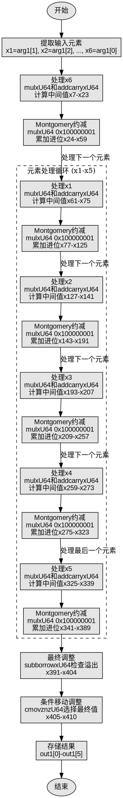

好的，我需要帮助用户分析他们提供的Zig代码，并生成对应的流程图。用户特别强调要用Graphviz而不是Mermaid，所以我得确保正确使用Graphviz的语法。

首先，我需要理解这段代码的功能。看起来这是一个将非Montgomery域的元素转换为Montgomery域的函数，可能用于椭圆曲线加密中的P-384曲线。函数名为`toMontgomery`，接受两个参数：输出`out1`和输入`arg1`。代码中有大量的乘法、加法以及进位处理，这可能是在进行大数运算，特别是模约减。

接下来，我需要确定代码的结构。函数开始时定义了多个变量（x1到x6），然后进行了一系列的乘法和加法运算，使用了`mulxU64`和`addcarryxU64`等函数，这些可能是处理64位无符号整数的乘法和带进位的加法。之后，多次出现类似的模式：乘法、累加、进位处理，最后是条件减法（`subborrowxU64`）和条件移动（`cmovznzU64`），这通常用于处理模运算中的溢出情况，确保结果在正确的域内。

为了绘制流程图，我需要将代码分解为主要的步骤：

1. **初始化**：提取输入参数的各个部分（x1到x6）。
2. **乘法与累加**：对每个输入部分进行乘法运算，并处理进位。
3. **Montgomery约减**：通过一系列的乘法和模运算，将结果转换到Montgomery域。
4. **最终调整**：使用条件减法处理可能的溢出，确保结果正确。
5. **输出结果**：将最终结果存储到输出数组。

每个主要步骤可以细分为更详细的操作，比如每个输入元素的处理循环，进位传递，以及最后的条件判断。需要注意的是，代码中有多个循环结构，尤其是对x1到x5的处理，每个元素都经历了类似的乘法和累加步骤。

在绘制Graphviz流程图时，我应该使用不同的节点表示不同的操作类型，例如矩形表示处理步骤，菱形表示条件判断，箭头表示流程方向。需要特别注意循环和条件分支的结构，确保流程图的逻辑正确。

可能的节点包括：

- 开始节点
- 提取输入元素
- 乘法运算（mulxU64）
- 进位处理（addcarryxU64）
- Montgomery约减步骤
- 条件减法（subborrowxU64）
- 条件移动（cmovznzU64）
- 结束节点

连接这些节点时，需要根据代码的执行顺序和条件跳转来安排箭头。例如，每次处理完一个输入元素后，进入下一个元素的处理，最后进行条件调整并输出结果。

需要注意的是，代码中有大量的变量和中间步骤，可能需要在流程图中简化表示，避免过于复杂。例如，可以将重复的乘法累加步骤合并为一个子过程，多次调用，而不是详细展开每一步。

最后，生成Graphviz代码时，要确保语法正确，使用正确的节点和边定义，可能使用子图来分组相关的操作步骤，提高可读性。
================================================
