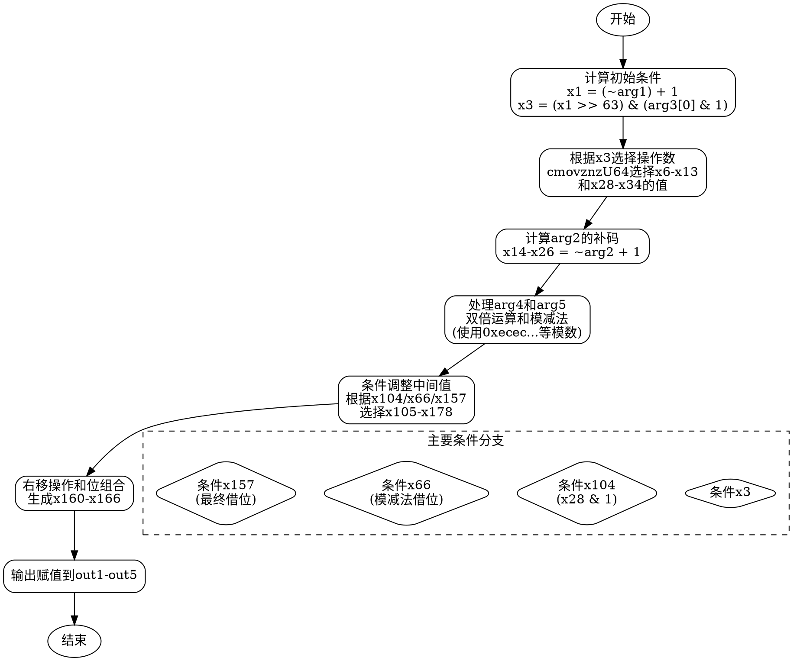

好的，我现在需要帮用户分析一个用Zig编写的函数，并生成对应的Graphviz流程图。首先，我得先理解这个函数的功能和结构。

函数名是divstep，参数很多，包括多个输出指针和输入参数。看起来像是某种密码学相关的运算，特别是椭圆曲线的标量运算，因为文件名提到了p384曲线。divstep可能是指某种除法步骤，或者是扩展欧几里得算法中的一步，这在模逆运算中常见。

接下来，我需要通读代码，理清逻辑。函数内部有很多变量操作，包括条件移动（cmovznzU64）、进位加法（addcarryxU64）、借位减法（subborrowxU64）等。这些操作通常用于大数运算，处理多精度整数。

首先，函数开始计算x1和x2，通过addcarryxU64计算(~arg1) + 1，这相当于取arg1的二进制补码，可能用于判断arg1是否为零。x3是判断arg1的最低位和arg3[0]的最低位是否都为1？或者可能是一个条件判断，决定后续的cmovznz操作。

然后，一系列cmovznzU64根据x3的值选择不同的值，这类似于条件赋值。比如，如果x3非零，则x6取arg1，否则取x4。这部分可能是在根据某些条件切换不同的操作数。

接下来，有很多的addcarryxU64和subborrowxU64操作，处理不同的变量，并生成中间结果。然后有更多的条件移动，根据x3和后续的条件（如x104，x66，x157等）来设置不同的变量值。

在代码后半部分，处理了多个数组元素，进行加减运算，并最终将结果写入out1到out5中。最后的部分对各个输出数组进行赋值，包括移位操作（如x160是x112右移1位，并与x114左移63位组合）。

为了画流程图，我需要将整个函数的控制流分解成基本块，每个块中的操作，以及块之间的跳转条件。但由于Zig是过程式语言，没有明显的循环或条件分支结构，这里可能大部分是顺序执行，但内部的条件移动（cmovznz）会根据某些条件选择不同的值，这可能需要用条件判断的节点来表示。

不过，Graphviz的流程图通常用于控制流的可视化，而这个函数内部主要是数据流和条件赋值，没有明显的循环或分支结构。所以可能需要以操作为节点，展示数据如何流动，条件如何影响变量的选择。

可能的步骤：

1. 初始步骤：计算x1, x2, x3，确定条件。
2. 根据x3选择不同的操作数（如x6到x13，x28到x34）。
3. 进行一系列的加减运算，生成中间变量。
4. 处理arg4和arg5，可能进行模运算，因为后面出现了特定的常量如0xecec196accc52973，这可能是p384曲线的参数。
5. 后续的条件移动和加减运算，调整结果。
6. 最后将结果赋值给输出参数。

由于代码非常线性，但包含很多条件赋值，流程图可能需要将这些条件判断作为分支点，每个分支对应不同的计算路径。但由于代码中没有显式的if-else结构，而是通过cmovznz来条件选择，可能需要将这些条件作为决策节点，然后展示不同情况下的数据流。

例如，x3的条件会影响x6到x13的值，然后在后续的步骤中，这些值会被用来计算其他变量。每个cmovznz可以视为一个条件选择节点，根据某个条件选择不同的路径。

但是，将所有变量和操作都画出来会导致流程图过于复杂。可能需要简化，只关注主要的控制流和数据流，而不是每个变量的细节。

可能的流程图结构：

- 开始
- 计算初始条件（x1, x2, x3）
- 根据x3选择不同的操作数路径
- 处理arg2和arg3的补码运算
- 处理arg4和arg5的运算，包括加减和模减
- 多步的条件移动和调整
- 处理最终的输出赋值

每个主要步骤作为一个节点，用箭头表示执行顺序。条件判断（如x3, x66, x157）作为分支点，连接不同的处理路径。

需要注意的是，像cmovznz这样的条件移动操作，虽然影响变量的值，但在流程图中可能需要表示为条件分支，导致不同的计算路径。

例如，当x3为真时，选择arg1的值，否则选择另一个值。这可以画为一个判断节点，分为两个分支，分别处理不同的值选择。

但由于代码中大量的条件移动，这样的流程图会变得非常庞大。因此，可能需要抽象层次，将多个类似的条件选择合并为一个步骤，或者用注释说明。

最终，流程图可能包含以下节点：

1. 计算初始条件（x3）
2. 根据x3选择操作数（arg1或补码）
3. 计算arg2和arg3的补码
4. 处理arg4和arg5的加减运算
5. 进行模减法（使用p384的模数）
6. 根据后续条件调整中间结果
7. 处理输出数组的赋值

每个节点之间的流程是顺序的，但某些步骤内部有条件选择，可以用条件判断的菱形节点表示，然后分支到不同的处理步骤，最后合并。

不过，由于代码中没有显式的跳转，而是通过条件赋值来改变数据流，可能更适合用数据流图，展示变量之间的依赖关系，而不是控制流图。但用户要求的是流程图，可能需要折中。

总结：流程图需要展示函数的主要步骤，包括条件判断和数据处理，每个步骤按顺序连接，条件判断导致不同的数据处理路径。可能使用子图来分组相关操作，减少复杂度。
================================================
