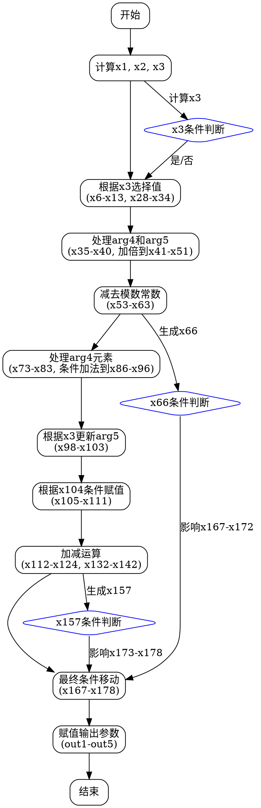

好的，我现在需要帮助用户将给定的Zig函数转换为流程图。这个函数名为divstep，参数和变量很多，看起来涉及一些密码学操作，可能是椭圆曲线相关的计算。首先，我需要理解这个函数的结构和逻辑流程，这样才能正确地绘制流程图。

首先，我会通读整个函数，看看主要的步骤是什么。函数开始于一些变量的定义，然后是一系列的addcarryxU64和cmovznzU64操作。这些函数可能是处理大整数的进位和条件移动操作。接下来有很多条件赋值和算术运算，比如加法、减法，以及位操作。

接下来，我需要识别函数中的各个步骤。例如，函数开始时计算x1和x2，使用addcarryxU64，然后根据x3的条件选择不同的值。之后，对arg2和arg3进行一系列的条件赋值，生成x7到x13。然后处理arg4和arg5，生成x35到x40。之后进行一系列的加法和减法运算，可能是在模数下进行运算，因为后面有一些与特定常数的减法操作，比如0xecec196accc52973，这可能是模数的部分。

然后，函数中有多个条件移动操作（cmovznzU64），根据不同的条件选择不同的值。这些条件可能是基于之前的进位或计算结果。之后处理arg4和arg5的相关变量，进行更多的算术运算，包括加法和带进位的减法（subborrowxU64）。

接下来，看到有很多关于x104到x111的条件赋值，之后是更多的加法、减法，以及最终的输出赋值到out1到out5的各个位置。

为了绘制流程图，我需要将整个函数的执行流程分解为主要的步骤，每个步骤代表一个操作块。可能的步骤如下：

1. 初始化变量，计算x1和x3。
2. 根据x3的条件，选择不同的值赋给x6到x13，x28到x34。
3. 处理arg4和arg5，生成x35到x40，并进行加倍操作（x41到x51）。
4. 减法运算，涉及特定常数，生成x53到x63。
5. 处理arg4的元素，生成x73到x83，并进行条件加法生成x86到x96。
6. 根据x3的条件，更新arg5的值到x98到x103。
7. 处理x104的条件，进行条件赋值到x105到x111。
8. 进行一系列的加法和减法运算，生成x112到x124，x132到x142。
9. 最后的条件移动操作，生成x167到x178。
10. 将结果赋值给输出参数out1到out5。

每个步骤之间可能有条件判断，比如根据x3、x66、x157等变量的值选择不同的路径。需要注意的是，流程图中需要包含这些条件分支，以及各个操作块之间的数据流。

可能的挑战在于处理大量的变量和复杂的条件判断，需要确保每个步骤的正确连接。此外，函数中的循环可能被展开为线性操作，因此流程图中不会有循环结构，而是顺序执行各个步骤，带有条件分支。

最后，需要确保流程图的每个节点清晰表示操作类型（如条件赋值、加减运算、位操作等），并用箭头连接表示执行顺序和条件分支。
================================================
要使用Graphviz绘制该函数的流程图，可以按照以下步骤进行：

### 说明：
1. **流程结构**：图表采用自上而下的布局，按代码执行顺序排列关键步骤。
2. **核心操作**：
   - **条件选择**（cmovznz）：根据`x3`、`x66`、`x157`等标志位选择不同值。
   - **大数运算**：通过`addcarryxU64`和`subborrowxU64`处理进位/借位。
   - **模约减**：与固定常数（如`0xecec196accc52973`）的减法操作暗示模运算。
3. **关键分支**：
   - `x3`控制初始参数选择（arg2/arg3和arg4/arg5）。
   - `x66`和`x157`决定最终结果的路径选择。
4. **输出阶段**：最终结果通过位操作（右移/掩码）重组后写入输出参数。

### 生成方式：
1. 将上述代码保存为`.dot`文件。
2. 使用Graphviz工具（如`dot -Tpng flow.dot -o flow.png`）生成图像。
3. 实际实现时可根据细节需要添加更多子步骤和条件分支。