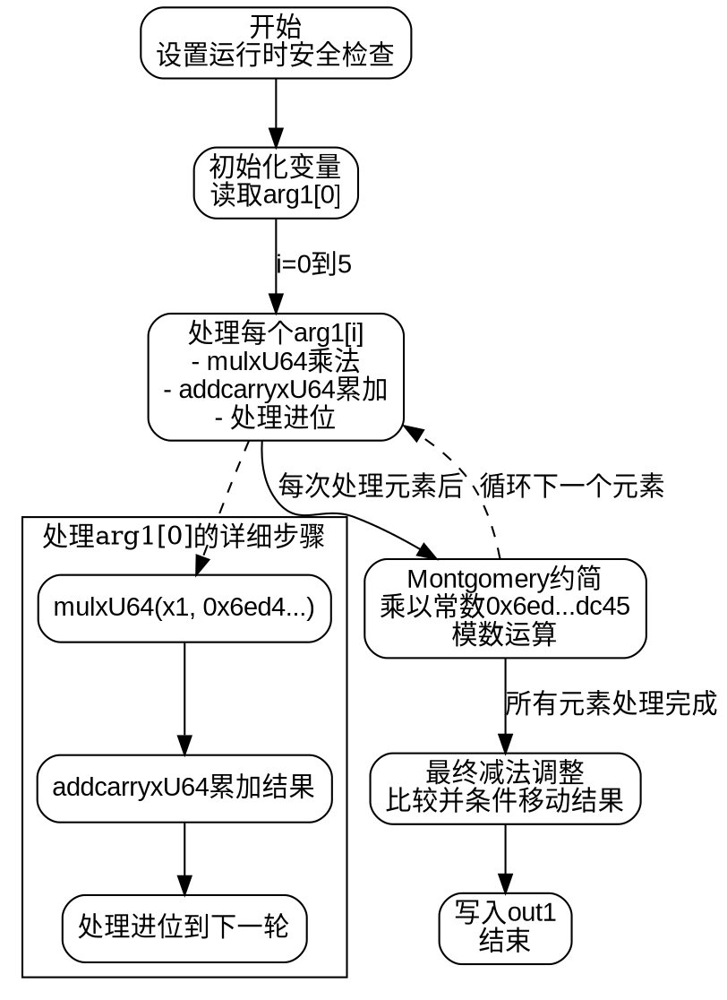

好的，我现在需要帮助用户将提供的Zig代码转换为流程图。首先，我需要仔细阅读并理解这段代码的功能。看起来这是一个从Montgomery域转换到非Montgomery域的函数，用于椭圆曲线加密中的P-384曲线标量运算。

首先，函数名为`fromMontgomery`，接受两个参数：一个指向非Montgomery域元素的指针`out1`和一个Montgomery域元素`arg1`。函数的主要目标是将`arg1`从Montgomery表示转换为常规表示，并将结果存储在`out1`中。

接下来，我需要分析代码的结构。代码中多次使用了`mulxU64`和`addcarryxU64`等函数，这些可能是处理大整数乘法和带进位的加法操作。代码中有大量的变量定义和操作，看起来像是在进行一系列的乘法、加法，以及模数运算，可能是在进行Montgomery约简的步骤。

由于代码中存在多个相似的块，比如处理不同的数组元素（arg1[0], arg1[1], ..., arg1[5]），每个块都进行类似的乘法和累加操作，这可能对应于处理大整数的每个64位部分。每个块之后，进行一系列的加法操作，并处理进位，最后进行减法操作和条件移动（cmovznzU64），这可能是在进行最终的模数调整，确保结果在正确的范围内。

为了绘制流程图，我需要将代码分解为几个主要步骤：

1. **初始化**：获取输入参数，设置运行时安全检查。
2. **处理每个输入元素**：对于每个arg1[i]，进行乘法、累加、处理进位。
3. **模数约简**：在每次处理完一个元素后，可能进行模数运算，使用预定义的常数（如0x6ed46089e88fdc45等）。
4. **最终调整**：通过减法检查是否结果超过模数，若超过则进行调整，使用条件移动指令确保结果正确。

每个步骤中的循环或重复结构需要被识别出来。例如，处理arg1[0]到arg1[5]可能构成一个循环，但由于代码是展开的，可能需要分别表示每个处理块。

可能的挑战在于处理大量的中间变量和进位标志，需要确保流程图中能清晰地表达这些操作之间的关系。此外，条件移动和最后的减法调整需要正确的分支表示。

在绘制流程图时，可以采用以下结构：

- 开始节点：函数开始，设置调试模式。
- 处理每个输入元素的块，每个块包含乘法、加法、进位处理。
- 模数约简步骤，使用特定的常数进行乘法和调整。
- 最后的条件调整，判断是否需要减去模数，并选择正确的值输出。
- 结束节点：将结果写入out1数组。

需要确保每个操作块之间的数据流清晰，特别是进位如何传递到下一步骤。可能使用子流程图来表示重复的操作模式，以减少复杂性。

总结来说，流程图需要展示从输入处理、逐位运算、进位传递、模数约简到最终调整的整个过程，每个步骤之间的逻辑关系和数据流动需要明确标注。
================================================
要绘制该函数的流程图，可以将其分解为以下关键步骤，使用Graphviz进行可视化。流程图展示了从Montgomery域到非Montgomery域的转换过程，包含乘法、累加、进位处理和最终的模数调整。

### 流程图说明：
1. **开始**：设置调试模式并初始化。
2. **逐元素处理**：
   - 对`arg1`的每个元素（0到5）进行乘法（`mulxU64`）和带进位加法（`addcarryxU64`）。
   - 每次乘法后累加结果，并传递进位到下一步。
3. **Montgomery约简**：
   - 使用常数`0x6ed46089e88fdc45`进行乘法，并结合模数`0xffffffffffffffff`等进行约简。
4. **最终调整**：
   - 通过减法检查结果是否超过模数，若超过则用条件移动（`cmovznzU64`）修正。
5. **结束**：将最终结果写入`out1`数组。

流程图清晰地展示了数据流和关键操作，特别突出了循环处理每个元素和最终的模数调整逻辑。