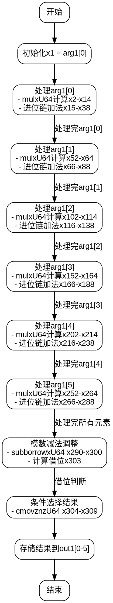

好的，我现在需要帮用户将提供的Zig函数转换为Graphviz的流程图。首先，我得仔细阅读这段代码，理解它的结构和流程。

这个函数名为fromMontgomery，看起来是处理椭圆曲线P-384的标量域转换，从Montgomery域转换到非Montgomery域。函数内部有很多的变量操作，尤其是使用mulxU64和addcarryxU64这样的函数，这可能涉及到大数运算和模约减。

首先，我需要理清函数的主要步骤。函数开始于从arg1[0]取值，进行一系列的乘法和加法运算，每次处理一个元素，直到处理完arg1的所有元素（共有6个，因为P-384的标量域可能用6个64位整数表示）。然后，在最后部分，有一系列的subborrowxU64操作，可能是进行模减法，最后使用cmovznzU64来条件选择结果。

接下来，流程图的结构需要反映这些步骤。可能的步骤包括：

1. 初始化变量，比如x1 = arg1[0]。
2. 循环或重复处理每个输入元素（arg1[0]到arg1[5]），每个元素处理过程中涉及乘法、进位加法等操作。
3. 每个处理阶段可能包含多个mulxU64和addcarryxU64调用，生成中间变量。
4. 处理完所有元素后，进行减法操作（subborrowxU64）来调整结果，确保在模数范围内。
5. 最后，使用条件移动指令（cmovznzU64）选择正确的结果，存入out1数组。

需要注意的是，代码中有多个相似的块，可能是处理每个输入元素的循环展开。例如，处理arg1[1]到arg1[5]的部分可能结构相似，但变量名不同。因此，在流程图中，可以将这些视为重复的结构，用循环或重复的节点表示。

另外，每个处理块的结构大致如下：
- 从arg1[i]取值
- 进行乘法运算（mulxU64）
- 一系列的进位加法（addcarryxU64）
- 更新中间变量，传递到下一阶段

最后的减法部分用于模约减，判断是否需要减去模数，如果结果大于模数则进行减法。cmovznzU64根据借位标志选择是否使用减法后的值。

因此，流程图的大致结构可能分为初始化、处理每个输入元素的阶段、最后的模减法处理，以及结果存储。每个阶段内部需要详细展示关键操作，如乘法和进位处理，但为了简化，可能需要将重复的部分合并表示。

需要特别注意，代码中的变量如x2, x3等是局部变量，流程图中需要标明这些变量的生成和传递过程。但Graphviz可能无法处理过多的节点，所以可能需要抽象这些步骤，用高级的步骤描述，比如“处理arg1[i]的乘法运算”、“处理进位链”等。

最后，确保流程图中的控制流正确，包括可能的条件分支（比如最后的subborrowxU64后的条件选择）。
================================================
