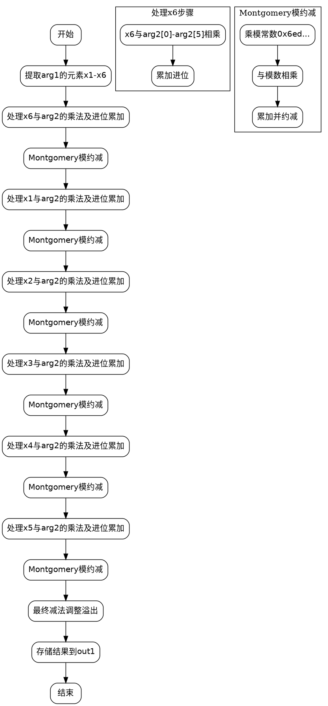

嗯，我现在需要分析这个用Zig编写的函数，并画出它的流程图。这个函数看起来是一个椭圆曲线加密中的乘法运算，特别是针对P-384曲线的标量乘法。首先，我需要理解这个函数的整体结构，然后分解各个步骤，最后用Graphviz来绘制流程图。

首先，函数名为mul，接受三个参数：out1是一个指向MontgomeryDomainFieldElement的指针，arg1和arg2都是MontgomeryDomainFieldElement类型的参数。函数内部有很多变量定义和操作，看起来像是进行大数运算，特别是64位的无符号整数操作。里面有很多mulxU64和addcarryxU64的调用，这些应该是处理乘法和进位加法操作的函数。

接下来，我需要理清函数的流程。首先，函数从arg1中提取元素x1到x6，其中x6是arg1的第一个元素，而x1到x5是后续的元素。这可能是因为Montgomery域中的元素存储顺序问题。然后，使用mulxU64进行一系列的乘法操作，将x6与arg2的各个元素相乘，生成中间结果x7到x18。

之后，使用addcarryxU64进行进位加法，将各个乘法的结果累加起来，得到x19到x29。接下来，又进行一系列的乘法和加法操作，可能与模约减有关，因为出现了0x6ed46089e88fdc45这样的常数，这可能是Montgomery乘法中的常数。

接下来的部分似乎是对每个arg1的元素（x1到x5）进行类似的处理，每次处理都包括乘法、加法、进位处理，以及模约减的步骤。每次处理完一个元素后，都会更新中间变量，最终通过cmovznzU64进行条件移动，处理可能的减法溢出，最后将结果存储在out1中。

绘制流程图的话，应该分为几个主要部分：

1. 初始化：从arg1中提取x1到x6。
2. 处理第一个元素x6与arg2的乘法，累加进位。
3. 进行模约减操作，使用特定的常数。
4. 对每个后续的x1到x5元素重复类似的操作：乘法、累加、模约减。
5. 最后的减法处理，确保结果在模数范围内。
6. 使用条件移动指令将结果存入out1。

每个步骤之间会有循环结构，特别是处理x1到x5的部分，可能需要循环展开。但由于代码是手动展开的，流程图中的每个处理块会对应代码中的一个段落。

需要注意的是，每个乘法步骤之后都会有进位加法和模约减，这可能形成一个循环模式。此外，最后的减法步骤是为了处理可能的溢出，确保结果正确。

现在，我需要将这些步骤转化为Graphviz的节点和边。节点表示操作步骤，边表示流程的走向。可能需要使用子图来分组不同的处理阶段，比如初始化、每个元素处理、模约减、最终调整等。

可能的节点包括：

- 提取arg1的元素
- 计算x6与arg2的乘积
- 累加进位
- 应用Montgomery约减
- 处理x1到x5的每个元素
- 最后的溢出检查和结果存储

边将按照代码的执行顺序连接这些节点。对于处理x1到x5的部分，每个元素处理的结构相似，可以在流程图中表示为重复的块，但具体代码中每个元素都是单独处理的，所以可能需要五个独立的处理块。

最后，需要处理减法步骤，根据是否有借位来决定最终的输出值，使用cmovznzU64函数进行条件移动。

总结下来，流程图的大致结构是：

初始化 → 处理x6 → 模约减 → 处理x1 → 模约减 → ... → 处理x5 → 模约减 → 最终减法调整 → 存储结果。

每个处理xi的块内部结构相似，包括乘法、累加进位、模约减步骤。

现在，我需要将这些步骤用Graphviz的语法表示出来，可能需要使用矩形节点表示操作，菱形节点表示条件判断，箭头表示流程方向。不过由于代码中没有显式的条件循环，而是展开的处理步骤，所以可能主要是顺序结构，每个处理阶段按顺序连接。
================================================

这个流程图展示了函数的主要步骤，从初始化参数到处理每个元素（x6到x5），每次处理后进行Montgomery模约减，最后进行溢出调整并存储结果。每个处理块内部包含乘法、进位累加和模约减操作。