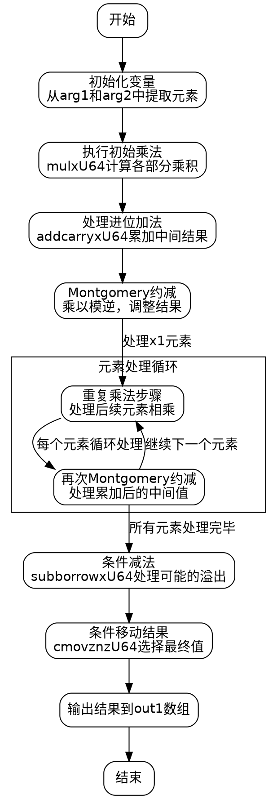

好的，我现在需要为这个用Zig编写的mul函数绘制一个流程图，使用Graphviz。首先，我需要理解这个函数的功能和结构。看起来这是一个处理椭圆曲线密码学中P-384曲线的标量乘法函数，特别是Montgomery域中的元素相乘。函数名是mul，参数是两个MontgomeryDomainFieldElement类型的输入参数arg1和arg2，以及一个输出参数out1。

首先，我需要通读代码，理清其逻辑结构。函数内部有很多变量定义和操作，涉及大量的乘法、加法以及进位处理。代码中使用了mulxU64和addcarryxU64这样的函数，应该是处理64位无符号整数的乘法和带进位的加法。每个步骤可能对应着大数运算中的各个阶段，比如逐位相乘、累加进位，以及模约减等步骤。

接下来，函数的结构大致可以分为几个部分：
1. 初始的乘法操作，处理输入参数的各个元素相乘。
2. 中间结果的累加和进位处理。
3. 模约减步骤，可能使用了Montgomery约减。
4. 最后的条件减法，以确保结果在模数的范围内。

我需要将这些步骤分解为流程图中的各个节点，并确定它们之间的控制流和数据流。例如，初始的乘法部分可能涉及多个并行的乘法操作，随后是进位传递，接着是模约减的步骤，最后是条件判断和结果输出。

注意到代码中有多个循环展开的部分，比如对arg1的每个元素（从x1到x5，以及x6即arg1[0]）与arg2的各个元素相乘。每个乘法步骤之后，都会进行进位处理，这可能对应于大整数乘法的分解步骤。

在绘制流程图时，可能需要将每个主要的计算步骤作为一个节点，比如各个乘法阶段、进位处理、模约减步骤，以及最后的条件移动操作。此外，流程中的分支（如进位判断）需要用条件节点表示。

需要注意的是，Graphviz使用DOT语言来描述图表，因此需要正确使用节点、边和子图来组织复杂的流程。可能需要将整个流程分解为几个主要块，如初始化、乘法循环、进位累加、模约减、条件减法等。

此外，代码末尾的cmovznzU64函数可能对应于条件移动操作，根据之前的进位或借位情况选择结果值。这在流程图中应表现为条件判断后的不同路径。

在分析过程中，可能会遇到变量名如x1到x473，这些变量代表中间计算结果，但可能难以直接对应到流程图中的节点。因此，流程图应关注操作的步骤，而不是具体的变量名。例如，处理每个元素的乘法、处理进位、执行模约减的乘法与加法步骤，最后的减法判断等。

最后，需要确保流程图的逻辑正确，覆盖所有可能的执行路径，包括进位传递的不同情况和最后的条件选择。
================================================
