嗯，我现在需要给这个Zig语言写的函数画一个流程图。首先，这个函数是做什么的呢？看起来像是处理椭圆曲线密码学中的P-384曲线的标量平方运算。函数名是square，参数是Montgomery域的元素。

首先，我需要理解整个函数的流程。函数开始的时候，从arg1数组中取出各个元素，比如x1到x6，然后进行一系列的乘法操作，mulxU64可能是指双字乘法，得到高位和低位的结果。然后有很多addcarryxU64，这些应该是带进位的加法。接着，有一些常数的乘法，比如0x6ed46089e88fdc45，这可能是在进行Montgomery约简的操作，因为P-384曲线的参数可能会用到这些常数。

接下来，函数重复了几次类似的操作模式：对每个输入元素（x1到x5）进行乘法，然后进行进位加法，再进行Montgomery约简。每次处理一个元素，然后累积结果。最后部分有subborrowxU64和cmovznzU64，这可能是在做模约减，确保结果在模数的范围内。

流程图应该分为几个主要部分：初始化、乘法步骤、进位处理、Montgomery约简、循环处理每个输入元素，最后的模减和结果存储。

可能的结构：

1. 初始化，提取输入元素。
2. 对每个元素进行乘法和累加，处理进位。
3. 进行Montgomery约简步骤，使用特定的常数。
4. 重复上述步骤，处理下一个输入元素。
5. 最后的减法处理，确保结果在模数范围内。
6. 使用条件移动指令（cmovznzU64）来选择正确的值，避免负结果。

需要注意各个步骤之间的依赖关系，尤其是进位和借位的传递。每个乘法步骤可能生成新的中间结果，然后这些结果被后续的加法或约简步骤使用。

画图的时候应该用不同的节点表示各个操作步骤，比如乘法、加法、约简、循环处理等。箭头表示流程的方向，条件判断可能需要分支。不过这个函数看起来是线性的处理，没有明显的条件循环，但可能有基于进位的连续操作。

可能需要将每个主要的处理块（如处理x6、x1、x2等）作为不同的流程块，并展示它们如何连接。同时，Montgomery约简的步骤可能需要详细展开，展示其中的乘法和加法步骤。

最后的部分是减法处理，根据借位来决定是否替换结果，这里可能需要一个条件判断节点，然后输出最终结果到out1数组。

总结流程图的结构：

开始 -> 初始化变量 -> 处理第一个元素（x6）的乘法与加法 -> Montgomery约简 -> 处理下一个元素（x1）的乘法与加法 -> 再次约简 -> 重复直到所有元素处理完毕 -> 最后的减法处理 -> 条件选择结果 -> 输出到out1。
================================================

```dot
digraph flowchart {
    node [shape=rectangle, style="rounded", fontname="Helvetica", fillcolor="#E5E5E5", color="#333333"];
    edge [color="#666666", arrowsize=0.8];

    start [label="开始", shape=ellipse, fillcolor="#4CAF50", color="#2E7D32"];
    init [label="初始化变量\n从arg1中提取x1-x6"];
    process_x6 [label="处理x6:\n- 多精度乘法\n- 进位累加"];
    montgomery_reduce_1 [label="Montgomery约简:\n- 特殊常数乘法\n- 模运算优化"];
    process_x1 [label="处理x1:\n- 多精度乘法\n- 进位累加"];
    montgomery_reduce_2 [label="Montgomery约简"];
    process_x2 [label="处理x2:\n- 多精度乘法\n- 进位累加"];
    montgomery_reduce_3 [label="Montgomery约简"];
    process_x3 [label="处理x3:\n- 多精度乘法\n- 进位累加"];
    montgomery_reduce_4 [label="Montgomery约简"];
    process_x4 [label="处理x4:\n- 多精度乘法\n- 进位累加"];
    montgomery_reduce_5 [label="Montgomery约简"];
    process_x5 [label="处理x5:\n- 多精度乘法\n- 进位累加"];
    final_reduce [label="最终约简:\n- 借位减法\n- 条件选择结果"];
    output [label="存储结果到out1数组", shape=box3d];
    end [label="结束", shape=ellipse, fillcolor="#FF5252", color="#B71C1C"];

    start -> init;
    init -> process_x6;
    process_x6 -> montgomery_reduce_1;
    montgomery_reduce_1 -> process_x1;
    process_x1 -> montgomery_reduce_2;
    montgomery_reduce_2 -> process_x2;
    process_x2 -> montgomery_reduce_3;
    montgomery_reduce_3 -> process_x3;
    process_x3 -> montgomery_reduce_4;
    montgomery_reduce_4 -> process_x4;
    process_x4 -> montgomery_reduce_5;
    montgomery_reduce_5 -> process_x5;
    process_x5 -> final_reduce;
    final_reduce -> output;
    output -> end;

    // 隐式循环结构表示
    edge [style=invis];
    montgomery_reduce_5 -> process_x5 [weight=10];
}
```
