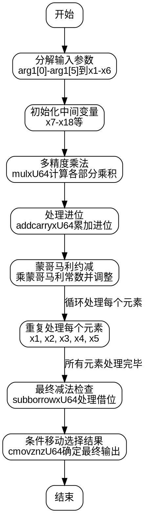

嗯，我现在需要为一个用 Zig 语言编写的函数绘制流程图，这个函数是 P-384 曲线的标量平方运算。首先，我得理解这个函数的结构和逻辑。函数名为 square，接受两个参数：out1 和 arg1，都是 MontgomeryDomainFieldElement 类型。看起来这是一个蒙哥马利域的平方运算。

首先，我注意到函数内部有很多变量定义，比如 x1 到 x473，这些变量都是用于中间计算的。函数一开始从 arg1 中取出各个元素，例如 x1 = arg1[1]，直到 x6 = arg1[0]。接着使用 mulxU64 进行乘法操作，并处理进位。然后有很多 addcarryxU64 调用，这些可能是处理带进位的加法。

接下来，函数中多次出现对 mulxU64 的调用，并且有一些魔数，比如 0x6ed46089e88fdc45，这可能是蒙哥马利约减的常数。之后还有一系列的乘法和加法操作，最后有一些条件移动指令 cmovznzU64，用于处理可能的减法借位，确保结果在模数范围内。

要画流程图的话，我需要理清函数的主要步骤。大致来说，平方运算可能分为以下步骤：
1. 输入参数的分解和初始化。
2. 多精度乘法运算，生成中间结果。
3. 蒙哥马利约减，将中间结果转换为蒙哥马利域。
4. 处理进位和借位，确保数值正确。
5. 最后的条件移动，选择正确的输出值。

不过，具体的流程图需要更详细的分析。比如，函数中每个部分的循环或分支在哪里？虽然看起来这个函数是线性执行的，没有明显的循环或条件分支（除了最后的条件移动），但可能有多个阶段，如乘法阶段、约减阶段、累加阶段等。

可能的流程图节点包括：
- 初始化变量，分解输入。
- 执行多精度乘法（mulxU64）并处理进位。
- 应用蒙哥马利常数进行乘法，调整中间结果。
- 多次迭代处理每个输入元素（如x1到x5），每次迭代可能包括类似的乘法、加法和约减步骤。
- 最后的减法检查，使用cmovznzU64选择是否需要调整结果。

需要注意的是，每次处理输入的不同部分（比如x1到x5）时，可能重复类似的结构。每个元素的处理可能形成一个子流程，比如处理x1，然后是x2，直到x5。每个子流程可能包括乘法、加法、进位处理、蒙哥马利约减步骤。

另外，最后的减法部分可能是为了确保结果小于模数，通过条件移动来选择是否使用减法后的值或原值。

因此，流程图的大致结构可能是：
开始 → 分解输入 → 初始化中间变量 → 对每个输入元素执行乘法与加法 → 蒙哥马利约减 → 处理进位 → 重复直到所有元素处理完毕 → 最后的减法检查 → 条件移动确定输出 → 结束。

需要确认每个步骤之间的连接，特别是循环或迭代部分。不过由于代码是展开的（没有显式循环），可能每个处理步骤都是顺序执行的，每个元素（如x1到x5）都有自己的处理块。

另外，每个乘法操作后的进位处理（addcarryxU64）和随后的蒙哥马利乘法和调整步骤是关键部分。流程图需要展示这些步骤的顺序和依赖关系。

可能还需要注意，代码中的变量如x7到x473是在不同阶段生成的中间值，这些变量之间的数据流需要被正确表示。但由于流程图是高级的，可能不需要每个变量都画出，而是关注主要操作块。

总结，流程图的主要步骤可能包括：
1. 输入分解和初始化。
2. 多精度乘法生成中间积。
3. 应用蒙哥马利常数进行约减。
4. 累加中间结果并处理进位。
5. 对所有输入元素重复步骤2-4。
6. 最终结果调整，条件选择输出。

现在，我需要将这些步骤转化为Graphviz的节点和边，注意顺序和可能的循环结构。由于代码是线性展开的，每个元素处理都是独立的块，可能用顺序节点表示。
================================================

该流程图展示了函数的主要流程：
1. **输入分解**：将输入的6个64位元素分解到临时变量。
2. **乘法与进位处理**：通过多精度乘法和进位累加计算中间结果。
3. **蒙哥马利约减**：通过乘特定常数将结果转换到蒙哥马利域。
4. **循环处理**：对每个输入元素重复上述步骤（展开为顺序操作）。
5. **最终调整**：通过借位检查和条件移动确保结果在模数范围内。