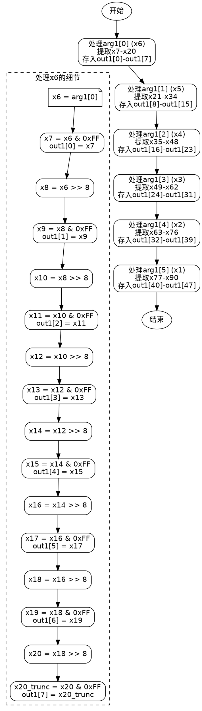

好的，我现在需要为这个Zig函数绘制一个流程图。首先，我需要理解这个函数的功能。函数名为toBytes，接受一个长度为48的字节数组指针和一个包含6个u64元素的数组作为参数，返回void。看起来这个函数的目的是将6个64位的无符号整数（总共384位）转换为一个48字节的数组。因为每个字节是8位，所以48字节正好是384位，所以这应该是一个将大整数（比如加密中的标量）序列化为字节数组的过程。

接下来，我需要详细阅读代码，理解每一步的操作。代码中首先将arg1数组中的元素从x6到x1分别赋值给x1到x6变量。这里可能是一个笔误，因为arg1[5]赋值给x1，arg1[4]给x2，依此类推，直到arg1[0]给x6。这可能是因为在序列化时需要考虑字节序的问题，比如大端序或小端序。比如，如果arg1数组中的元素是按高位到低位排列的，那么arg1[5]是最高位的64位，而arg1[0]是最低位的。在转换为字节数组时，可能需要将每个u64拆分为8个字节，并按一定的顺序排列。

然后，对于每个x变量（比如x6到x1），代码进行了多次右移和截断操作，提取每个字节。例如，x6被处理为x7到x20，每个步骤提取一个字节，并将剩下的部分继续右移。每个u64有64位，即8个字节，所以每个u64会被拆分成8个u8。例如，x6的处理：

x7是x6的最低8位（0xff掩码），然后x8是x6右移8位后的结果。接着x9是x8的低8位，以此类推，直到处理完整个64位。这样，每个u64会被分解为8个连续的字节，然后这些字节会被按顺序存入out1数组中。

现在的问题是，如何将这些操作转化为流程图。流程图应该展示函数的执行流程，包括变量赋值、位操作以及如何将结果存入out1数组。

可能的步骤是：

1. 函数开始。
2. 将arg1的各个元素赋值给x1到x6（注意顺序可能颠倒）。
3. 对每个x变量进行位操作，分解为多个字节。
4. 将分解后的字节按顺序存入out1数组的相应位置。
5. 函数结束。

需要注意的是，每个x变量（x6到x1）的处理是独立的，可以并行处理，但流程图可能需要按代码的顺序展示。此外，每个变量的处理步骤类似，都是多次右移和截断，所以可以抽象成一个循环结构，但代码中并没有使用循环，而是展开处理，因此流程图可能需要重复这些步骤。

但问题在于，代码中每个u64的处理是手动展开的，没有循环，因此流程图可能会显得冗长，但必须准确反映代码的结构。例如，处理x6的部分会有多个步骤，每个步骤提取一个字节，然后将剩余部分右移，直到处理完所有8个字节。

另外，关于字节的顺序，需要确定out1数组的填充顺序。例如，x6对应arg1[0]，那么x6分解出来的第一个字节x7会被放在out1[0]，接下来是x9到x20，然后处理x5（arg1[1]）得到x21到x34，放在接下来的8个位置，依此类推。这样，整个out1数组是按每个u64的低位到高位排列，还是相反？比如，对于x6，分解后的x7是低8位，x9是接下来的8位，直到x20是最高8位。所以每个u64分解后的字节是按小端序排列，而整个数组的顺序则取决于arg1的顺序。

但根据变量赋值，arg1[5]被赋给x1，arg1[4]给x2，直到arg1[0]给x6。然后处理x6到x1的顺序，分解后的字节依次存入out1数组，可能意味着out1数组是先将arg1[0]分解为8字节（从out1[0]到out1[7]），然后是arg1[1]分解到out1[8]到out1[15]，依此类推，直到arg1[5]分解到最后的8字节（out1[40]到out1[47]）。这样的话，整个字节数组是按原始u64数组的顺序排列，每个u64内部是按小端序存储（因为先处理低8位，放在前面）。

接下来，绘制流程图时，可能需要为每个u64的处理绘制一个子流程，然后将它们组合起来。例如：

函数开始
|
处理x6（arg1[0]）得到x7到x20，存入out1[0]到out1[7]
|
处理x5（arg1[1]）得到x21到x34，存入out1[8]到out1[15]
|
处理x4（arg1[2]）得到x35到x48，存入out1[16]到out1[23]
|
处理x3（arg1[3]）得到x49到x62，存入out1[24]到out1[31]
|
处理x2（arg1[4]）得到x63到x76，存入out1[32]到out1[39]
|
处理x1（arg1[5]）得到x77到x90，存入out1[40]到out1[47]
|
函数结束

每个处理步骤内部是类似的，比如对于x6的处理：

开始处理x6
|
x7 = x6 & 0xff → out1[0]
|
x8 = x6 >> 8
|
x9 = x8 & 0xff → out1[1]
|
x10 = x8 >>8
|
x11 = x10 &0xff → out1[2]
|
...直到x20存入out1[7]

但由于代码中的处理是线性的，每个步骤都是顺序执行，所以流程图中的每个u64处理部分需要展开这些步骤。

不过，这样的流程图会非常长，包含很多重复的步骤。为了简化，可以使用子流程或循环结构，但代码本身没有循环，所以可能需要如实反映每个步骤。

不过，考虑到代码的结构，每个u64的处理都是独立的，可以将其视为六个主要块，每个块处理一个u64，然后将结果存入对应的out1位置。每个块内部处理该u64的8个字节，每个字节的提取和存储步骤。

因此，流程图的大致结构是：

开始
|
处理arg1[0]（x6）到out1[0-7]
|
处理arg1[1]（x5）到out1[8-15]
|
处理arg1[2]（x4）到out1[16-23]
|
处理arg1[3]（x3）到out1[24-31]
|
处理arg1[4]（x2）到out1[32-39]
|
处理arg1[5]（x1）到out1[40-47]
|
结束

每个处理块内部的结构相同，可以表示为：

处理u64变量（例如x6）
|
提取第0字节 → out1[i]
|
右移8位，提取第1字节 → out1[i+1]
|
...重复直到第7字节 → out1[i+7]

因此，整个流程图将包含六个这样的处理块，每个块对应一个u64元素，并按顺序填充out1数组的不同部分。

最后，需要确认每个处理块中的字节顺序是否正确，以及out1数组的索引是否正确。例如，第一个块处理x6（arg1[0]）并将结果放在out1[0]到out1[7]，第二个块处理x5（arg1[1]）放在out1[8]到out1[15]，依此类推，每个块处理一个u64，生成8个字节，所以每个块的起始索引是前一个块的结束索引+1。

综上所述，流程图的结构应该是线性的，每个处理块按顺序处理每个u64，并将结果按顺序存入out1数组的相应位置。每个处理块内部展开8次提取字节的操作，每次提取后存储到对应的索引。
================================================

该流程图展示了以下逻辑：

1. **主流程**为线性结构，按顺序处理6个u64元素（arg1[0]到arg1[5]），每个元素生成8字节并填充到`out1`的对应位置。
2. **子流程**（以arg1[0]为例）详细展示了如何将单个u64拆分为8个字节：
   - 通过逐次右移和掩码操作提取每个字节。
   - 字节顺序为小端模式（低位在前，高位在后）。
3. 其他u64元素（arg1[1]到arg1[5]）的处理逻辑与arg1[0]完全一致，仅填充位置不同。