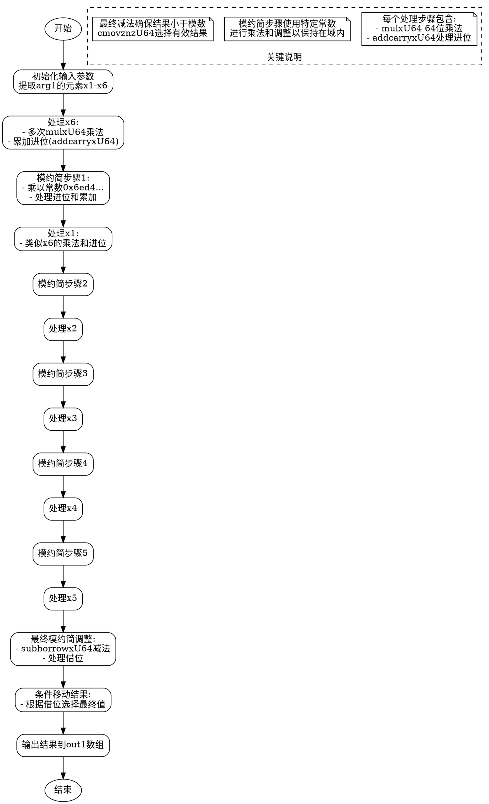

嗯，我需要帮用户画出这个Zig函数的流程图。首先，我得先理解这个函数是做什么的。看起来这是一个将非蒙哥马利域的元素转换为蒙哥马利域的函数，具体来说可能是针对P-384曲线的标量乘法操作。

首先，函数名为`toMontgomery`，参数是`out1`和`arg1`。`arg1`是非蒙哥马利域的元素，`out1`是转换后的结果。函数内部有很多变量和操作，主要是乘法、加法以及进位处理。

接下来，我需要分析代码的结构。代码中多次使用`mulxU64`进行乘法，然后进行一系列的`addcarryxU64`处理进位。每个部分似乎处理不同的位或块，可能是分步处理大数运算的各个部分。例如，开始的几个`mulxU64`可能是在进行某个常数的乘法，然后通过一系列的加法累积结果。

用户希望用Graphviz生成流程图，所以我需要将代码的逻辑结构转化为流程图中的节点和边。每个主要的操作步骤可以作为一个节点，比如乘法、加法、进位处理、条件判断等。流程图的边表示操作的顺序或条件跳转。

不过，这段代码非常长，有很多变量和步骤，手动分析每个操作可能会很繁琐。可能需要找出代码中的循环或重复模式，或者函数的主要阶段。比如，函数可能分为多个阶段：初始化、乘法阶段、累加阶段、模约简阶段、最终调整和输出阶段。

需要注意的是，代码中有多个`mulxU64`和`addcarryxU64`调用，可能对应大整数乘法的各个部分。此外，最后的部分有减法操作`subborrowxU64`和条件移动`cmovznzU64`，这可能是进行模约简后的结果调整，确保结果在正确的范围内。

为了画出流程图，我需要：

1. **确定主要步骤**：比如初始化变量、逐位乘法、累加进位、模约简处理、结果调整等。
2. **识别循环或重复结构**：是否有重复的乘法-加法模式，处理不同位数。
3. **条件分支**：比如最后的减法后根据进位标志决定是否替换结果。
4. **节点间的连接**：操作之间的顺序流程，以及条件分支导致的路径变化。

可能需要将代码分成几个大块，每个块作为一个流程图的节点，然后描述它们之间的连接。例如：

- 初始化输入参数
- 对每个输入元素进行乘法和累加
- 处理中间结果的进位
- 进行模约简乘法
- 处理模约简后的结果
- 最终调整并输出结果

每个大块内部可能有多个子步骤，但为了流程图的可读性，可能需要合并成较大的节点，或者用子图表示。

在Graphviz中，可以使用不同的节点形状表示不同的操作类型，例如矩形表示处理步骤，菱形表示条件判断，平行四边形表示输入/输出等。

由于代码非常长且复杂，可能需要简化表示，突出主要流程，而不是每一个变量操作。否则，流程图会过于庞大，难以阅读。

可能的流程图结构：

1. **开始**节点
2. **处理第一个输入元素（x6）**：进行多次乘法，累加进位
3. **模约简步骤（乘以特定常数）**：再次乘法和处理进位
4. **处理后续输入元素（x1, x2, x3, x4, x5）**：每个元素重复类似步骤
5. **最终模约简调整**：使用subborrowxU64进行减法，处理可能的借位
6. **条件移动结果**：根据借位标志选择正确的结果
7. **输出结果**到out1数组
8. **结束**节点

每个处理输入元素的步骤可能结构相似，可以视为循环或重复结构，但在流程图中可能需要展开或用注释说明。

需要注意的是，实际代码中对每个输入元素（x6, x1, x2, x3, x4, x5）都进行了类似的处理，这可能对应于大整数的各个部分，按顺序处理每个部分，并进行进位传播。

最后，在生成Graphviz代码时，需要定义各个节点，并用有向边连接它们，表示执行顺序。对于条件判断（如subborrowxU64后的cmovznzU64），需要根据条件标志决定路径。

总结，流程图的大致步骤为：初始化→逐个处理输入元素→模约简→调整结果→输出。每个处理元素的部分包含乘法和进位处理，模约简部分涉及额外的乘法和减法调整。
================================================
要使用Graphviz绘制该函数的流程图，可以按照以下步骤组织节点和边。由于代码较长且复杂，流程图将简化主要步骤，突出关键操作和流程。

### 流程图说明：
1. **初始化**：提取输入参数`arg1`的各个元素（x1-x6）。
2. **处理每个元素**（x6, x1, x2, x3, x4, x5）：
   - 使用`mulxU64`进行64位乘法。
   - 通过`addcarryxU64`处理进位，累加中间结果。
3. **模约简步骤**：在每次处理元素后，使用特定常数（如`0x6ed46089e88fdc45`）进行乘法，确保结果仍在蒙哥马利域内。
4. **最终调整**：
   - 使用`subborrowxU64`进行减法操作，确保结果小于模数。
   - 通过`cmovznzU64`根据借位标志选择最终结果。
5. **输出**：将调整后的结果写入`out1`数组。

该流程图简化了重复的乘法和进位处理步骤，突出了主要阶段和关键操作，便于理解整体逻辑。