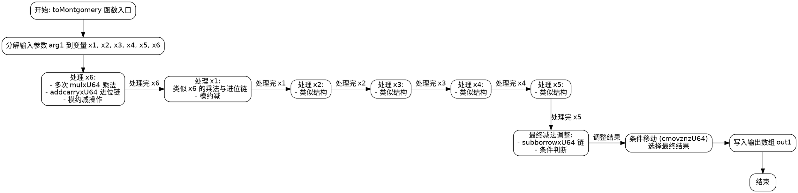

好的，我需要为这个用 Zig 写的函数绘制流程图。首先，我得理解这个函数的功能。看起来这是一个将非蒙哥马利域场元素转换为蒙哥马利域的函数。函数名是 toMontgomery，接受输出参数 out1 和输入参数 arg1。

接下来，我需要逐行分析代码，理清控制流。代码中有大量的变量声明和数学运算，尤其是 mulxU64 和 addcarryxU64 这样的操作，可能涉及到大数运算或模乘。由于代码结构中有多个步骤，每个步骤可能对应流程图中的一个节点。

首先，函数开始部分将输入参数 arg1 的各个元素赋值给 x1 到 x6。然后进行一系列的乘法和加法操作，使用 mulxU64 进行乘法并处理进位。每个乘法步骤可能生成两个结果（高位和低位），然后通过 addcarryxU64 处理进位相加。

观察代码，每个乘法后的加法操作形成一个链条，可能对应流程中的顺序步骤。例如，第一次对 x6 的乘法操作后，有一系列的加法处理进位，然后进行模约减（可能涉及到 Montgomery 约简），接着处理下一个输入元素（x1、x2等），重复类似的步骤。

对于每个输入元素（x1到x5），代码似乎重复了类似的操作模式：乘法、处理进位、模约减。最后，在处理完所有输入元素后，进行减法操作（subborrowxU64）和条件移动（cmovznzU64），以确定最终的输出值是否需要进行调整。

绘制流程图时，可能需要将整个函数分解为几个主要阶段：

1. 初始化：将输入参数分解为各个变量。
2. 处理每个输入元素（x6, x1, x2, x3, x4, x5）的乘法与加法链。
3. 每个元素处理后的模约减步骤。
4. 最终的减法调整和条件选择输出。

需要注意的是，由于代码中存在大量的变量和操作，流程图可能会非常复杂。因此，可能需要将重复的模式抽象成子流程，例如每个输入元素的处理流程可以视为一个子模块，而模约减也是一个重复使用的子流程。

另外，条件移动（cmovznzU64）和最后的减法部分需要判断是否需要调整结果，这在流程图中应体现为条件分支。

总结步骤：

1. 开始：函数入口。
2. 分解输入参数到变量 x1-x6。
3. 对每个变量（x6, x1, x2, x3, x4, x5）进行处理：
   a. 进行多次乘法运算。
   b. 处理进位链。
   c. 执行模约减（可能涉及乘法、加法链）。
4. 处理完所有变量后，进行最终的减法调整。
5. 根据条件选择最终结果。
6. 将结果写入输出数组。
7. 结束。

在绘制时，每个主要步骤用矩形框表示，条件判断用菱形，箭头表示流程方向。重复的部分可以用循环结构或子程序框表示，但由于代码是线性的展开，可能需要将每个元素的处理步骤逐一画出。

需要注意，代码中的每个元素处理步骤结构相似，但具体操作不同，因此流程图中的每个处理块可能包含相似的子结构，但参数不同。例如，处理x6和x1的步骤结构相同，但使用的变量和常量不同。

最后，确保流程图准确反映代码的逻辑，包括所有的数学运算、进位处理、条件判断和结果存储。可能需要多次检查代码逻辑，确保流程图的每个节点和分支都正确对应代码的操作。
================================================
