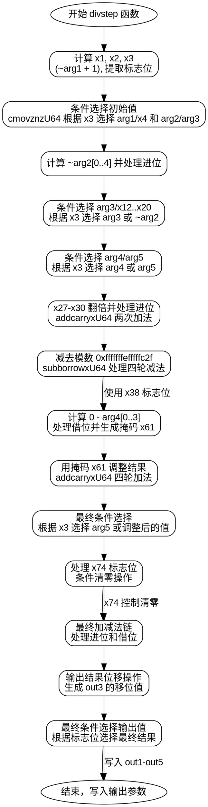

好的，我现在需要帮用户将提供的Zig函数转换为Graphviz的流程图。首先，我需要理解这个函数的结构和逻辑。函数名为divstep，参数包括多个输出指针和输入参数。看起来这个函数可能涉及某种加密算法，比如椭圆曲线secp256k1的操作，可能是模逆运算或类似的分步骤计算。

首先，我需要分析函数的控制流。函数内部有很多变量声明和操作，特别是使用了addcarryxU64和cmovznzU64这样的函数，这些可能是处理带进位加减和条件移动的操作。变量名如x1, x2, ..., x126说明有大量中间计算步骤，可能涉及位操作和条件判断。

接下来，我需要确定如何将这些操作转化为流程图的基本块。流程图通常由开始、结束、处理步骤、条件判断和箭头组成。由于Zig函数中没有明显的循环或复杂条件分支（除了基于x3, x74等变量的条件移动），可能需要将每个主要操作步骤视为一个处理节点，条件移动操作为条件判断节点。

可能的步骤分解：
1. 初始变量计算，如x1到x3。
2. 根据x3的条件选择不同值，使用cmovznzU64函数。
3. 一系列的加法、减法和进位处理。
4. 中间结果的调整，如与常量0xfffffffefffffc2f进行减法操作，这可能是模数的处理。
5. 最后将结果赋值给输出参数。

需要注意，函数中有多个条件移动操作，这些可能对应于条件判断分支。例如，当x3为真或假时，选择不同的值。在流程图中，这可能需要用判断节点来表示。

由于变量非常多，流程可能会很复杂。为了简化，可以将相似的操作合并为一个步骤，例如多个addcarryxU64连续操作可以视为一个处理块，特别是当它们处理连续的数组元素时。

此外，函数的输出部分将结果写入多个数组，这可以作为流程图的结束节点，分不同的输出路径。

可能的挑战是如何处理大量的变量和操作，同时保持流程图的可读性。可能需要分层或分块表示，将复杂操作分组，并用子图来管理。

总结步骤：
1. 确定函数的入口和出口。
2. 分解函数内的主要操作块。
3. 识别条件判断点（如cmovznzU64调用处）。
4. 将连续的无条件操作合并为处理节点。
5. 用箭头连接各节点，表示控制流。
6. 使用注释或标签解释关键操作，特别是涉及常量和模数的地方。

需要确保流程图清晰展示函数的逻辑流程，即使细节较多，也要保持结构合理。
================================================
