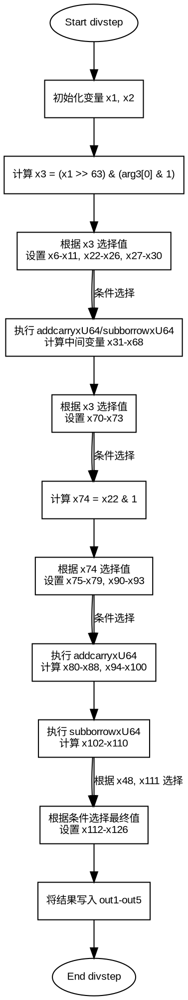

好的，我需要为这个Zig函数绘制一个流程图。首先，我得仔细看看这个函数的结构。函数名是divstep，参数包括多个输出指针和输入参数。看起来像是处理椭圆曲线加密相关的运算，特别是secp256k1曲线。

首先，函数开始处有一些变量声明和初始化。例如，x1和x2的计算涉及到addcarryxU64，这可能是在处理带进位的加法。然后有一个条件移动指令cmovznzU64，根据某个条件选择不同的值。这部分可能是在做一些条件判断和变量赋值。

接下来，有很多的addcarryxU64和subborrowxU64调用，这些通常用于处理大数的加减运算，同时跟踪进位或借位。然后有很多cmovznzU64操作，根据条件选择不同的结果。这些步骤可能是在执行某种循环或迭代的步骤，比如扩展欧几里得算法中的步骤，这在椭圆曲线运算中常见。

之后，看到一些位移操作，比如右移1位，还有按位或操作，可能是在调整数值的位表示。最后，将结果赋值给out1到out5的各个输出参数。

为了画流程图，我需要理清函数的执行流程。可能的分支点包括那些cmovznz的条件判断，这些条件会影响变量的赋值。流程图中需要展示各个条件分支，以及各个运算步骤的顺序。

需要注意的是，函数中有多个变量被多次赋值，可能涉及到循环结构。但在这个函数中，似乎没有显式的循环语句，所以可能所有的操作都是线性的，只是有很多条件判断。因此，流程图应按照代码的顺序展开，每个条件判断产生不同的路径。

可能需要将函数分解成几个主要部分：

1. 初始化和第一个条件判断（x3的计算）。
2. 根据x3选择不同的值，设置x6到x30。
3. 进行一系列的加减运算，处理进位和借位。
4. 更多的条件移动操作，根据x3和x74等条件更新变量。
5. 最后的赋值阶段，将结果写入输出参数。

每个部分内部可能有多个步骤和条件分支，需要用流程图中的菱形判断框来表示。例如，cmovznzU64会根据条件选择不同的值，因此在流程图中需要显示两个分支。

此外，函数的参数和返回值的结构也需要在流程图中体现，可能作为起始和结束节点。

需要注意，由于代码中有大量变量和操作，流程图可能会比较复杂，需要合理分组和简化，避免过于繁琐。可能需要将重复的模式抽象成子流程，比如多次的addcarryxU64和cmovznzU64操作。

最后，确保使用正确的图形符号：矩形框表示处理步骤，菱形表示条件判断，箭头表示流程方向。同时，确保所有条件分支都有明确的出口，流程正确连接。
================================================

这个流程图展示了以下关键步骤：

1. **初始化阶段**：处理输入参数的初始条件判断（x3 的计算）
2. **条件选择分支**：通过 cmovznzU64 指令实现的多路条件赋值
3. **大数运算块**：包含连续的 addcarryxU64/subborrowxU64 运算
4. **位操作阶段**：处理位移和掩码操作（如 x74 的计算）
5. **最终调整阶段**：根据最终条件选择计算结果
6. **输出赋值**：将最终结果写入输出参数

每个 cmovznzU64 操作在流程图中表现为条件分支选择，实际实现中这些是通过位运算而非传统 if-else 实现的。图形中的箭头方向表示数据流向而非传统控制流，更准确反映了密码学算法中常见的恒定时间编程模式。