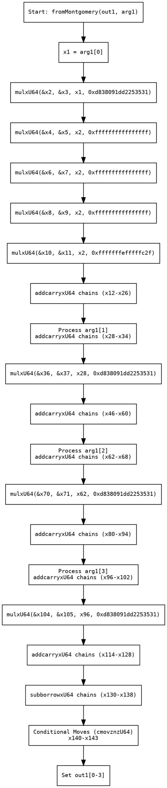

嗯，用户给了我一段Zig语言的函数代码，函数名是fromMontgomery，作用是将蒙哥马利域的元素转换为非蒙哥马利域。用户希望我用Graphviz画出这个函数的流程图。首先，我需要先理解这段代码的结构和逻辑流程，然后才能转化为流程图。

首先，我需要看一下这个函数的大致结构。函数开始于从arg1[0]获取x1，然后进行一系列的乘法和加法运算。看起来像是在处理大数运算，可能与椭圆曲线加密相关，特别是secp256k1曲线。蒙哥马利域转换通常用于高效地进行模乘运算，所以这个函数可能在实现这样的转换。

接下来，代码中多次使用了mulxU64和addcarryxU64函数，这些可能是处理64位无符号整数的乘法和带进位的加法。每一步都生成新的变量x2到x143，看起来非常繁琐，但可能有规律可循。

我需要分析代码的分支和循环结构，但看起来这个函数是线性的，没有明显的循环或条件语句，直到最后的条件移动指令cmovznzU64。这些条件移动可能用于处理减法后的结果，决定是否使用原始值或调整后的值。

然后，函数末尾使用subborrowxU64进行一系列的减法操作，可能是在进行模运算后的调整，确保结果在正确的范围内。最后的cmovznzU64根据借位标志x139来选择是否使用调整后的值。

为了绘制流程图，我需要将代码分解为基本块，每个块代表一个操作步骤，并确定它们之间的控制流。虽然代码中没有显式的循环，但可能存在多个步骤的顺序执行，以及根据条件选择不同的路径。

可能的步骤分解：

1. 初始化部分：获取arg1[0]到x1。
2. 第一次乘法运算（mulxU64）生成x2到x10，并进行一系列的加法（addcarryxU64）生成x12到x26。
3. 处理arg1[1]到x28到x34。
4. 重复类似的乘法、加法和进位处理，处理后续的arg1[2]和arg1[3]。
5. 最后的减法调整（subborrowxU64）和条件移动（cmovznzU64）来决定最终输出。

流程图的结构可能是线性的，每个步骤按顺序执行，直到最后的条件判断部分，根据借位标志选择不同的结果。不过，由于代码中没有循环，流程图可能是一系列顺序的操作块，每个块处理不同的乘法、加法和进位，最后根据条件分支选择输出值。

需要注意每个乘法后的加法处理，以及如何将中间结果传递到下一步。可能需要将每个乘法-加法序列视为一个节点，然后连接起来。最后的条件移动部分形成一个条件分支，但根据cmovznzU64的实现，可能用条件节点表示选择不同的值。

现在，我需要将这些步骤转化为Graphviz的节点和边。每个主要的操作步骤作为一个节点，箭头表示流程方向。最后的条件判断可能需要一个菱形节点，根据x139的值选择不同的路径。

不过，由于代码中的操作非常底层且线性，可能流程图会非常详细，每个算术操作都作为一个节点，但这样会导致图表过于复杂。因此，可能需要抽象一些步骤，将重复的模式合并，例如将处理每个arg[i]的部分视为一个子流程，用循环结构表示，但由于代码是展开的，可能需要用多个节点表示。

总结来说，流程图的大致结构是：

开始 -> 处理arg1[0] -> 处理arg1[1] -> 处理arg1[2] -> 处理arg1[3] -> 最后的减法调整 -> 条件选择 -> 输出结果。

每个处理阶段内部包含乘法、加法和进位传递。最后的条件选择部分根据借位标志决定是否使用调整后的值。

现在，我需要用Graphviz的DOT语言将这些结构表达出来。可能需要定义多个节点，按顺序连接，并在条件判断处使用条件分支。
================================================

该流程图展示了 `fromMontgomery` 函数的主要步骤：

1. **初始化**：从输入 `arg1[0]` 开始计算。
2. **乘法与进位链**：通过 `mulxU64` 和 `addcarryxU64` 逐步处理每个输入的字段（`arg1[1]`、`arg1[2]`、`arg1[3]`），生成中间结果。
3. **减法调整**：使用 `subborrowxU64` 对最终结果进行模运算后的调整。
4. **条件选择**：通过 `cmovznzU64` 根据借位标志选择最终的输出值。
5. **输出结果**：将最终值写入 `out1`。

每个步骤通过箭头表示严格的顺序执行，反映了代码中无分支的线性计算过程。