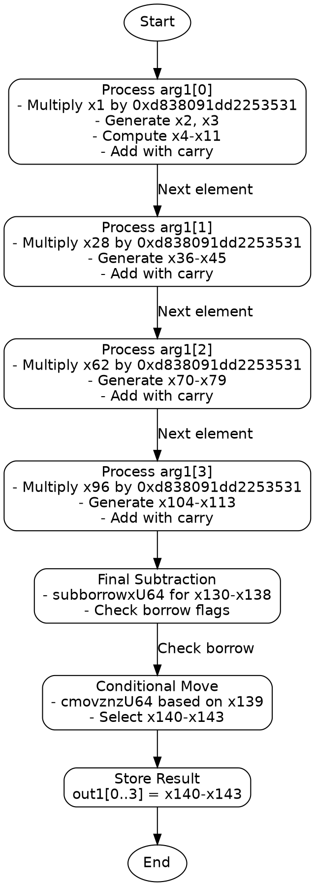

嗯，我现在需要为一个用Zig语言编写的函数绘制流程图，这个函数名为fromMontgomery，属于secp256k1曲线的实现部分。用户要求使用Graphviz来绘制，而不是Mermaid。首先，我得仔细看看这个函数的代码结构，理解它的逻辑流程，然后将其转化为流程图。

首先，函数的作用是将Montgomery域的元素转换为非Montgomery域的元素。看起来它涉及大量的64位无符号整数运算，包括乘法、加法、进位处理等。代码中有很多变量，比如x1到x143，这些变量可能代表中间计算步骤的结果。

接下来，我需要逐步分析代码的执行流程。函数开始于从输入参数arg1中取出第一个元素x1，然后进行一系列的乘法（mulxU64）和带进位的加法（addcarryxU64）。每次乘法运算的结果被存储到不同的变量中，例如x2和x3是x1与0xd838091dd2253531相乘的结果。然后，这些中间结果被用来进行更多的计算，可能涉及到模约减，因为secp256k1的素数域特性。

代码中有多个类似的块，每个块处理不同的输入元素（arg1[1], arg1[2], arg1[3]），这可能对应着四个64位元素组成的256位数。每个块似乎重复类似的步骤：乘法、生成中间变量、处理进位，然后进行累加。最后的步骤包括减法（subborrowxU64）和条件移动（cmovznzU64），可能是为了处理模运算后的结果，确保结果在正确的范围内。

为了绘制流程图，我需要识别主要的步骤和循环结构。不过，从代码中看，并没有显式的循环，而是通过展开的步骤处理每个输入元素。每个输入元素（如arg1[0], arg1[1]等）的处理可能对应流程图中的一个处理块。每个块内部包含乘法、进位加法，然后更新中间变量。之后，处理完所有四个元素后，进行减法操作来调整结果，最后使用条件移动来选择正确的结果。

流程图的大致结构可能是：

1. 开始
2. 处理arg1[0]
   a. 乘法操作
   b. 生成中间变量
   c. 处理进位加法
3. 处理arg1[1]
   a. 类似的乘法、加法步骤
4. 处理arg1[2]
5. 处理arg1[3]
6. 最后的减法调整
7. 条件移动选择结果
8. 输出结果到out1
9. 结束

需要注意的是，每个处理块的结构可能相似，因此可以表示为重复的流程节点。此外，进位和借位标志（如x13, x15等）会影响后续的操作，因此流程图中可能需要条件判断节点，但代码中使用了addcarryxU64和subborrowxU64函数，这些函数内部可能处理进位，因此可能在流程图中表示为顺序步骤，而不是显式的条件分支。

另外，最后的条件移动（cmovznzU64）根据x139的值来决定是否选择减法后的结果，这需要在流程图中表示为一个条件判断节点，根据x139的真假来选择不同的路径。

总结来说，流程图的结构是线性的处理每个输入元素，每个元素处理包含多个乘法和进位加法的步骤，最后进行减法调整和条件选择，输出最终结果。现在需要用Graphviz的DOT语言将这些步骤结构化。
================================================

该流程图展示了以下步骤：

1. 按顺序处理输入参数的4个64位元素（arg1[0]-arg1[3]）
2. 每个元素的处理包含：
   - 与常数0xd838091dd2253531的乘法操作
   - 通过mulxU64生成中间变量
   - 通过addcarryxU64处理进位加法链
3. 完成所有元素处理后：
   - 通过subborrowxU64进行最终的减法调整
   - 根据借位标志x139选择最终结果（cmovznzU64）
4. 将结果存储到输出参数out1中

每个处理块内部的具体运算（如mulxU64和addcarryxU64的级联操作）因细节较多未完全展开，但保留了关键操作节点。最终的条件移动操作体现了模约减的典型模式——"尝试减法，若结果为负则回退"。