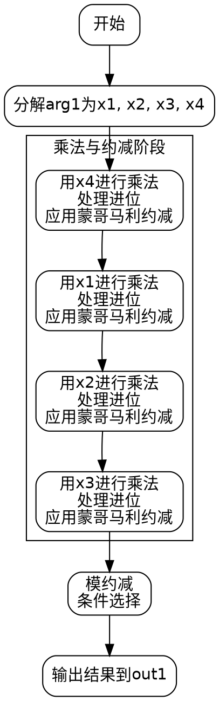

嗯，我需要为这个用Zig编写的secp256k1曲线乘法函数绘制一个流程图。首先，我得仔细看一下代码的结构，理解每个部分在做什么。这个函数叫做mul，参数是两个MontgomeryDomainFieldElement类型的参数arg1和arg2，输出是out1。看起来这是在进行蒙哥马利域下的乘法运算，用于椭圆曲线加密。

首先，函数开始时设置了一些运行时安全检查。然后，代码分解了arg1的各个元素，比如x1到x4，分别对应arg1的不同位置。接下来，使用mulxU64进行一系列的64位无符号整数乘法，并处理进位。这里可能是在进行大数的乘法运算，因为椭圆曲线参数很大，需要处理多精度运算。

之后，我看到有很多变量被定义，比如x5到x19，这可能是中间结果的存储。每次乘法之后，用addcarryxU64处理进位，这可能是在累加中间结果。然后，有一个常数0xd838091dd2253531被使用，这可能是蒙哥马利约减的常数，用于将结果转换回蒙哥马利形式。

接下来的部分重复了类似的模式：乘法、处理进位、使用蒙哥马利常数进行约减。这可能对应于处理不同的位或不同的乘法部分。例如，对x1、x2、x3分别进行类似的操作，每次处理不同的部分，并累加进位。

在代码的后半部分，有subborrowxU64函数被调用，这可能是在进行减法，用于最后的模约减，确保结果在模数范围内。之后，cmovznzU64函数根据条件选择值，这可能是在处理减法后的结果，如果结果为负，则恢复原来的值。

为了画流程图，我需要将这些步骤分解成基本块，并找出它们之间的控制流。可能的步骤包括：初始化、分解输入参数、进行多精度乘法、处理进位、应用蒙哥马利约减、重复处理每个元素的乘法部分、最后的模约减和条件选择。

需要注意循环结构，但看起来这里没有显式的循环，而是通过展开多个乘法步骤来处理每个部分。因此，流程图会有多个并行的处理路径，每个处理不同的乘法部分，然后合并结果，进行最终的调整。

可能的结构是：

1. 函数开始
2. 分解arg1到x1-x4
3. 对x4进行乘法操作，处理进位，应用蒙哥马利约减
4. 对x1进行乘法操作，处理进位，应用蒙哥马利约减
5. 对x2进行乘法操作，处理进位，应用蒙哥马利约减
6. 对x3进行乘法操作，处理进位，应用蒙哥马利约减
7. 进行模约减和条件选择
8. 输出结果到out1

每个乘法部分可能包含类似的步骤：乘法、进位处理、约减。流程图需要将这些步骤详细展开，并显示数据流的方向。此外，最后的减法部分和条件移动也需要明确表示。

在绘制时，可能需要使用子图来区分不同的乘法阶段，每个阶段处理不同的参数部分。同时，进位和中间结果需要在步骤之间传递。最后的模运算部分需要判断是否需要调整结果，这可能形成一个条件分支。

总之，流程图需要展示函数的主要步骤，包括乘法处理、进位累加、蒙哥马利约减、模运算调整，以及各步骤之间的数据依赖关系。每个大的步骤可以作为一个节点，箭头表示控制流和数据流。
================================================
