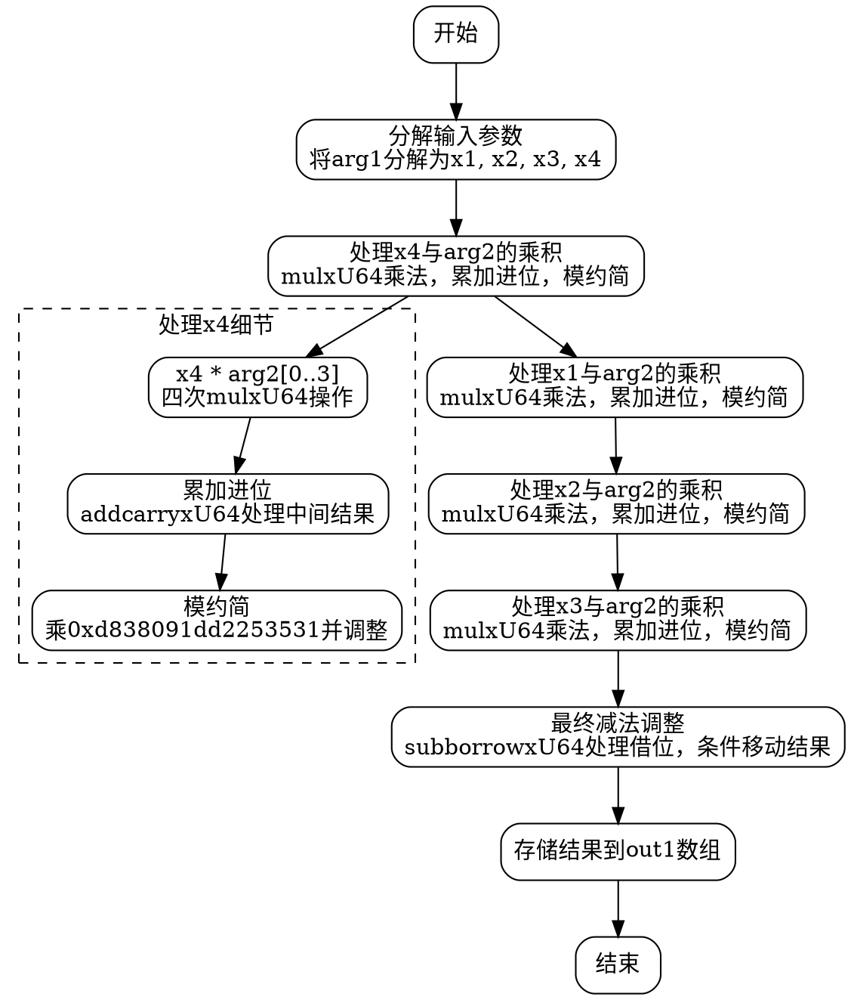

嗯，我需要为这个用Zig编写的函数绘制一个流程图。首先，我得仔细看看这段代码的结构和逻辑。函数名为mul，接受两个MontgomeryDomainFieldElement类型的参数arg1和arg2，并将结果存储在out1中。看起来这是一个椭圆曲线secp256k1上的乘法运算，使用Montgomery域来优化计算。

首先，函数内部有很多变量声明和操作，特别是使用了mulxU64、addcarryxU64、subborrowxU64等函数，这些可能是处理64位无符号整数的乘法和进位加法/借位减法的内联函数。代码中有多个部分重复类似的模式，可能是在处理大数的各个部分（比如四个64位元素组成的256位数）。

接下来，我需要理解函数的整体流程。函数可能分为几个阶段：

1. **初始化阶段**：将输入参数分解为各个部分（x1, x2, x3, x4），然后进行一系列的乘法和累加操作。
2. **乘法与累加**：多次调用mulxU64进行乘法，然后使用addcarryxU64处理进位。每个乘法步骤可能对应大数乘法的不同部分。
3. **模约简**：在每次部分乘积之后，可能会有模约简步骤，使用特定的常数（如0xfffffffefffffc2f，这是secp256k1的素数域的模数）来确保结果在正确的域内。
4. **最后的减法调整**：在计算的最后，有一系列的subborrowxU64操作，可能是为了将结果调整到模数以下，避免溢出。然后使用cmovznzU64（条件移动指令）来选择是否需要保留调整后的结果。

接下来，我需要将这些步骤转化为流程图的结构。可能的步骤如下：

- **开始**：函数入口。
- **分解输入参数**：将arg1和arg2分解为四个部分。
- **四个主要的乘法累加循环**：每个循环处理参数的一个部分，并进行乘法和进位处理，然后进行模约简。
- **处理每个部分的乘积**：每个部分（如x4, x1, x2, x3）分别与arg2的各个部分相乘，累加中间结果，并进行模约简。
- **最终的减法调整**：检查结果是否超过模数，若超过则减去模数。
- **存储结果**：将最终的四个部分存入out1数组。

需要注意的是，代码中有四个主要的部分处理x4、x1、x2、x3，每个部分的结构类似，可能对应处理大数的四个64位块。每个部分包括乘法、累加、模约简的步骤。每个这样的部分可能需要作为一个子流程在流程图中表示。

在绘制流程图时，应该使用条件判断来处理进位和借位，以及最后的模数调整。每个mulxU64和addcarryxU64可能需要表示为操作步骤，但由于代码较为底层，可能需要将整个乘法累加过程概括为一个块，而不是每个指令都单独画出。

最后，确保流程图正确反映函数的控制流，包括循环（如果有的话）和条件分支。但看起来这个函数没有显式的循环，而是展开处理每个部分，所以流程图会是线性的步骤，每个部分处理不同的参数块，然后进行模约简，最后调整结果。

总结流程图的主要步骤：

1. 分解输入参数为x1-x4。
2. 处理x4与arg2的乘积，进行累加和模约简。
3. 处理x1与arg2的乘积，累加并模约简。
4. 处理x2与arg2的乘积，累加并模约简。
5. 处理x3与arg2的乘积，累加并模约简。
6. 最后的减法调整，确保结果在模数范围内。
7. 存储结果到out1。

每个处理步骤内部可能包含乘法和进位处理的子步骤，但在流程图中可以简化为一个处理块，特别是当每个块的结构相似时。

现在需要将这些步骤转化为Graphviz的DOT语言，使用节点和边来表示流程。注意不要使用Mermaid语法，而是Graphviz的语法。
================================================

这个Graphviz流程图展示了函数的整体结构：

1. **分解输入参数**：将输入的Montgomery域元素拆分为x1-x4四个部分。
2. **四步乘法累加**：依次处理x4/x1/x2/x3与arg2的乘积，每步包含：
   - 四次64位乘法（mulxU64）
   - 进位累加（addcarryxU64）
   - Montgomery约简（乘特殊常量调整）
3. **最终调整**：通过借位减法确保结果在素数域范围内，使用条件移动选择最终值。
4. **结果存储**：将调整后的四部分存入输出数组。

每个处理步骤（如process_x4）内部的详细操作用虚线框表示，展示了乘法、进位累加和模约简三个子步骤。实际实现中四个处理块（x4/x1/x2/x3）具有相同的结构，故未全部展开。