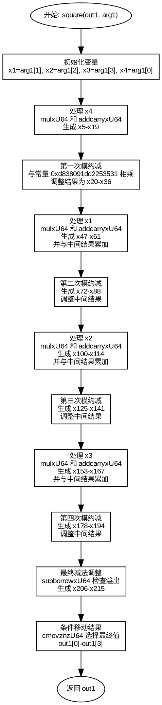

好的，我需要为这个Zig函数绘制流程图。首先，我要理解这个函数的功能。看起来这是一个用于椭圆曲线secp256k1的平方运算函数，属于Montgomery域中的元素平方。函数名为square，接受两个参数：输出out1和输入arg1，都是MontgomeryDomainFieldElement类型。

接下来，我需要仔细阅读代码，了解其结构。代码中有很多变量定义和操作，特别是mulxU64和addcarryxU64函数的使用，这些可能涉及到无符号64位整数的乘法和带进位的加法。此外，还有一些条件移动指令cmovznzU64，用于根据条件选择值。

首先，函数开始处将输入arg1的元素赋值给x1到x4。然后进行一系列的乘法和累加操作，生成中间变量x5到x19。接下来，使用乘法结果与常数0xd838091dd2253531相乘，并进行模约减操作，这可能涉及到Montgomery约减。之后，重复类似的结构处理x1、x2、x3，分别进行乘法、累加、模约减，最后进行减法操作和条件移动，得到最终的输出out1。

为了绘制流程图，我需要将代码分解成几个主要部分：

1. 初始化和变量赋值：将输入参数分解为x1到x4。
2. 第一个乘法累加阶段：处理x4与其他元素的乘法，生成中间结果。
3. 第一个模约减阶段：使用常数进行乘法并调整结果。
4. 重复处理其他元素（x1, x2, x3）：每个元素都会进行类似的乘法和模约减步骤。
5. 最后的减法调整和条件移动：确保结果在模数范围内，并存储到输出数组。

每个阶段之间通过进位和中间变量连接。流程图中需要展示这些阶段的顺序，循环或重复的结构，以及条件判断（如subborrowxU64和cmovznzU64）。

需要注意，代码中有多个重复的块，处理x1、x2、x3时结构相似，可能可以用循环表示，但在流程图中可能需要分别展开，因为具体的变量和操作不同。

最后，确定各个步骤之间的数据流向，例如乘法结果如何传递到下一步，进位如何影响后续计算，以及最终的调整步骤如何影响输出。

在绘制流程图时，使用不同的形状表示操作：矩形框表示处理步骤，菱形表示条件判断，箭头表示控制流和数据流。可能需要将复杂的算术操作简化为块，以避免图表过于繁琐。

现在，我需要将这些步骤组织成一个连贯的流程图，确保每个阶段正确连接，并准确反映代码的逻辑结构。
================================================
