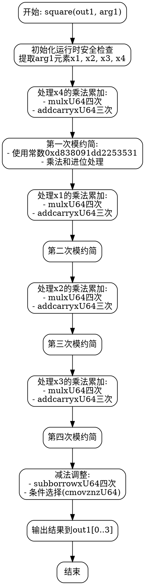

好的，我现在需要为这个用Zig语言编写的函数绘制一个流程图。首先，我得仔细阅读并理解这个函数的逻辑。这个函数名为square，属于Montgomery域中的元素平方运算，用于secp256k1曲线的64位实现。函数接收一个输出参数out1和一个输入参数arg1，都是MontgomeryDomainFieldElement类型。

首先，函数开始时设置运行时安全检查，仅在调试模式下启用。然后，函数从arg1中提取各个元素x1到x4。接下来，使用mulxU64进行一系列的乘法运算，这些运算可能是在处理大整数的乘法，并带有进位处理。每次mulxU64调用会产生两个结果，比如x5和x6。随后，使用addcarryxU64处理进位加法，将中间结果累加，并跟踪进位标志。

然后，出现了一个常量0xd838091dd2253531，这可能是模数相关的常数，用于Montgomery约简。接着进行更多的乘法和进位加法，这可能是在进行模约简步骤，将结果转换回Montgomery域的形式。每个阶段都会处理不同的位数，并更新中间变量。

接下来，函数处理了多个阶段的乘法和累加，可能对应于展开的循环结构，每次处理不同的输入元素（如x1, x2, x3）与arg1的其他部分相乘。每个阶段之后，都会进行一次模约简，使用相同的常数，并更新中间变量。最后，通过subborrowxU64和cmovznzU64处理可能的减法溢出，并根据条件选择最终的结果，存储到out1数组中。

为了绘制流程图，我需要将整个函数的逻辑步骤分解成块。流程可能包括以下几个主要部分：

1. 初始化和参数提取。
2. 第一次乘法累加阶段。
3. 第一次模约简。
4. 后续的乘法累加阶段（可能重复多次，每次处理不同的元素）。
5. 最后的减法调整和条件选择。
6. 结果输出。

每个阶段之间会有箭头表示控制流。需要注意循环结构是否存在，但根据代码结构，看起来是线性展开的，没有显式循环，因此每个步骤都是顺序执行的。

可能的错误点在于是否正确处理了进位和借位，以及模约简步骤是否正确应用。另外，条件移动指令cmovznzU64用于在减法后选择正确的结果，这一步需要正确判断是否发生了下溢。

现在需要将这个过程转化为Graphviz的DOT语言。流程图中的每个节点代表一个主要的操作步骤，边表示流程的顺序。可能需要将每个乘法、加法、模约简步骤作为不同的节点，但考虑到代码的重复结构，可以适当合并相似的步骤以提高可读性。

例如，处理x4、x1、x2、x3的部分可能有相似的结构，可以表示为四个并行的块，但实际代码中是顺序处理每个元素的乘法累加和模约简。因此，每个元素的处理会按顺序进行，形成链式结构。

最后的部分是减法调整和条件选择，确保结果在模数范围内，并将最终结果存入out1数组。

现在需要将这些步骤转化为Graphviz的节点和边，确保流程正确反映函数的执行顺序。
================================================
