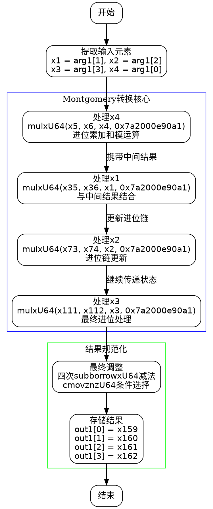

好的，我需要为这个Zig函数绘制一个流程图。首先，我会仔细阅读代码，理解它的结构和各个部分的功能。

这个函数名为`toMontgomery`，它的作用是将一个非Montgomery域的元素转换为Montgomery域的元素。从代码中可以看到，函数内部进行了多次乘法和进位操作，可能涉及大数运算或模约减。

首先，函数开始处定义了一些变量，如x1到x4，它们似乎是从输入参数`arg1`中提取的值。接着，使用`mulxU64`进行乘法运算，并处理进位。看起来这是一个多精度乘法，可能用于将输入值转换为Montgomery形式。

接下来，代码中有多个循环或重复的模式，每次处理不同的输入元素（x1, x2, x3, x4）。每次处理都包括乘法、进位处理、可能的模运算，最后将结果存储到输出变量`out1`中。

在流程图的绘制上，我需要将整个过程分解为几个主要步骤：

1. **初始化**：从输入参数中提取各个元素（x1, x2, x3, x4）。
2. **逐元素处理**：对每个元素进行乘法和进位处理，可能包括多次的乘法、进位累加和模约减。
3. **中间结果处理**：将每次处理的结果与之前的中间结果结合，处理进位和溢出。
4. **最终调整**：在最后阶段，可能进行减法操作以调整结果，确保在Montgomery域中的正确性，并使用条件移动指令（cmovznzU64）来选择正确的结果。
5. **结果输出**：将最终的四个部分（x159, x160, x161, x162）存储到输出数组`out1`中。

需要注意的是，代码中存在大量的变量和步骤，需要合理分组，避免流程图过于复杂。可以按照处理每个输入元素的阶段来分块，每个块内部展示详细的运算步骤，块之间用箭头连接表示流程顺序。

另外，条件判断（如`cmovznzU64`）部分需要特别标注，以显示根据条件选择不同值的逻辑。

最后，要确保流程图的清晰和可读性，可能需要使用子图来分组相关的操作，或者使用注释来解释某些复杂的步骤。

总结来说，流程图的大致结构可能是：

- 开始
- 提取输入元素
- 处理第一个元素（x4）
- 处理第二个元素（x1）
- 处理第三个元素（x2）
- 处理第四个元素（x3）
- 最终调整和条件选择
- 输出结果
- 结束

每个处理阶段内部包含详细的乘法和进位操作，以及可能的模约减步骤。需要将这些细节适当抽象，以保持流程图的简洁性。
================================================

该流程图通过以下结构展示算法：

1. **初始化阶段**：提取输入的4个64位元素
2. **核心转换过程**：四个并列处理模块，每个模块：
   - 执行带进位的64位乘法（mulxU64）
   - 进行多精度累加（addcarryxU64）
   - 模约减运算（与secp256k1的素数0xfffffffefffffc2f相关）
3. **最终规约阶段**：
   - 通过四次带借位的减法（subborrowxU64）进行最终模运算
   - 使用条件移动指令（cmovznzU64）选择最终结果
4. **结果输出**：将四个64位分量存入输出数组

箭头方向表示数据流和逻辑顺序，蓝色区域表示Montgomery转换的核心计算部分，绿色区域表示最终的结果规范化步骤。每个处理模块内部隐含了类似的结构：乘法→进位链更新→中间结果传递。