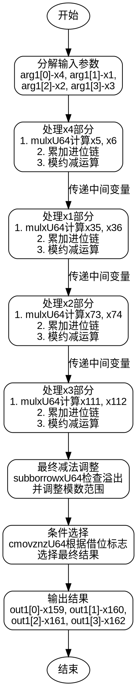

好的，我现在需要帮助用户分析一个用Zig语言编写的函数，并生成相应的流程图。用户提供的函数是`toMontgomery`，属于secp256k1曲线相关的代码。首先，我需要理解这个函数的功能和结构，然后根据代码逻辑绘制流程图。

首先，我应该通读一遍代码，了解大致的执行流程。函数`toMontgomery`接收两个参数：一个指向Montgomery域元素的指针`out1`和一个非Montgomery域元素`arg1`。函数的目的是将输入的非Montgomery域元素转换为Montgomery域元素。这通常涉及到模乘运算，因为Montgomery形式通过乘以某个常数来优化模运算。

代码中使用了大量的变量，如x1到x162，这些变量可能是在进行多精度算术运算，比如乘法、加法、进位处理等。观察到代码中频繁使用了`mulxU64`和`addcarryxU64`函数，这些可能是处理64位无符号整数的乘法和带进位的加法。此外，还有`cmovznzU64`函数，可能用于条件赋值，根据进位标志选择不同的值。

接下来，我需要分块分析代码。函数的结构似乎分为几个阶段，每个阶段处理输入的不同部分（例如x4, x1, x2, x3）。每个阶段可能对应处理输入元素的不同64位部分，并进行一系列的乘法和模约减操作。例如，第一个部分处理x4（即arg1[0]），然后是x1（arg1[1]）、x2、x3。每个部分可能都涉及乘法和模运算，以将值转换到Montgomery域。

在代码的后半部分，尤其是从变量x149开始，有多个`subborrowxU64`调用，这可能是进行模约减的最后步骤，检查结果是否超过模数，并进行必要的减法调整。最后，使用`cmovznzU64`根据条件选择最终的值，确保结果在正确的范围内。

接下来，绘制流程图时，需要将代码的结构分解成不同的步骤。可能的步骤包括：

1. 初始化变量和分解输入参数。
2. 对输入的每个部分（如x4, x1, x2, x3）进行乘法和累加操作。
3. 处理每个部分的模约减，使用乘法和进位链。
4. 最后的减法调整，确保结果在模数范围内。
5. 条件移动以选择正确的值作为输出。

每个阶段可能包含循环或重复的结构，特别是处理每个输入部分时的类似操作。需要注意各变量之间的依赖关系，以及进位和借位如何影响后续的操作。

在绘制流程图时，应使用graphviz的节点和边来表示各个操作步骤，比如乘法、加法、条件判断等。每个大的代码块可以作为一个节点，例如处理第一个输入部分x4的过程，然后依次处理x1、x2、x3。每个处理阶段可能包括多个乘法和进位处理步骤，然后进行模约减。最后的减法调整和条件选择作为单独的节点。

需要注意的是，代码中有大量的中间变量和状态传递，比如进位标志（x8, x20等），这些在流程图中可能需要表示为边的条件或状态转移。不过，为了保持流程图的清晰，可能需要简化这些细节，只展示主要的操作流程，而不是每一个变量的处理。

另外，函数末尾的条件移动（cmovznzU64）可能对应于根据之前的借位情况选择最终结果，这在流程图中应表现为条件判断节点，根据条件选择不同的路径。

总结来说，流程图的大致结构可能如下：

- 开始
- 分解输入参数到x4, x1, x2, x3
- 处理x4部分：乘法、累加、模约减
- 处理x1部分：类似步骤
- 处理x2部分：类似步骤
- 处理x3部分：类似步骤
- 最后的减法调整
- 条件判断，选择正确的结果
- 输出结果到out1
- 结束

每个处理阶段内部可能包含多个乘法和进位处理的子步骤，但为了简洁，可能在流程图中将这些子步骤合并为一个节点，标注为“乘法及进位处理”等。

最后，确保流程图正确反映了代码的控制流，尤其是条件判断和循环结构（如果有的话）。不过，根据代码结构，似乎每个输入部分的处理是线性的，没有显式的循环，因此流程图可能呈现为顺序结构，每个部分依次处理，最后进行条件调整。
================================================
使用Graphviz绘制该函数的流程图如下：

### 流程图说明：
1. **开始** -> **分解输入参数**：将输入的`arg1`拆分为四个64位变量（x4, x1, x2, x3）。
2. **处理x4-x3部分**：依次对每个输入部分执行：
   - `mulxU64`进行乘法运算
   - `addcarryxU64`处理进位链
   - 通过模乘和累加实现**Montgomery约减**
3. **最终减法调整**：通过`subborrowxU64`检查结果是否超过模数`0xfffffffefffffc2f`，必要时进行减法调整。
4. **条件选择**：根据借位标志（`x158`），用`cmovznzU64`选择调整后的值或原始值。
5. **输出结果**：将最终结果写入`out1`数组，完成转换。

流程图清晰地展示了**多精度算术运算**和**Montgomery约减**的分层处理过程。每个阶段的进位链和模乘操作被抽象为单一节点以提高可读性。