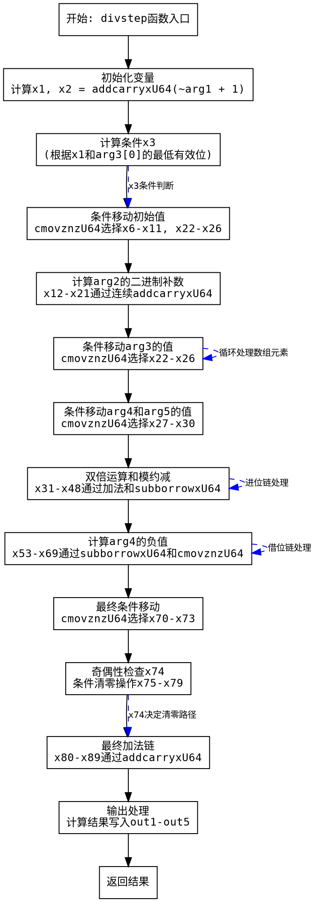

好的，我需要为这个用Zig编写的函数绘制一个流程图。首先，我得仔细看看这个函数的结构和逻辑。函数名为divstep，参数很多，包括多个输出指针和各种输入数组。看起来这个函数可能涉及一些椭圆曲线密码学中的运算，特别是secp256k1曲线的标量运算。

首先，我需要理清函数的执行流程。函数开始处有一些变量声明，接着是@setRuntimeSafety的设置，可能用于调试模式下的安全检查。然后看到一系列的addcarryxU64和cmovznzU64操作，这些可能是处理大整数的进位和条件移动操作。

接下来，注意到有很多变量x1到x126，这说明函数内部有很多中间步骤和计算。我需要识别主要的控制流结构，比如条件判断、循环等。不过从代码中看，可能没有显式的循环，而是通过条件移动（cmovznzU64）来处理不同的情况。

然后，函数末尾对输出参数进行赋值，将计算得到的各种x变量赋给out1到out5。这说明流程图的结束部分是将结果写入输出参数。

为了绘制流程图，我需要将整个函数分解成几个主要步骤：

1. 初始化步骤：处理输入参数，计算初始值，比如x1到x6的赋值。
2. 条件判断和变量选择：使用cmovznzU64根据条件选择不同的值，这部分可能有多个分支。
3. 中间计算：包括加法、减法、位移操作，处理进位和借位。
4. 结果处理和输出：将最终结果赋值给输出参数。

需要注意的是，函数中有很多位操作和条件移动，这可能涉及到算法的特定步骤，比如模逆运算或者某种迭代算法。由于这是secp256k1曲线相关的代码，可能涉及到扩展欧几里得算法或其变种，如二进制GCD或者divstep算法。

接下来，我需要确定每个部分的条件和操作之间的关系。例如，变量x3可能是一个条件标志，用于后续的条件移动操作。然后根据x3的值，选择不同的参数进行计算。

在处理进位和借位时，函数使用了addcarryxU64和subborrowxU64，这些函数可能会影响后续的操作流程。例如，x32、x34等变量可能代表进位标志，影响下一个加法或减法的执行。

由于流程图的复杂性，可能需要将每个主要操作块表示为流程图中的节点，并根据条件判断连接这些节点。例如，初始计算后，根据x3的值选择不同的路径，然后处理相应的算术运算，最后汇总结果。

需要注意的是，由于代码中没有显式的循环结构，可能所有的操作都是线性的，但带有条件分支。因此，流程图会有多个分支，根据不同的条件选择不同的计算路径。

最后，在绘制流程图时，需要确保每个步骤和条件判断都被正确表示，并使用合适的图形符号，如矩形框表示处理步骤，菱形表示条件判断，箭头表示流程方向。

总结一下，流程图的步骤可能包括：

- 初始化和参数处理
- 计算初始条件（如x3）
- 根据条件选择变量（cmovznzU64）
- 执行算术运算（加法、减法、位移）
- 处理进位和借位
- 最终结果赋值

每个步骤之间通过条件判断连接，形成不同的执行路径。需要详细分析每个变量的依赖关系和控制流，以确保流程图准确反映代码逻辑。
================================================
