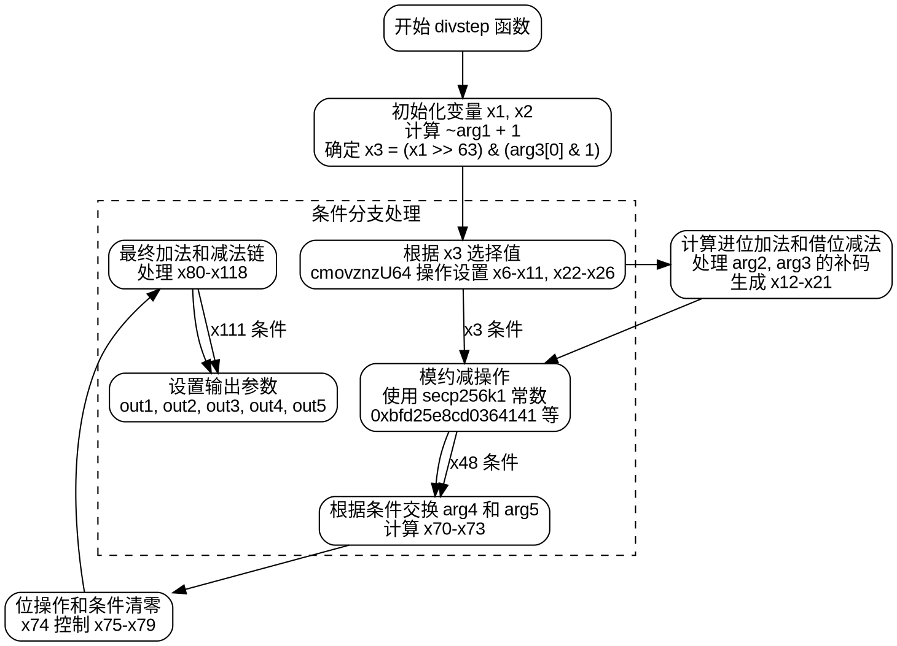

嗯，这个函数看起来有点复杂。首先，我需要理解它的功能。函数名是divstep，可能是用于椭圆曲线secp256k1的标量运算中的除法步骤。输入参数包括多个数组和u64类型的变量，输出参数有五个，分别是out1到out5。

首先，我会从函数的第一部分开始分析。变量x1和x2被定义为undefined，然后调用addcarryxU64函数，参数是0x0，~arg1，和0x1。这可能是在计算arg1的补码或者某种位操作。接着，x3是通过截断x1右移63位的结果和arg3[0]的最低位进行按位与操作得到的。这似乎是在检查某些条件。

然后，有多个cmovznzU64的调用，根据x3的值选择不同的值。这可能是在实现条件移动操作，类似于三元运算符。接下来，有一系列的addcarryxU64和subborrowxU64调用，这些通常用于处理大整数的加减运算，考虑进位和借位。

中间部分有一些常量的出现，比如0xbfd25e8cd0364141和0xbaaedce6af48a03b，这些可能与secp256k1曲线的参数有关。函数中还涉及大量的变量赋值和条件判断，需要跟踪每个变量的用途。

在流程图的绘制上，首先应该确定函数的主要分支。函数中有多个条件判断，比如x3和x74，这些会导致不同的执行路径。每个条件判断后的cmovznzU64操作会影响后续变量的值。因此，流程图需要反映这些条件分支和变量的变化。

另外，函数末尾对输出参数进行了赋值，out1到out5分别被赋予不同的计算结果。需要确定每个输出参数对应的变量是如何计算的，以及它们之间的依赖关系。

可能的流程包括：

1. 初始化和参数处理。
2. 计算x1到x3，确定条件分支。
3. 根据x3选择不同的操作路径，进行变量赋值。
4. 处理大整数的加减运算，考虑进位和借位。
5. 根据中间条件（如x48、x111）调整最终结果。
6. 将结果赋值给输出参数。

在绘制流程图时，需要将这些步骤分解为不同的节点，并用箭头表示控制流和数据流。条件判断会导致分支，如x3为0或1时的不同处理。每个主要的计算部分应作为一个处理框，变量赋值和条件移动操作用不同的形状表示。

需要特别注意循环结构，但在这个函数中没有明显的循环，主要是顺序执行和条件分支。因此，流程图应该是一个有多个条件分支的顺序结构，每个分支处理不同的计算路径，最终汇总到输出部分。

最后，确保所有输出参数都被正确赋值，并理解每个步骤在椭圆曲线运算中的作用，以确保流程图的准确性。
================================================
