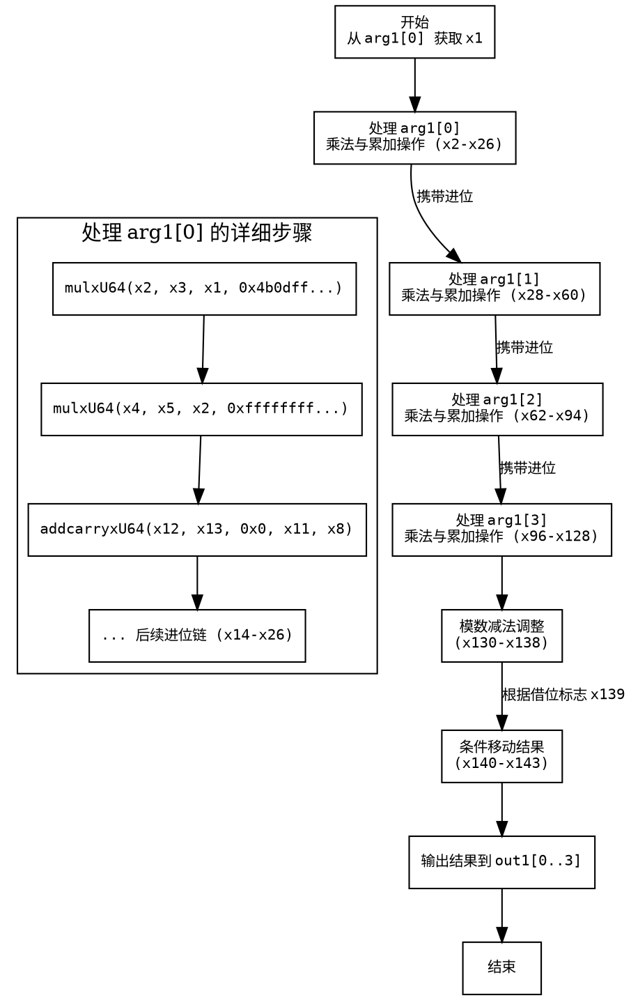

好的，我现在要尝试理解这个Zig函数，并画出它的流程图。首先，这个函数名为fromMontgomery，看起来是将一个蒙哥马利域的元素转换为非蒙哥马利域的域元素。函数接受两个参数：out1是一个指向非蒙哥马利域元素的指针，arg1是蒙哥马利域的元素。

首先，我需要大致了解函数的结构。看起来函数内部进行了多次乘法和加法运算，可能涉及到大数的处理，因为使用了u64类型和进位标志。代码中反复出现mulxU64和addcarryxU64，这些可能是处理64位无符号整数的乘法和带进位的加法。还有最后的subborrowxU64和cmovznzU64，用于条件移动，可能是在进行模减操作，确保结果在模数范围内。

接下来，我需要理清函数的步骤。函数开始时从arg1[0]取出x1，然后进行一系列的乘法和累加操作。每次处理arg1的不同元素（如arg1[1], arg1[2], arg1[3]）时，都会重复类似的步骤：乘法、累加、处理进位。每个阶段可能对应处理不同的位或块。

例如，第一个部分处理arg1[0]，生成中间变量x2到x26，然后处理arg1[1]时使用x28到x60，依此类推。每次处理一个输入元素后，都会更新中间结果，并将进位传递到下一步。

最后的subborrowxU64和cmovznzU64可能是在进行模数减法，以确定最终的结果是否需要调整。如果减法导致借位（x139），则使用条件移动来保持结果的有效性。

为了画出流程图，我需要将这些步骤模块化。可能的流程包括初始化、循环处理每个输入元素、乘法步骤、进位处理、最后的模数调整等。但这里的代码是展开的，没有循环，所以每个处理arg1元素的步骤都是显式重复的。

流程图的大致结构可能是：

1. 初始化，处理第一个元素arg1[0]
   - 乘法操作
   - 累加和进位处理
2. 处理arg1[1]
   - 类似的乘法、累加、进位步骤
3. 处理arg1[2]
   - 重复结构
4. 处理arg1[3]
   - 重复结构
5. 最终调整，模数减法
6. 条件移动结果到输出

每个处理步骤内部可能有多个乘法和加法步骤，需要详细展开。但由于代码较长且重复，流程图可能会显得复杂，但结构上是重复的模式。

需要注意各个步骤之间的依赖关系，比如每一步的结果作为下一步的输入。同时，最后的模数调整部分需要处理可能的借位，并选择正确的结果值。

在绘制流程图时，应该使用矩形框表示操作步骤，菱形框表示条件判断（如进位或借位），箭头表示流程方向。每个主要处理阶段（如处理每个arg1元素）可以作为一个子流程，内部展开详细的乘法和加法步骤。

可能遇到的挑战是如何简化重复的部分，使流程图不过于冗长。可以考虑将重复的模式抽象成子图，或者用注释说明重复的结构。例如，处理每个arg1[i]的部分结构相似，可以表示为循环结构，但实际代码中是展开的，因此需要分别画出每个步骤。

总之，流程图需要从函数入口开始，按代码顺序逐步展开每个操作，显示数据流和控制流，包括乘法的分解、进位的传递、最终的减法调整和条件选择。
================================================
使用 Graphviz 绘制该函数的流程图如下：

### 流程图说明：
1. **层级结构**：主流程按参数索引分阶段处理 `arg1[0]-arg1[3]`，每个阶段内部展开乘法、累加和进位操作。
2. **进位传递**：每个阶段的输出（如 `x26, x60, x94`）会携带进位到下一阶段（用虚线箭头表示数据依赖）。
3. **最终调整**：通过 `subborrowxU64` 进行模数减法，根据借位标志 `x139` 决定是否使用条件移动（`cmovznzU64`）。
4. **展开示例**：第一个处理块 `arg1[0]` 展示了详细的乘法与进位链，其他块结构类似（用注释简化表示）。

将上述代码保存为 `.dot` 文件后，可用 Graphviz 工具生成矢量图（如 SVG/PDF）。