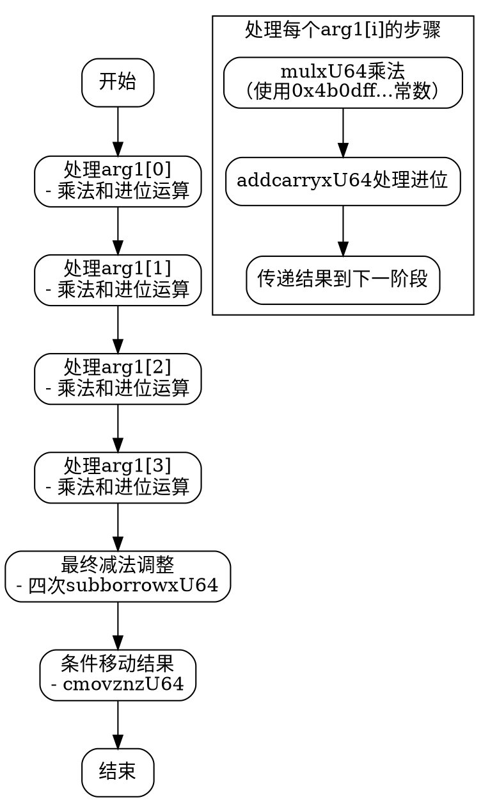

嗯，我需要为这个Zig函数绘制一个流程图。首先，我得仔细看看这个函数是做什么的。函数名是fromMontgomery，看起来像是将蒙哥马利域的元素转换为非蒙哥马利域的字段元素。这在椭圆曲线加密中很常见，特别是处理大数运算时。

函数的参数是一个输出数组out1和一个输入数组arg1。函数内部有很多变量和操作，比如mulxU64（可能是64位乘法）、addcarryxU64（带进位的加法）、subborrowxU64（带借位的减法），以及cmovznzU64（条件移动指令）。这些操作应该是在处理大数的乘法和模约减。

首先，我需要理解代码的结构。看起来函数分为几个阶段，每个阶段处理输入的不同部分。每次处理都涉及乘法、加法，然后可能进行模运算。特别是多次使用0x4b0dff665588b13f作为乘数，这可能与蒙哥马利约减的常数有关。

接下来，我需要识别代码中的循环或重复模式。例如，每次处理arg1的元素（arg1[0]、arg1[1]等）时，都会有一系列的乘法、加法，然后可能进行模运算。可能每个循环处理一个64位的块，共处理4个块（因为arg1是数组，索引到3）。

然后，要注意到最后的条件移动操作（cmovznzU64），这通常用于条件选择，可能是根据减法后的借位情况来决定是否使用减后的结果，以确保结果在模的范围内。

接下来，我需要将这些步骤转化为流程图中的节点和判断。可能的步骤包括：

1. 初始化变量，处理第一个元素arg1[0]。
2. 进行乘法和加法操作，处理进位。
3. 处理下一个元素arg1[1]，重复类似的步骤。
4. 直到处理完所有四个元素。
5. 进行最终的减法操作，检查是否需要调整结果（通过条件移动）。

每个阶段可能有多个操作，如乘法、进位处理，然后处理下一个元素。最后的减法部分可能需要判断是否有借位，从而决定是否使用调整后的值。

需要注意的是，代码中有四次主要的处理阶段（对应arg1[0]到arg1[3]），每次处理都包括乘法、进位传递，然后累加到结果中。之后进行四次减法操作，检查是否需要调整结果。

因此，流程图的结构可能是线性的处理每个输入元素，然后进入减法调整阶段，最后根据条件选择结果。

可能需要将每个处理阶段分解为子流程，特别是乘法和进位处理部分。但为了简化，可以概括每个元素处理的步骤，然后连接起来。

最后，用条件判断来决定是否使用减法后的值，从而完成整个转换过程。
================================================
要绘制`fromMontgomery`函数的流程图，可以将代码分解为以下几个主要步骤，并用Graphviz表示：

### 流程图说明：
1. **逐元素处理**：  
   函数依次处理输入`arg1`的4个元素（`arg1[0]`到`arg1[3]`）。每个元素通过：
   - `mulxU64`进行乘法（使用常数`0x4b0dff665588b13f`）。
   - `addcarryxU64`处理进位。
   - 结果传递到下一阶段。

2. **最终减法调整**：  
   完成所有元素处理后，通过四次`subborrowxU64`操作进行模约减，确保结果小于模数。

3. **条件移动**：  
   根据借位标志（`x139`），使用`cmovznzU64`选择调整后的值或原始值，确保结果正确。

### 关键点：
- **蒙哥马利约减**：通过乘法和进位链将蒙哥马利域的值转换为标准域。
- **逐块运算**：每个64位块独立处理，最后合并结果。
- **常数使用**：`0x4b0dff665588b13f`是secp256k1曲线的蒙哥马利常数。