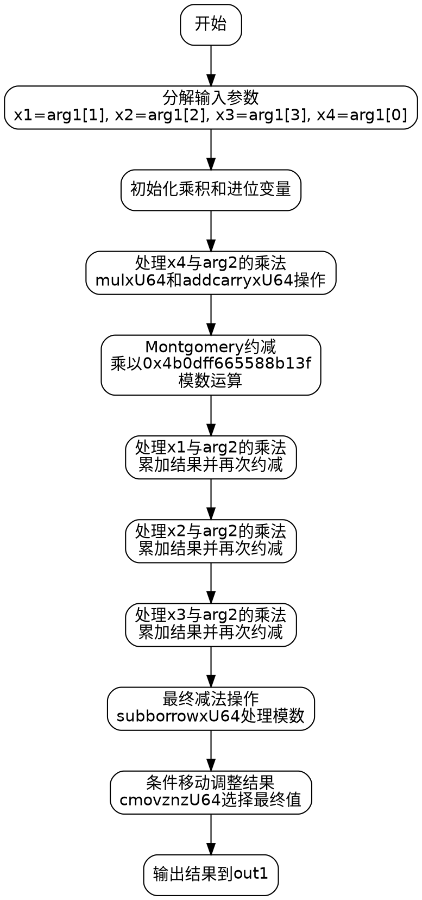

好，我现在要帮用户分析这个用Zig语言写的函数，并画出它的流程图。首先，我需要理解这个函数的功能。看起来这是一个在Montgomery域中进行乘法运算的函数，用于椭圆曲线secp256k1的标量运算。函数名是mul，接受三个参数，都是MontgomeryDomainFieldElement类型，其中out1是输出，arg1和arg2是输入参数。

接下来，我需要仔细阅读代码，理清逻辑。代码里有很多变量，比如x1到x219，这些变量名看起来像是中间计算步骤的结果。首先，函数将arg1的元素分解成x1, x2, x3, x4，然后开始一系列的乘法和加法操作。mulxU64和addcarryxU64这些函数可能是进行无符号64位整数乘法和带进位的加法。

然后，我注意到代码中有多次类似的模式：先进行乘法，然后处理进位，接着进行模约减，可能使用了Montgomery约减的方法。比如，每次处理完一部分乘法后，会乘以一个常数0x4b0dff665588b13f，然后与一些特定的模数（如0xffffffffffffffff）相乘，再进行累加。这可能是在进行Montgomery乘法中的中间步骤，将结果转换回正常域。

此外，代码的最后部分有一些条件移动指令cmovznzU64，这通常用于条件选择，避免分支预测错误。这可能是在处理模运算后的结果，如果结果超过了模数，就减去模数，否则保持原值。

接下来，用户要求用graphviz画流程图，不能用mermaid。流程图需要展示函数的控制流和主要步骤。因为代码较长且变量多，需要抽象出主要步骤，而不是每一行都画出来。

首先，函数开始，初始化变量，分解输入参数。然后进行四个部分的乘法运算，每次处理不同的元素（x4, x1, x2, x3），每个部分的结构可能类似：乘法、处理进位、模约减。最后进行减法操作和条件移动，得到最终结果。

所以流程图的大致步骤可能是：
1. 分解输入参数。
2. 对每个输入元素进行乘法和累加。
3. 每次乘法后进行Montgomery约减。
4. 处理完所有元素后，进行最终的模运算和条件选择。
5. 输出结果。

需要将这些步骤用graphviz的节点和边表示出来，注意循环或重复的结构可能需要用循环框表示。例如，四次乘法处理可能可以用一个循环结构，但代码中是展开的，所以可能需要四个不同的处理块。

每个乘法处理块内部可能有相似的步骤：乘法、进位处理、模乘、累加。因此，可以将每个处理块简化为几个步骤，然后在流程图中用不同的节点表示每个块。

最后的条件处理和输出部分也需要单独表示。

需要注意的是，graphviz的语法是用节点和边，可以用子图来分组不同的处理阶段，比如输入分解、四次乘法处理、最终调整和输出。

可能的结构：
- 开始节点
- 分解输入参数
- 第一个乘法处理块（x4）
- 第二个乘法处理块（x1）
- 第三个乘法处理块（x2）
- 第四个乘法处理块（x3）
- 最终的减法处理
- 条件移动选择
- 输出结果

每个处理块内部可以简化为几个步骤，如乘法、进位加法、模约减等。不过为了保持流程图简洁，可能需要将每个处理块作为一个节点，内部细节用文字描述。

这样，流程图就能展示函数的主要流程，而不陷入过多的变量细节中。另外，需要注意箭头方向表示流程的顺序。
================================================
