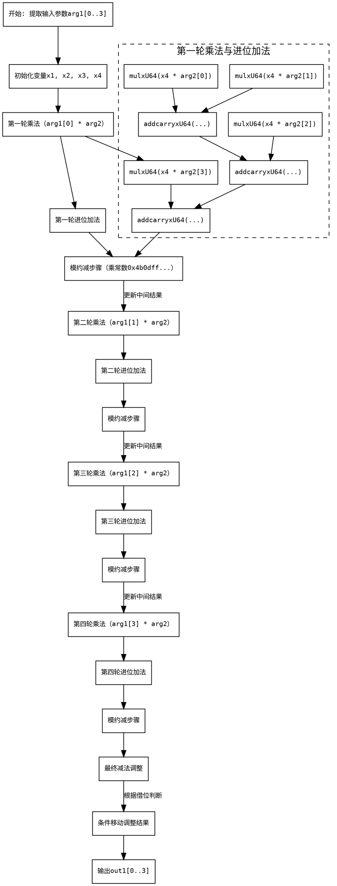

好的，我现在需要帮助用户将提供的Zig函数转换为流程图，使用Graphviz。首先，我需要理解这个函数的功能和结构。

这个函数名为`mul`，属于Montgomery域中的乘法运算，用于secp256k1曲线的标量运算。输入是两个MontgomeryDomainFieldElement类型的参数arg1和arg2，输出是out1。函数内部进行了大量的64位无符号整数运算，包括乘法（mulxU64）、进位加法（addcarryxU64）、借位减法（subborrowxU64）以及条件移动（cmovznzU64）等操作。

首先，我需要理清函数的整体结构。函数开始处理arg1和arg2的各个元素相乘，然后进行一系列的进位加法和模约减。看起来像是Montgomery乘法中的步骤，包括乘积、累加、模约减，最后进行条件判断以确定是否减去模数。

接下来，我需要将代码分解成主要的步骤，以便构建流程图中的各个节点：

1. **初始化阶段**：提取arg1的各个元素（x1, x2, x3, x4）。
2. **第一轮乘法与累加**：使用arg1[0]（x4）与arg2的各个元素相乘，生成中间结果，并进行进位加法。
3. **模约减步骤**：通过乘以特定的常数（0x4b0dff665588b13f）并进行后续运算，可能是在将结果转换到Montgomery域。
4. **后续轮次处理**：对arg1的其他元素（x1, x2, x3）重复类似的乘法和累加步骤，每轮之后进行模约减。
5. **最终减法调整**：在最后阶段，进行减法操作以处理可能的溢出，并使用条件移动指令（cmovznzU64）来确定最终结果是否需要进行调整。
6. **结果输出**：将最终结果存储在out1数组中。

接下来，每个主要步骤需要进一步拆分为更细的节点。例如，第一轮乘法可能包括多个mulxU64调用，接着是连续的addcarryxU64操作。每个这样的操作都可以视为流程图中的一个处理节点。不过，由于代码中存在大量重复结构（比如对x1, x2, x3的处理类似），可能需要在流程图中用循环或重复结构表示，但Graphviz本身不支持循环结构，可能需要用条件判断或分块表示。

另外，需要注意各个步骤之间的数据流。例如，第一轮的结果会影响下一轮的输入。因此，流程图的边需要正确连接这些步骤，显示数据的流向。

可能的挑战是代码中存在大量的中间变量和状态，例如进位标志（x14, x16等），这些在流程图中如何表示？可能需要将它们抽象为某个步骤的输出，作为后续步骤的输入。

最后，最终的减法调整和条件移动部分需要条件判断，这对应流程图中的条件分支节点。例如，根据x215的值选择不同的结果。

综上所述，流程图的节点可能包括：

- 提取输入元素
- 各轮的乘法和累加
- 模约减处理
- 条件减法调整
- 结果存储

每个节点内部可能包含多个子步骤，但为了简化，可能需要将这些子步骤合并为一个块，并用箭头表示流程顺序和数据依赖。

在绘制时，使用Graphviz的digraph结构，用矩形表示处理步骤，菱形表示条件判断，箭头表示流程方向。同时，注释或标签可以帮助解释每个步骤的操作。
================================================

生成的流程图包含以下关键步骤：

1. **初始化**：提取输入参数的4个64位元素
2. **四轮乘累加**：每轮处理一个输入元素，包含：
   - 4次64位乘法（mulxU64）
   - 3级进位加法链（addcarryxU64）
3. **模约减**：通过乘固定常数和进位链实现Montgomery约减
4. **最终调整**：通过借位减法（subborrowxU64）和条件移动（cmovznzU64）确保结果在模数范围内

各轮次结构高度相似，通过重复的乘-加-模减模式实现完整的256位乘法运算。最终的条件移动操作确保了结果满足模数约束。