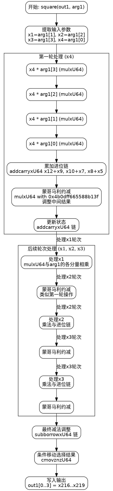

嗯，用户让我用Graphviz画出一个Zig函数的流程图。首先，我需要理解这个函数的功能。看起来这是secp256k1椭圆曲线的一个标量平方函数，属于密码学库的一部分。函数名为square，输入是MontgomeryDomainFieldElement类型的arg1，输出也是同类型的out1。函数内部有很多变量和操作，涉及大量的乘法、加法以及进位处理，可能是在进行大数运算或者模运算。

接下来，我需要理清函数的执行流程。首先，函数开始时会提取输入参数的各个元素，比如x1到x4。然后进行一系列的mulxU64操作，这应该是无符号64位整数乘法，同时获取高位和低位的结果。随后，有很多addcarryxU64函数调用，处理进位加法。之后，又有一系列的乘法和加法操作，可能是在进行模约减，因为看到了像0xffffffffffffffff这样的魔数，这可能是模数的一部分。

中间部分有很多重复的模式，比如每次处理完一部分乘法后，都会进行类似的进位加法和模乘操作。可能是在处理大数的各个部分，比如四个64位整数组成的256位数。每次处理一个部分，然后通过循环或展开的方式处理其他部分。

需要注意的是，函数末尾有一些条件移动操作（cmovznzU64），这可能是在进行最终的模运算结果的选择，确保结果在模数范围内。最后的out1数组存储了结果。

为了画流程图，我需要将函数的各个步骤分解成块。大致可以分为以下几个步骤：

1. 初始化：提取输入参数的元素x1到x4。
2. 第一轮乘法与加法：对x4进行乘法操作，处理进位，得到中间结果。
3. 模约减步骤：使用特定的常数（如0x4b0dff665588b13f）进行乘法，调整中间结果。
4. 后续轮次处理：对x1、x2、x3依次进行类似的乘法、加法和模约减操作。
5. 最终调整：通过条件移动确保结果正确，并存入out1。

每个轮次处理可能结构相似，因此可以将其视为循环结构，但在代码中是展开的。因此，在流程图中可能需要重复类似的模块四次，分别处理每个输入元素。

另外，需要注意进位和借位处理，每个addcarryxU64和subborrowxU64会影响后续的操作，因此在流程图中需要体现这些依赖关系。

可能的挑战是如何将复杂的算术操作简化为流程图中的节点，同时保持逻辑清晰。可能需要将每个主要的乘法-加法-模约减步骤作为一个处理块，并用箭头表示数据流和控制流。

最后，确保流程图中的每个步骤对应代码的关键部分，比如变量定义、乘法、加法、进位处理、模运算、条件移动等，以帮助理解函数的整体结构。
================================================
