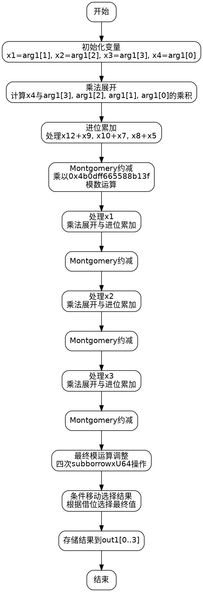

嗯，我现在需要为这个Zig语言编写的函数绘制流程图。首先，我得理解这个函数的功能。看起来这是一个在Montgomery域中进行平方运算的函数，属于椭圆曲线secp256k1的标量运算部分。函数名为square，接受两个参数：out1和arg1，都是MontgomeryDomainFieldElement类型。

首先，我需要理清函数的执行流程。代码里有很多变量和操作，比如mulxU64和addcarryxU64，这些可能是处理64位无符号整数的乘法和带进位的加法。此外，还有一些条件移动指令cmovznzU64，用于根据条件选择值。

整个函数的结构看起来是分阶段的，每个阶段处理不同的乘法累积，然后进行模约减。可能分为四个部分，对应四个输入元素（arg1[0]到arg1[3]）的处理。每次处理一个元素，进行乘法运算，累加结果，然后进行Montgomery约减。

接下来，我需要将代码分解为基本块。比如，初始的变量赋值，然后每个乘法步骤，然后是加法进位处理，接着是模约减步骤，最后的条件移动和结果存储。

需要注意的是，代码中有多个循环结构吗？看起来没有显式的循环，而是展开的操作，每个步骤都显式处理不同的位和进位。因此，流程图中的每个步骤可能对应代码中的一个块。

可能的流程步骤：
1. 初始化变量，提取输入元素的各个部分。
2. 对第一个元素（arg1[0]）进行乘法运算，累积结果。
3. 进行Montgomery约减的第一步。
4. 处理第二个元素（arg1[1]）的乘法，并累积结果。
5. 再次进行约减。
6. 处理第三个元素（arg1[2]）和第四个元素（arg1[3]），重复类似的步骤。
7. 最后的模运算检查，条件移动确定最终结果。
8. 将结果存储到out1中。

每个主要步骤之间会有箭头连接，表示执行顺序。条件移动部分可能需要判断是否有借位，决定是否使用减法后的值或原值。

需要注意的是，每次处理一个元素时，都会进行乘法和累加，然后进行一次约减。这可能形成一个模式，每个元素处理的结构相似，但具体操作不同。

在绘制流程图时，需要将这些步骤模块化，每个模块代表一个主要的计算阶段，比如乘法、累加、约减等。箭头表示控制流的方向，可能根据进位或借位的情况分支，但看起来代码中的条件处理主要是通过进位标志顺序执行，而不是跳转。

由于代码中没有明显的循环或条件分支（除了最后的条件移动），流程图可能是一个线性的结构，但有多个并行或连续的操作块。每个乘法步骤后的进位处理可能需要多个步骤，但代码中是通过连续的addcarryxU64和mulxU64函数来处理。

最后，处理完所有元素后，进行一系列的减法操作（subborrowxU64）来调整结果，确保其在模数范围内。然后根据是否有借位，使用cmovznzU64来选择正确的值存入输出数组。

总结流程图的结构：
- 初始化输入分解
- 四个主要处理阶段（每个输入元素）
  - 乘法运算
  - 累加和进位处理
  - Montgomery约减
- 最后的模运算调整
- 条件选择结果
- 输出结果

每个阶段内部可能有详细的操作步骤，但在流程图中可以简化为处理块，用箭头连接顺序。
================================================
