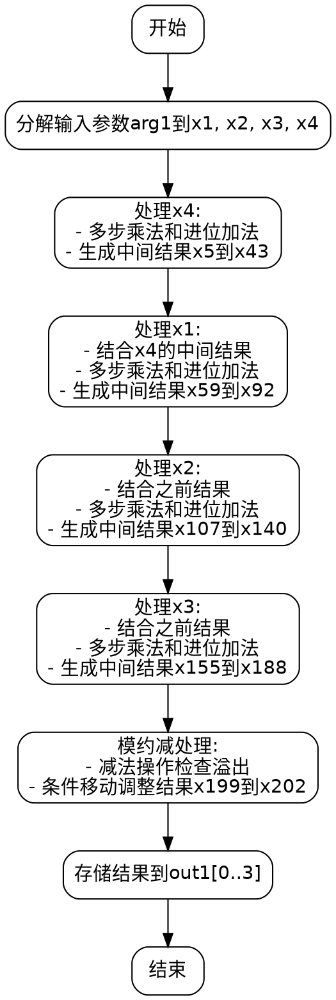

嗯，我现在需要为这个Zig函数绘制流程图。首先，我得仔细看看这个函数的结构和逻辑。函数名是toMontgomery，看起来是将一个非蒙哥马利域的元素转换为蒙哥马利域的元素。这可能涉及到一些大数运算，比如模乘或者模加，因为secp256k1曲线相关的操作通常会用到这些。

首先，函数接收两个参数：out1是一个指向蒙哥马利域元素的指针，arg1是一个非蒙哥马利域元素。函数内部有很多变量声明和一系列的操作，看起来像是在进行多精度算术运算。有很多mulxU64和addcarryxU64的调用，这些可能是处理64位无符号整数的乘法和带进位的加法。

我需要理清函数的执行流程。首先，函数开始时将arg1的元素分解成x1, x2, x3, x4。然后进行一系列的乘法和加法操作，生成中间变量x5到x43。接着处理x1的部分，生成更多的中间变量，直到x91和x92。之后处理x2，同样生成很多变量，直到x139和x140。然后是处理x3的部分，直到x187和x188。

最后的部分有一些减法操作（subborrowxU64）和条件移动（cmovznzU64），可能是进行模约减，确保结果在正确的范围内。最后的结果存储在out1数组中。

为了绘制流程图，我需要将整个函数的步骤分解成块。每个主要的计算阶段可能对应一个流程块。例如，处理x4的部分，处理x1的部分，处理x2的部分，处理x3的部分，然后是最后的减法调整和结果存储。

需要注意的是，每个处理阶段可能包括多个乘法和加法的组合，可能需要将这些步骤合并成一个块，比如“处理x4的乘法链”或“处理x1的乘加步骤”。此外，最后的减法部分和条件移动可能需要单独的分支判断，比如是否发生了借位，从而决定是否使用调整后的值。

可能的流程步骤：
1. 初始化：分解arg1到x1-x4。
2. 处理x4：进行一系列的乘法和加法，生成中间结果。
3. 处理x1：同样的乘加操作，结合之前的中间结果。
4. 处理x2：继续类似的步骤。
5. 处理x3：最后的乘加步骤。
6. 最后的模约减：通过减法检查是否超过模数，必要时调整结果。
7. 存储结果到out1。

在这个过程中，每个处理阶段可能会涉及到多个乘法和进位加法的步骤，但因为这些都是线性进行的，所以流程图应该按顺序展示每个阶段的处理，最后进入条件判断和结果调整。

另外，需要注意各个变量之间的依赖关系，比如处理x1的部分可能依赖于之前处理x4得到的中间结果。这可能在流程图中表现为箭头连接各个处理块。

最后，函数结束时将调整后的值存入out1数组的各个位置。这部分也是一个步骤。

总结下来，流程图应该包括开始节点，各个处理阶段的节点（x4处理、x1处理、x2处理、x3处理），模约减的判断节点，以及结果存储的结束节点。各个步骤之间用箭头连接，顺序执行，模约减部分可能需要条件分支，但根据代码中的cmovznzU64函数，可能是在同一流程中进行条件选择，而不需要显式的分支路径，而是根据条件选择不同的值。

现在需要将这些步骤转化为Graphviz的DOT语言，用不同的节点和边来表示流程。
================================================
