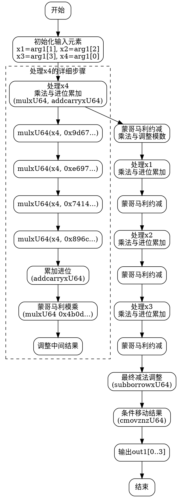

好的，我现在需要帮用户分析一个用Zig语言编写的函数，并生成对应的流程图。首先，我需要理解这个函数的功能和结构。函数名为toMontgomery，似乎是将一个非蒙哥马利域的元素转换为蒙哥马利域的元素，这在椭圆曲线密码学中常见，比如secp256k1曲线的标量运算。

接下来，我需要通读代码，了解其大致流程。函数接受一个NonMontgomeryDomainFieldElement类型的输入arg1，处理后输出到MontgomeryDomainFieldElement类型的out1。代码中有大量的变量声明和操作，尤其是mulxU64（乘法）、addcarryxU64（带进位的加法）、subborrowxU64（带借位的减法）和cmovznzU64（条件移动）等函数的使用，这些通常用于大数运算，处理256位的数值。

首先，代码将输入的四个部分（x1到x4）进行初始化。然后，对每个部分进行一系列的乘法和累加操作，中间涉及到多次进位处理。之后，进行蒙哥马利约简，可能涉及模乘和模减运算。最后，通过条件移动指令（cmovznzU64）处理可能的借位情况，确保结果正确。

接下来，我需要确定如何将这些步骤转化为流程图。流程图的节点应代表代码中的主要操作，如初始化变量、乘法、加法、进位处理、减法、条件判断等。边则表示控制流和数据流的方向。

可能的步骤如下：
1. 初始化变量，分解输入参数。
2. 对每个输入部分进行乘法运算，并处理进位。
3. 进行蒙哥马利约简的乘法操作，调整中间结果。
4. 处理可能的进位和借位，进行减法操作以调整结果到模数范围内。
5. 使用条件移动指令选择正确的值作为最终输出。

需要注意的是，代码中有多个类似的块，可能是对每个输入元素（x4, x1, x2, x3）进行相同的处理流程，然后逐步累加结果。每个块可能包含乘法、进位加法、蒙哥马利参数的应用，最后进行减法调整和条件选择。

此外，最后的减法操作和条件移动可能用于确保结果在模数范围内，即如果结果在减法后出现借位，说明原值已经小于模数，需要保留原值而不是减去后的结果。

在绘制流程图时，需要将这些重复的块结构表现出来，同时展示各个步骤之间的依赖关系，比如一个步骤的输出作为下一个步骤的输入。此外，条件判断（如借位是否存在）会影响最终的结果选择，这也需要在流程图中明确标出。

可能会遇到的难点是如何简洁地表示重复的操作结构，以及如何处理多个变量之间的复杂数据流。可能需要使用子流程或循环结构来表示重复的处理步骤，但根据代码结构，每个输入元素是依次处理的，因此可能需要分阶段展示。

总之，流程图的大致结构可能包括初始化、多个处理阶段（每个阶段对应一个输入元素），蒙哥马利约简，减法调整，条件选择，最终输出。每个阶段内部包含乘法、加法、进位处理等步骤。
================================================
要绘制此函数的流程图，可将其分解为以下主要步骤，并使用Graphviz表示：

流程图说明：
1. **初始化**：分解输入参数到x1-x4
2. **分步处理**：依次处理x4/x1/x2/x3元素，每步包含：
   - 多精度乘法（mulxU64）
   - 带进位的累加（addcarryxU64）
   - 蒙哥马利约减（与特殊常数相乘并调整）
3. **最终调整**：通过带借位减法(subborrowxU64)确保结果在模数范围内
4. **条件选择**：用cmovznzU64选择最终正确值
5. **输出**：将结果写入out1数组

每个处理阶段（如处理x4）的结构相似，均包含乘法链、进位传播和模约减操作。蒙哥马利约减阶段通过乘以预计算的常数（0x4b0dff665588b13f）实现快速模运算。