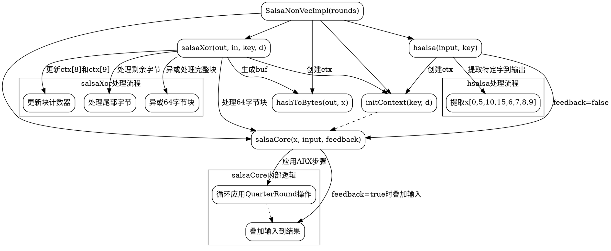

好的，我现在需要帮用户用Graphviz画出他们提供的Zig代码的流程图。首先，我需要理解这个代码的结构和功能。看起来这是一个Salsa20加密算法的非向量化实现，包含初始化上下文、Salsa核心处理、哈希转换、异或操作以及HSalsa函数。

首先，我应该确定各个函数之间的调用关系。比如，salsaXor函数调用了initContext和salsaCore，而salsaCore又使用了QuarterRound结构体。还有hsalsa函数也调用了initContext和salsaCore。流程图需要展示这些函数的调用流程以及数据流动。

接下来，我需要考虑每个函数内部的逻辑流程。例如，salsaXor函数中有循环处理64字节块的部分，还有处理剩余字节的部分。每个循环中的步骤需要分解成不同的节点，比如初始化上下文、执行salsaCore、生成哈希字节、进行异或操作，以及更新计数器。

对于salsaCore函数，它包含多个循环步骤，每次循环应用一系列的QuarterRound操作。这可能需要用一个子图来表示循环和内部操作。同时，要注意条件判断，比如feedback参数是否启用，影响是否将结果与输入相加。

然后，hsalsa函数的结构也需要拆解，包括读取输入、初始化上下文、执行salsaCore，然后提取特定的字到输出中。每个步骤都需要在流程图中体现。

我需要确保流程图的节点清晰，箭头正确表示执行顺序和函数调用。同时，要处理可能的错误，比如循环条件、溢出处理等，是否需要在流程图中体现？

可能遇到的挑战是如何将复杂的循环和条件分支简化为流程图中的节点，同时保持可读性。例如，salsaCore中的循环和多个QuarterRound步骤可能需要合并为一个节点，或者分解为多个步骤，但这样可能会导致图表过于复杂。

另外，要注意函数之间的数据传递，比如ctx在不同函数间的使用，以及buf的生成和使用。这些数据流也需要在流程图中用箭头表示。

最后，需要验证流程图是否准确反映了代码的逻辑，确保没有遗漏重要的步骤或条件分支。例如，salsaXor中的两种情况：处理完整的64字节块和处理剩余字节的部分，这两个分支都需要在流程图中分开表示。

总结来说，我需要将每个函数分解为步骤，确定调用关系和数据流，然后用Graphviz的节点和边来表示这些关系，确保逻辑正确且图表清晰。
================================================

这个流程图展示了以下关键逻辑：

1. 模块入口点SalsaNonVecImpl包含所有子函数
2. salsaXor的主要处理流程：
   - 初始化上下文
   - 循环处理64字节块
   - 应用Salsa核心算法
   - 哈希结果转换
   - 异或操作和计数器更新
   - 尾部处理

3. hsalsa的特殊处理流程：
   - 输入转换
   - 无反馈的核心运算
   - 特定字的提取

4. salsaCore的内部细节：
   - ARX操作循环
   - 反馈叠加逻辑

使用Graphviz渲染时建议：
1. 使用层级布局（rankdir=TB）
2. 用不同颜色区分主流程和子流程
3. 虚线表示数据传递，实线表示流程顺序
4. 圆角矩形提升可读性